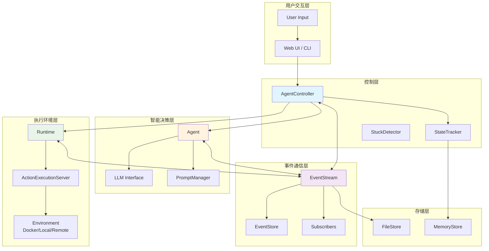
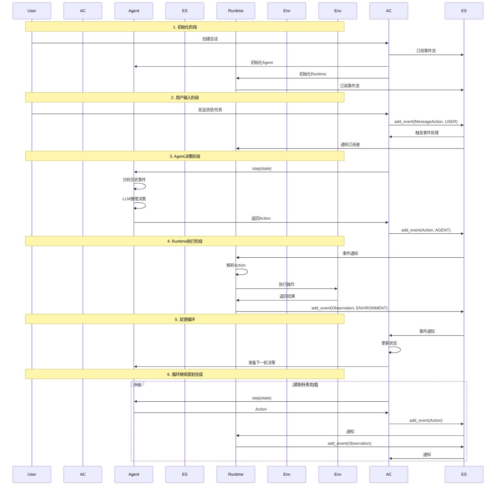
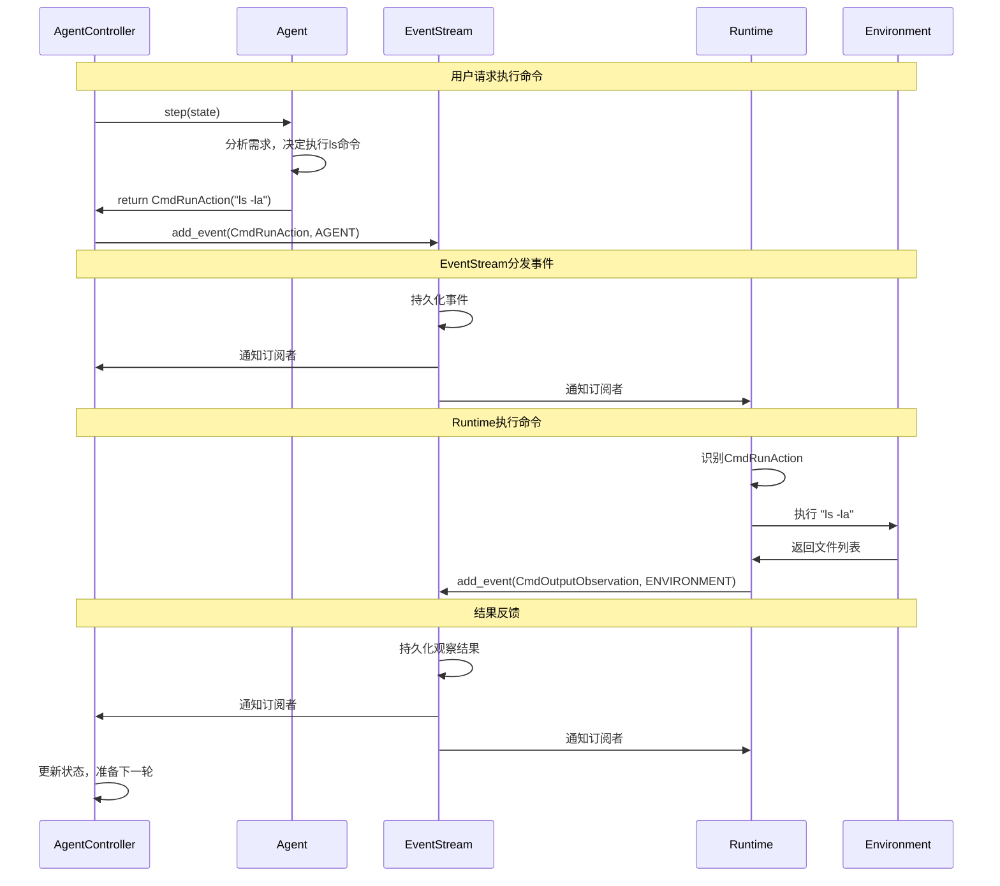
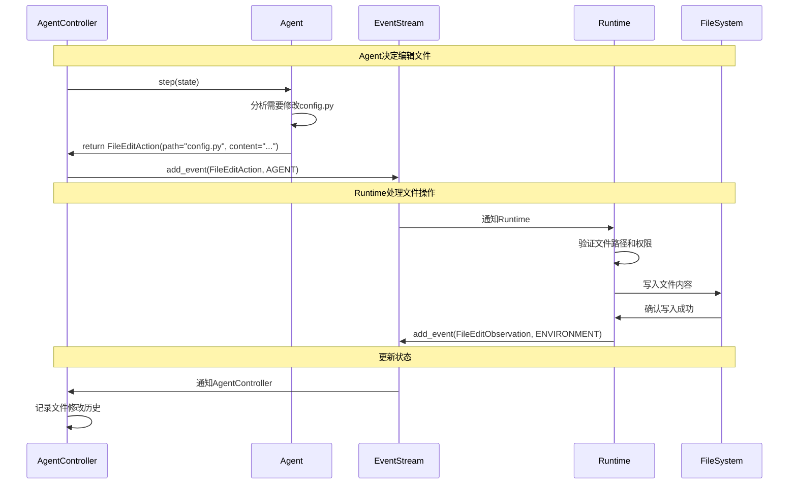
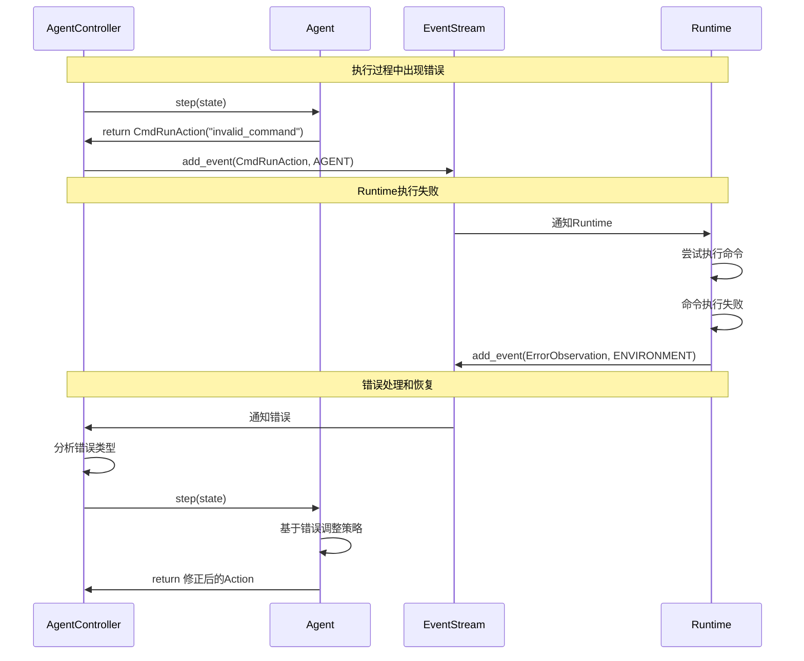
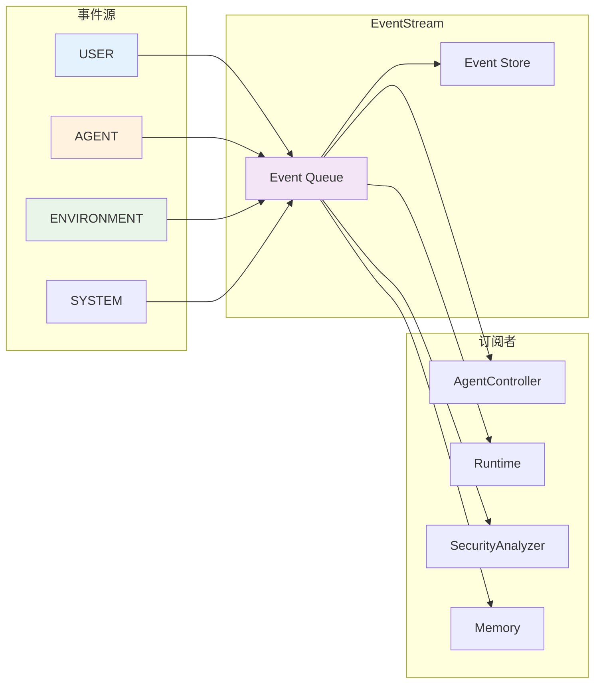

# AgentController-Agent-Runtime 通信架构详解

## 🎯 概述

在OpenHands中，AgentController、Agent和Runtime三个核心组件通过EventStream实现Agent-Action-Observation (AAO) 模式的完整通信循环。本文档详细分析这三者之间的关系和通信机制。

## 🏗️ 整体架构图



## 🔄 AAO通信循环详解

### 完整的通信流程



## 📋 核心组件详解

### 1. AgentController - 中央协调器

```python
# 文件：openhands/controller/agent_controller.py

class AgentController:
    """Agent控制器 - AAO循环的中央协调器"""
    
    def __init__(self, agent: Agent, event_stream: EventStream, ...):
        self.agent = agent
        self.event_stream = event_stream
        self.state_tracker = StateTracker(...)
        
        # 订阅事件流
        if not self.is_delegate:
            self.event_stream.subscribe(
                EventStreamSubscriber.AGENT_CONTROLLER, 
                self.on_event, 
                self.id
            )
    
    async def _on_event(self, event: Event) -> None:
        """处理来自EventStream的事件"""
        # 更新历史记录
        self.state_tracker.add_history(event)
        
        if isinstance(event, Action):
            await self._handle_action(event)
        elif isinstance(event, Observation):
            await self._handle_observation(event)
        
        # 决定是否需要让Agent进行下一步
        should_step = self.should_step(event)
        if should_step:
            await self._step_with_exception_handling()
    
    async def _step_with_exception_handling(self) -> None:
        """执行Agent的一步决策"""
        try:
            # 让Agent进行决策
            action = await self.agent.step(self.state)
            
            # 将Action添加到事件流
            self.event_stream.add_event(action, EventSource.AGENT)
            
        except Exception as e:
            # 错误处理
            error_obs = ErrorObservation(content=str(e))
            self.event_stream.add_event(error_obs, EventSource.ENVIRONMENT)
```

**AgentController的核心职责：**
- 🎯 **事件协调**：订阅EventStream，处理所有事件
- 🔄 **循环控制**：决定何时让Agent进行下一步决策
- 📊 **状态管理**：维护对话状态和执行历史
- 🛡️ **错误处理**：捕获和处理执行过程中的异常
- 🎭 **代理管理**：支持Agent委托和层级结构

### 2. Agent - 智能决策者

```python
# 文件：openhands/controller/agent.py

class Agent(ABC):
    """Agent基类 - 智能决策的核心"""
    
    def __init__(self, llm: LLM, config: AgentConfig):
        self.llm = llm
        self.config = config
        self._prompt_manager = None
    
    @abstractmethod
    async def step(self, state: State) -> Action:
        """核心决策方法 - 分析状态并返回Action"""
        pass

# 具体实现示例：CodeActAgent
class CodeActAgent(Agent):
    async def step(self, state: State) -> Action:
        # 1. 获取对话历史
        messages = self._get_messages(state)
        
        # 2. 调用LLM进行推理
        response = await self.llm.acompletion(
            messages=messages,
            temperature=0.1
        )
        
        # 3. 解析响应，创建Action
        action = self._parse_response(response)
        
        # 4. 设置思考过程
        if hasattr(action, 'thought'):
            action.thought = self._extract_thought(response)
        
        return action
    
    def _get_messages(self, state: State) -> list:
        """从EventStream获取对话历史"""
        messages = []
        
        # 获取系统消息
        system_message = self.get_system_message()
        if system_message:
            messages.append(system_message)
        
        # 获取历史事件
        for event in state.history:
            if isinstance(event, MessageAction):
                messages.append({
                    'role': 'user' if event.source == EventSource.USER else 'assistant',
                    'content': event.content
                })
            elif isinstance(event, Observation):
                messages.append({
                    'role': 'user',
                    'content': f"Observation: {event.content}"
                })
        
        return messages
```

**Agent的核心职责：**
- 🧠 **智能决策**：基于历史和当前状态做出最优决策
- 📝 **LLM交互**：与大语言模型进行对话和推理
- 🔍 **状态分析**：理解当前任务进度和环境状态
- ⚡ **Action生成**：将决策转换为具体的可执行Action
- 🎯 **目标导向**：朝着任务目标持续推进

### 3. Runtime - 执行环境

```python
# 文件：openhands/runtime/base.py

class Runtime:
    """Runtime基类 - Action执行环境"""
    
    def __init__(self, config: SandboxConfig, event_stream: EventStream, ...):
        self.config = config
        self.event_stream = event_stream
        
        # 订阅事件流
        if event_stream:
            event_stream.subscribe(
                EventStreamSubscriber.RUNTIME, 
                self.on_event, 
                self.sid
            )
    
    async def on_event(self, event: Event) -> None:
        """处理来自EventStream的事件"""
        if isinstance(event, Action) and event.runnable:
            # 执行可运行的Action
            observation = await self._execute_action(event)
            
            # 将结果添加到事件流
            self.event_stream.add_event(observation, EventSource.ENVIRONMENT)
    
    async def _execute_action(self, action: Action) -> Observation:
        """执行具体的Action"""
        try:
            if isinstance(action, CmdRunAction):
                return await self.run_command(action)
            elif isinstance(action, FileReadAction):
                return await self.read_file(action)
            elif isinstance(action, FileEditAction):
                return await self.edit_file(action)
            elif isinstance(action, BrowseURLAction):
                return await self.browse_url(action)
            else:
                return ErrorObservation(
                    content=f"Unknown action type: {type(action)}"
                )
        except Exception as e:
            return ErrorObservation(content=str(e))
    
    async def run_command(self, action: CmdRunAction) -> CmdOutputObservation:
        """执行命令的具体实现"""
        # 在环境中执行命令
        result = await self._execute_bash_command(action.command)
        
        # 创建观察结果
        return CmdOutputObservation(
            content=result.stdout + result.stderr,
            command=action.command,
            metadata=CmdOutputMetadata(
                exit_code=result.exit_code,
                working_dir=result.cwd
            )
        )
```

**Runtime的核心职责：**
- 🔧 **Action执行**：将抽象的Action转换为具体的环境操作
- 🌍 **环境管理**：维护执行环境的状态和配置
- 📊 **结果收集**：收集执行结果并转换为Observation
- 🛡️ **安全隔离**：提供安全的代码执行环境
- 🔌 **多环境支持**：支持Docker、本地、远程等多种执行环境

### 4. EventStream - 通信枢纽

```python
# 文件：openhands/events/stream.py

class EventStream(EventStore):
    """事件流 - 组件间通信的核心枢纽"""
    
    def __init__(self, sid: str, file_store: FileStore, user_id: str | None = None):
        super().__init__(sid, file_store, user_id)
        self._subscribers = {}  # 订阅者映射
        self._queue = queue.Queue()  # 事件队列
        self._lock = threading.Lock()  # 线程锁
        
        # 启动事件处理线程
        self._queue_thread = threading.Thread(target=self._run_queue_loop)
        self._queue_thread.daemon = True
        self._queue_thread.start()
    
    def add_event(self, event: Event, source: EventSource) -> None:
        """添加事件到流中"""
        # 设置事件属性
        event._timestamp = datetime.now().isoformat()
        event._source = source
        
        with self._lock:
            event._id = self.cur_id
            self.cur_id += 1
        
        # 持久化存储
        self.file_store.write(filename, event_json)
        
        # 加入处理队列
        self._queue.put(event)
        
        logger.info(f"Event add, event: {event}, source: {source}")
    
    def subscribe(self, subscriber_id: str, callback: Callable, callback_id: str):
        """订阅事件流"""
        if subscriber_id not in self._subscribers:
            self._subscribers[subscriber_id] = {}
        
        self._subscribers[subscriber_id][callback_id] = callback
        
        # 为订阅者创建专用线程池
        if subscriber_id not in self._thread_pools:
            self._thread_pools[subscriber_id] = {}
        
        self._thread_pools[subscriber_id][callback_id] = ThreadPoolExecutor(
            max_workers=1, thread_name_prefix=f'{subscriber_id}_{callback_id}'
        )
    
    def _run_queue_loop(self):
        """事件处理循环"""
        loop = asyncio.new_event_loop()
        asyncio.set_event_loop(loop)
        self._queue_loop = loop
        
        while not self._stop_flag.is_set():
            try:
                # 从队列获取事件
                event = self._queue.get(timeout=1)
                
                # 通知所有订阅者
                for subscriber_id, callbacks in self._subscribers.items():
                    for callback_id, callback in callbacks.items():
                        self._notify_subscriber(
                            subscriber_id, callback_id, callback, event
                        )
                        
            except queue.Empty:
                continue
            except Exception as e:
                logger.error(f"Error in event queue loop: {e}")
    
    def _notify_subscriber(self, subscriber_id: str, callback_id: str, 
                          callback: Callable, event: Event):
        """通知订阅者"""
        try:
            # 在专用线程池中执行回调
            executor = self._thread_pools[subscriber_id][callback_id]
            future = executor.submit(callback, event)
            
            # 可选：等待执行完成或设置超时
            # future.result(timeout=30)
            
        except Exception as e:
            logger.error(f"Error notifying subscriber {subscriber_id}: {e}")
```

**EventStream的核心职责：**
- 📡 **事件分发**：将事件分发给所有订阅者
- 💾 **持久化存储**：将事件持久化到文件系统
- 🔄 **异步处理**：支持异步事件处理和通知
- 🎯 **订阅管理**：管理组件的事件订阅关系
- 🧵 **线程安全**：确保多线程环境下的数据一致性

## 🔍 具体通信场景分析

### 场景1：命令执行流程



### 场景2：文件编辑流程



### 场景3：错误处理流程



## 📊 事件类型和流向分析

### 事件源分类

```python
class EventSource(str, Enum):
    USER = 'user'           # 用户输入
    AGENT = 'agent'         # Agent决策
    ENVIRONMENT = 'environment'  # Runtime执行结果
    SYSTEM = 'system'       # 系统消息
```

### 事件流向图



### 常见事件类型映射

| 事件类型 | 源 | 目标订阅者 | 处理逻辑 |
|---------|----|-----------|---------| 
| `MessageAction` | USER | AgentController | 触发Agent决策 |
| `CmdRunAction` | AGENT | Runtime | 执行命令 |
| `CmdOutputObservation` | ENVIRONMENT | AgentController | 更新状态，继续循环 |
| `FileEditAction` | AGENT | Runtime | 执行文件操作 |
| `FileEditObservation` | ENVIRONMENT | AgentController | 记录操作结果 |
| `BrowseURLAction` | AGENT | Runtime | 执行浏览器操作 |
| `BrowserOutputObservation` | ENVIRONMENT | AgentController | 处理页面内容 |
| `ErrorObservation` | ENVIRONMENT | AgentController | 错误处理和恢复 |
| `AgentFinishAction` | AGENT | AgentController | 任务完成处理 |

## 🔧 关键实现细节

### 1. 线程安全和异步处理

```python
class EventStream:
    def __init__(self):
        self._lock = threading.Lock()  # 保护共享状态
        self._queue = queue.Queue()    # 线程安全队列
        self._thread_pools = {}        # 每个订阅者独立线程池
        
    def add_event(self, event: Event, source: EventSource):
        with self._lock:  # 确保ID分配的原子性
            event._id = self.cur_id
            self.cur_id += 1
        
        # 异步通知订阅者
        self._queue.put(event)
```

### 2. 事件持久化机制

```python
class EventStream(EventStore):
    def add_event(self, event: Event, source: EventSource):
        # 序列化事件
        data = event_to_dict(event)
        event_json = json.dumps(data)
        
        # 持久化到文件
        filename = self._get_filename_for_id(event.id, self.user_id)
        self.file_store.write(filename, event_json)
        
        # 缓存页面机制（提高读取性能）
        self._store_cache_page(current_write_page)
```

### 3. 订阅者管理

```python
class EventStream:
    def subscribe(self, subscriber_id: str, callback: Callable, callback_id: str):
        # 注册回调函数
        if subscriber_id not in self._subscribers:
            self._subscribers[subscriber_id] = {}
        self._subscribers[subscriber_id][callback_id] = callback
        
        # 创建专用线程池
        if subscriber_id not in self._thread_pools:
            self._thread_pools[subscriber_id] = {}
        self._thread_pools[subscriber_id][callback_id] = ThreadPoolExecutor(
            max_workers=1, 
            thread_name_prefix=f'{subscriber_id}_{callback_id}'
        )
```

### 4. 状态同步机制

```python
class AgentController:
    async def _on_event(self, event: Event):
        # 更新状态追踪
        self.state_tracker.add_history(event)
        
        # 根据事件类型处理
        if isinstance(event, Action):
            await self._handle_action(event)
        elif isinstance(event, Observation):
            await self._handle_observation(event)
        
        # 决定是否继续循环
        should_step = self.should_step(event)
        if should_step:
            await self._step_with_exception_handling()
```

## 🎯 设计优势分析

### 1. 解耦合设计
- **松耦合**：组件间通过EventStream通信，不直接依赖
- **可扩展**：新组件只需订阅EventStream即可集成
- **可测试**：每个组件可独立测试

### 2. 异步处理
- **非阻塞**：事件处理不会阻塞主流程
- **并发性**：多个组件可并行处理事件
- **响应性**：用户界面保持响应

### 3. 持久化和恢复
- **会话恢复**：可从历史事件恢复会话状态
- **调试支持**：完整的事件历史便于调试
- **审计跟踪**：所有操作都有记录

### 4. 错误隔离
- **故障隔离**：单个组件故障不影响其他组件
- **错误传播**：错误通过ErrorObservation传播
- **恢复机制**：支持从错误状态恢复

## 🚀 最佳实践建议

### 1. 事件设计原则
```python
# 好的事件设计
@dataclass
class WellDesignedAction(Action):
    # 明确的参数
    target: str
    operation: str
    
    # 验证方法
    def validate(self) -> bool:
        return bool(self.target and self.operation)
    
    # 清晰的描述
    @property
    def message(self) -> str:
        return f"Performing {self.operation} on {self.target}"
```

### 2. 错误处理模式
```python
class RobustComponent:
    async def handle_event(self, event: Event):
        try:
            # 正常处理逻辑
            result = await self.process_event(event)
            return result
        except Exception as e:
            # 创建错误观察
            error_obs = ErrorObservation(
                content=f"Error processing {type(event).__name__}: {e}",
                error_type=type(e).__name__
            )
            self.event_stream.add_event(error_obs, EventSource.ENVIRONMENT)
```

### 3. 性能优化技巧
```python
class OptimizedEventStream:
    def add_event(self, event: Event, source: EventSource):
        # 批量处理
        if self._should_batch():
            self._batch_events.append(event)
            return
        
        # 异步持久化
        asyncio.create_task(self._persist_event(event))
        
        # 选择性通知
        relevant_subscribers = self._get_relevant_subscribers(event)
        for subscriber in relevant_subscribers:
            self._notify_subscriber(subscriber, event)
```

## 🔗 相关资源

- [Agent-Action-Observation模式详解](./agent-action-observation-pattern.md)
- [模块依赖关系图](./module-dependency-diagrams.md)
- [代码示例详解](./code-examples.md)
- [OpenHands架构概览](../README.md)
- [深入理解指南](../stage2-deep-dive/README.md)