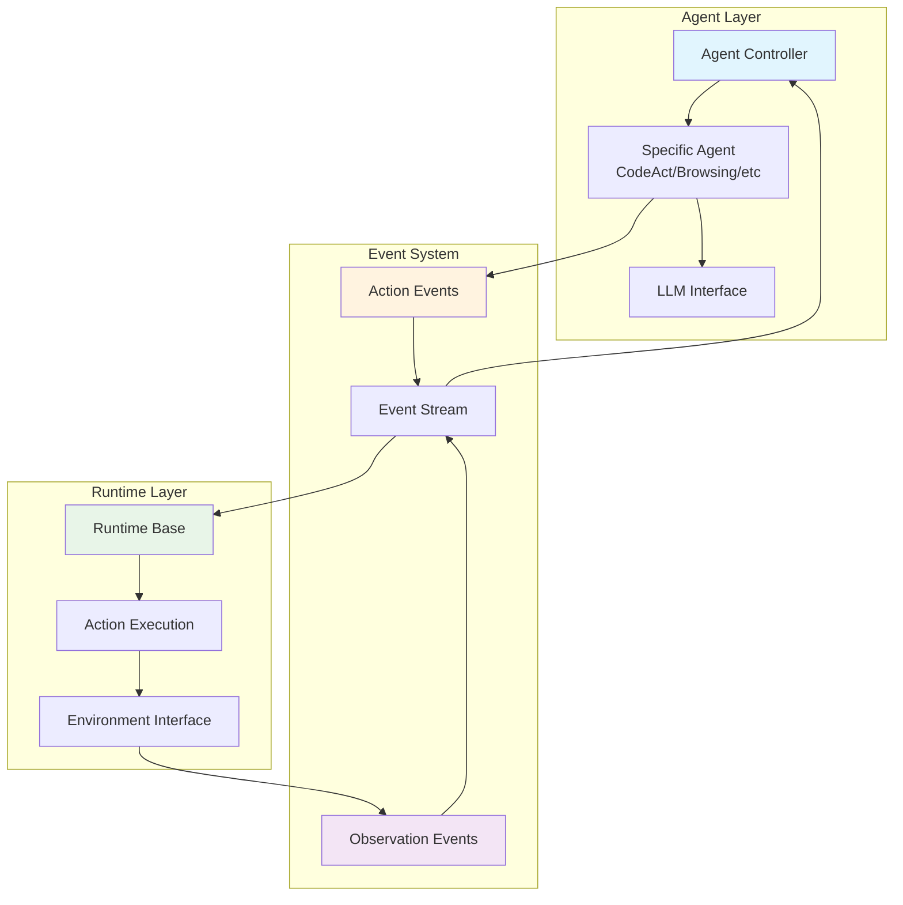
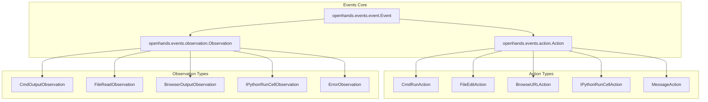
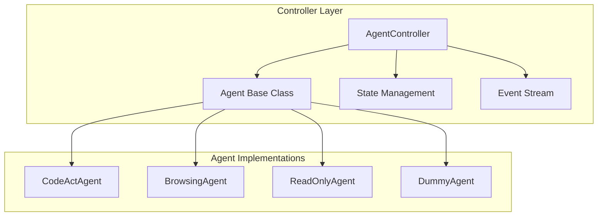
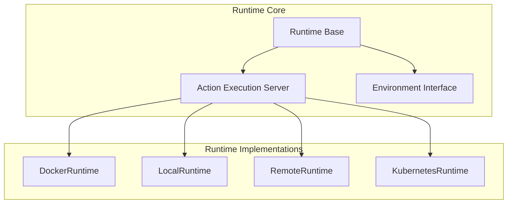
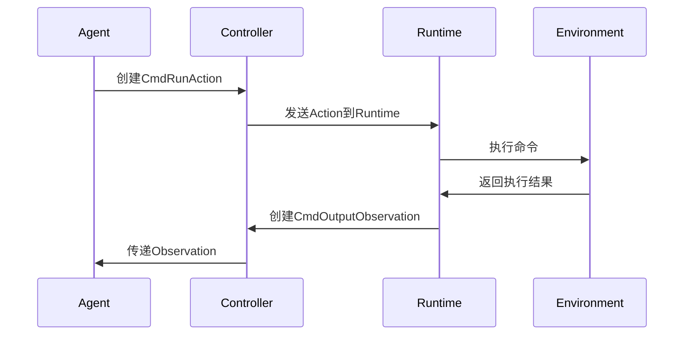
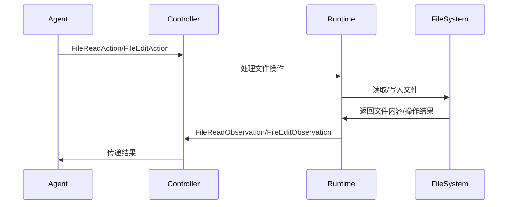
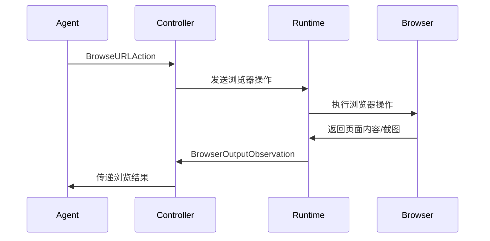
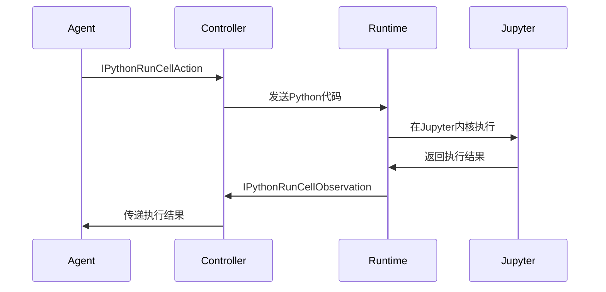

# Agent-Action-Observation 模式详解

## 📖 概述

Agent-Action-Observation (AAO) 模式是OpenHands的核心架构模式，它定义了智能代理与环境交互的基本循环：

1. **Agent（代理）**：智能决策者，分析当前状态并决定下一步行动
2. **Action（动作）**：代理执行的具体操作，如运行命令、编辑文件等
3. **Observation（观察）**：环境对动作的反馈，包含执行结果和状态信息

## 🏗️ 核心架构图



## 📁 模块依赖关系

### 1. 核心事件模块



### 2. 控制器模块



### 3. 运行时模块



## 🔍 按应用场景分类的学习路径

### 场景1：命令执行场景

**涉及的核心模块：**

```python
# 1. Action定义
# 文件：openhands/events/action/commands.py
@dataclass
class CmdRunAction(Action):
    command: str
    is_input: bool = False
    thought: str = ''
    blocking: bool = False
    runnable: ClassVar[bool] = True

# 2. Observation定义  
# 文件：openhands/events/observation/commands.py
@dataclass
class CmdOutputObservation(Observation):
    command: str
    metadata: CmdOutputMetadata
    
    @property
    def exit_code(self) -> int:
        return self.metadata.exit_code
```

**执行流程：**



**相关代码文件：**
- `openhands/events/action/commands.py` - 命令Action定义
- `openhands/events/observation/commands.py` - 命令Observation定义
- `openhands/runtime/utils/bash.py` - Bash命令执行工具
- `openhands/controller/agent_controller.py` - 控制器逻辑

### 场景2：文件操作场景

**涉及的核心模块：**

```python
# 1. 文件读取Action
# 文件：openhands/events/action/files.py
@dataclass
class FileReadAction(Action):
    path: str
    start: int = 1
    end: int = -1
    thought: str = ''

# 2. 文件编辑Action
@dataclass
class FileEditAction(Action):
    path: str
    file_text: str
    start: int = 1
    end: int = -1
    thought: str = ''

# 3. 文件操作Observation
# 文件：openhands/events/observation/files.py
@dataclass
class FileReadObservation(Observation):
    path: str
    content: str
```

**执行流程：**



**相关代码文件：**
- `openhands/events/action/files.py` - 文件操作Action定义
- `openhands/events/observation/files.py` - 文件操作Observation定义
- `openhands/runtime/utils/files.py` - 文件操作工具
- `openhands/runtime/utils/edit.py` - 文件编辑工具

### 场景3：浏览器交互场景

**涉及的核心模块：**

```python
# 1. 浏览器Action
# 文件：openhands/events/action/browse.py
@dataclass
class BrowseURLAction(Action):
    url: str
    thought: str = ''

@dataclass
class BrowseInteractiveAction(Action):
    browser_actions: str
    thought: str = ''

# 2. 浏览器Observation
# 文件：openhands/events/observation/browse.py
@dataclass
class BrowserOutputObservation(Observation):
    url: str
    screenshot: str | None = None
    error: bool = False
```

**执行流程：**



**相关代码文件：**
- `openhands/events/action/browse.py` - 浏览器Action定义
- `openhands/events/observation/browse.py` - 浏览器Observation定义
- `openhands/runtime/browser/utils.py` - 浏览器工具
- `openhands/agenthub/browsing_agent/` - 浏览器专用Agent

### 场景4：Python代码执行场景

**涉及的核心模块：**

```python
# 1. Python执行Action
# 文件：openhands/events/action/commands.py
@dataclass
class IPythonRunCellAction(Action):
    code: str
    thought: str = ''
    include_extra: bool = True
    kernel_init_code: str = ''

# 2. Python执行Observation
# 文件：openhands/events/observation/commands.py
@dataclass
class IPythonRunCellObservation(Observation):
    code: str
    image_urls: list[str] | None = None
```

**执行流程：**



**相关代码文件：**
- `openhands/events/action/commands.py` - Python执行Action
- `openhands/events/observation/commands.py` - Python执行Observation
- `openhands/runtime/plugins/jupyter/` - Jupyter插件

## 📋 核心代码文件清单

### 事件系统核心文件

| 文件路径 | 功能描述 | 关键类/函数 |
|---------|----------|-------------|
| `openhands/events/event.py` | 事件基类定义 | `Event`, `EventSource` |
| `openhands/events/action/action.py` | Action基类 | `Action`, `ActionConfirmationStatus` |
| `openhands/events/observation/observation.py` | Observation基类 | `Observation` |
| `openhands/events/stream.py` | 事件流管理 | `EventStream` |

### Action实现文件

| 文件路径 | 功能描述 | 主要Action类 |
|---------|----------|-------------|
| `openhands/events/action/commands.py` | 命令执行Action | `CmdRunAction`, `IPythonRunCellAction` |
| `openhands/events/action/files.py` | 文件操作Action | `FileReadAction`, `FileEditAction`, `FileWriteAction` |
| `openhands/events/action/browse.py` | 浏览器Action | `BrowseURLAction`, `BrowseInteractiveAction` |
| `openhands/events/action/message.py` | 消息Action | `MessageAction`, `SystemMessageAction` |
| `openhands/events/action/agent.py` | Agent控制Action | `AgentFinishAction`, `AgentDelegateAction` |

### Observation实现文件

| 文件路径 | 功能描述 | 主要Observation类 |
|---------|----------|-------------|
| `openhands/events/observation/commands.py` | 命令执行结果 | `CmdOutputObservation`, `IPythonRunCellObservation` |
| `openhands/events/observation/files.py` | 文件操作结果 | `FileReadObservation`, `FileEditObservation` |
| `openhands/events/observation/browse.py` | 浏览器操作结果 | `BrowserOutputObservation` |
| `openhands/events/observation/error.py` | 错误观察 | `ErrorObservation` |
| `openhands/events/observation/agent.py` | Agent状态观察 | `AgentStateChangedObservation` |

### 控制器文件

| 文件路径 | 功能描述 | 关键类/函数 |
|---------|----------|-------------|
| `openhands/controller/agent_controller.py` | Agent控制器 | `AgentController` |
| `openhands/controller/agent.py` | Agent基类 | `Agent` |
| `openhands/controller/state/state.py` | 状态管理 | `State` |
| `openhands/core/loop.py` | 主执行循环 | `run_agent_until_done` |

### 运行时文件

| 文件路径 | 功能描述 | 关键类/函数 |
|---------|----------|-------------|
| `openhands/runtime/base.py` | 运行时基类 | `Runtime` |
| `openhands/runtime/action_execution_server.py` | Action执行服务器 | `ActionExecutionServer` |
| `openhands/runtime/impl/docker/docker_runtime.py` | Docker运行时 | `DockerRuntime` |
| `openhands/runtime/impl/local/local_runtime.py` | 本地运行时 | `LocalRuntime` |

### Agent实现文件

| 文件路径 | 功能描述 | Agent类 |
|---------|----------|---------|
| `openhands/agenthub/codeact_agent/codeact_agent.py` | 代码执行Agent | `CodeActAgent` |
| `openhands/agenthub/browsing_agent/browsing_agent.py` | 浏览器Agent | `BrowsingAgent` |
| `openhands/agenthub/readonly_agent/readonly_agent.py` | 只读Agent | `ReadOnlyAgent` |

## 🔄 完整的AAO循环示例

以下是一个完整的Agent-Action-Observation循环的代码示例：

```python
# 1. Agent决策阶段
class CodeActAgent(Agent):
    async def step(self, state: State) -> Action:
        # Agent分析当前状态，决定下一步行动
        messages = self._get_messages(state)
        response = await self.llm.acompletion(messages=messages)
        
        # 解析LLM响应，创建Action
        action = self._parse_response(response)
        return action

# 2. Action执行阶段
class AgentController:
    async def _run_action(self, action: Action) -> Observation:
        # 将Action发送到Runtime执行
        if isinstance(action, CmdRunAction):
            observation = await self.runtime.run_command(action)
        elif isinstance(action, FileReadAction):
            observation = await self.runtime.read_file(action)
        # ... 其他Action类型处理
        
        return observation

# 3. Observation处理阶段
class Runtime:
    async def run_command(self, action: CmdRunAction) -> CmdOutputObservation:
        # 在环境中执行命令
        result = await self._execute_bash_command(action.command)
        
        # 创建Observation
        observation = CmdOutputObservation(
            content=result.stdout,
            command=action.command,
            metadata=CmdOutputMetadata(
                exit_code=result.exit_code,
                working_dir=result.cwd
            )
        )
        return observation
```

## 🎯 学习建议

### 初学者路径
1. **理解基本概念**：从`Event`、`Action`、`Observation`基类开始
2. **学习简单场景**：从命令执行场景入手，理解完整流程
3. **实践代码追踪**：跟踪一个完整的Action-Observation循环
4. **扩展到其他场景**：逐步学习文件操作、浏览器交互等场景

### 进阶开发路径
1. **自定义Action/Observation**：创建新的Action和Observation类型
2. **扩展Runtime**：实现自定义的Runtime环境
3. **开发专用Agent**：针对特定任务开发专门的Agent
4. **优化性能**：理解事件流处理和内存管理

### 调试技巧
1. **事件流追踪**：使用日志系统追踪事件流
2. **状态检查**：检查Agent状态和Runtime状态
3. **错误处理**：理解各种错误类型和处理机制
4. **性能分析**：分析Action执行时间和资源使用

## 🔗 相关资源

- [OpenHands架构文档](../../README.md)
- [Agent开发指南](../stage2-deep-dive/README.md)
- [Runtime扩展指南](../stage4-extension/README.md)
- [API参考文档](https://docs.all-hands.dev/)