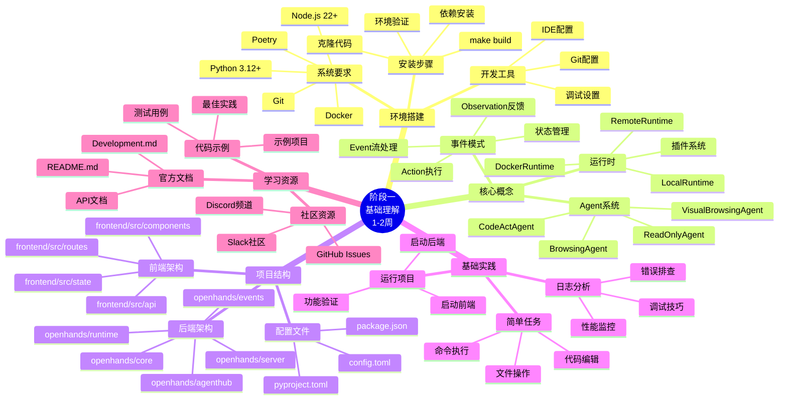
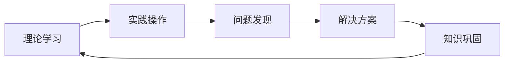

# 阶段一学习脑图：基础理解



## 🎯 重点学习路径

### 1. 环境搭建路径
```
系统检查 → 依赖安装 → 项目构建 → 功能验证 → 开发配置
```

### 2. 概念理解路径
```
Agent概念 → 事件模式 → 运行时系统 → 工具集成 → 架构理解
```

### 3. 代码探索路径
```
入口文件 → 核心模块 → 配置系统 → 工具函数 → 测试代码
```

### 4. 实践学习路径
```
基础运行 → 简单任务 → 日志分析 → 问题排查 → 功能测试
```

## 📊 知识点权重分布

| 知识领域 | 重要程度 | 学习时间占比 | 实践比重 |
|---------|----------|-------------|----------|
| 环境搭建 | ⭐⭐⭐⭐⭐ | 25% | 80% |
| 核心概念 | ⭐⭐⭐⭐⭐ | 35% | 40% |
| 项目结构 | ⭐⭐⭐⭐ | 25% | 60% |
| 基础实践 | ⭐⭐⭐⭐ | 15% | 90% |

## 🔄 学习循环



## 📈 进度里程碑

### 第1周里程碑
- [ ] 环境搭建完成
- [ ] 项目成功运行
- [ ] 核心概念理解
- [ ] 代码结构熟悉

### 第2周里程碑
- [ ] 完成基础实践项目
- [ ] 能够独立排查常见问题
- [ ] 理解主要模块功能
- [ ] 准备进入下一阶段

## 🎨 可视化学习工具

### 架构图理解
```
用户界面 (Frontend)
    ↓
API网关 (Server)
    ↓
Agent控制器 (Controller)
    ↓
运行时环境 (Runtime)
    ↓
工具执行 (Tools)
```

### 数据流图
```
用户输入 → 消息处理 → Agent思考 → 动作执行 → 结果反馈 → 界面更新
```

## 💡 学习技巧

1. **渐进式学习**：从简单到复杂，逐步深入
2. **实践导向**：每学一个概念就动手实践
3. **问题驱动**：带着问题去学习，效果更好
4. **笔记记录**：记录重要概念和实践心得
5. **社区参与**：积极参与讨论，获取帮助

## 🔗 相关链接

- [官方文档](https://docs.all-hands.dev)
- [GitHub仓库](https://github.com/All-Hands-AI/OpenHands)
- [社区讨论](https://join.slack.com/t/openhands-ai/shared_invite/zt-3847of6xi-xuYJIPa6YIPg4ElbDWbtSA)
- [开发指南](../../Development.md)
