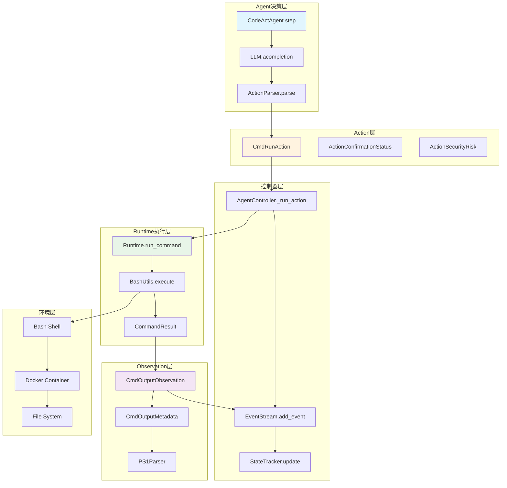
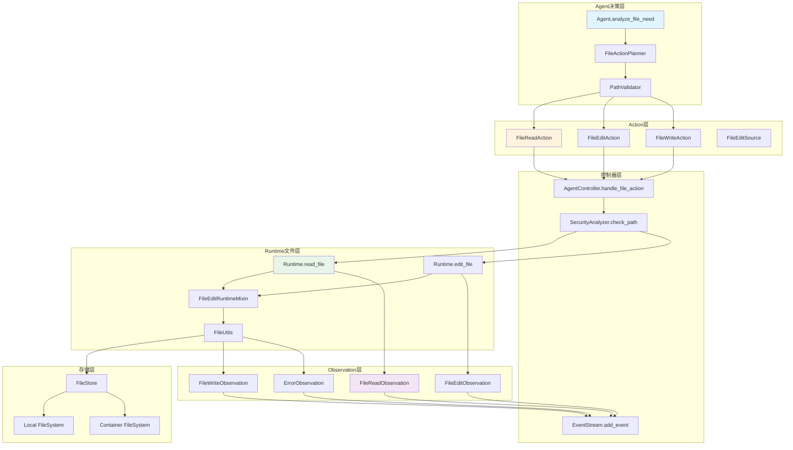
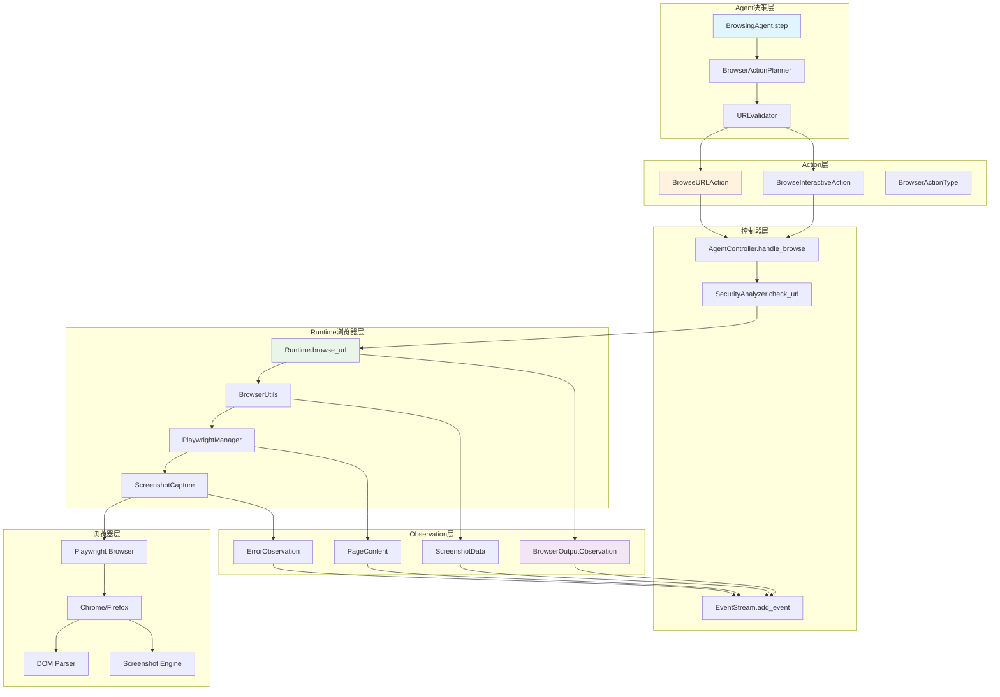
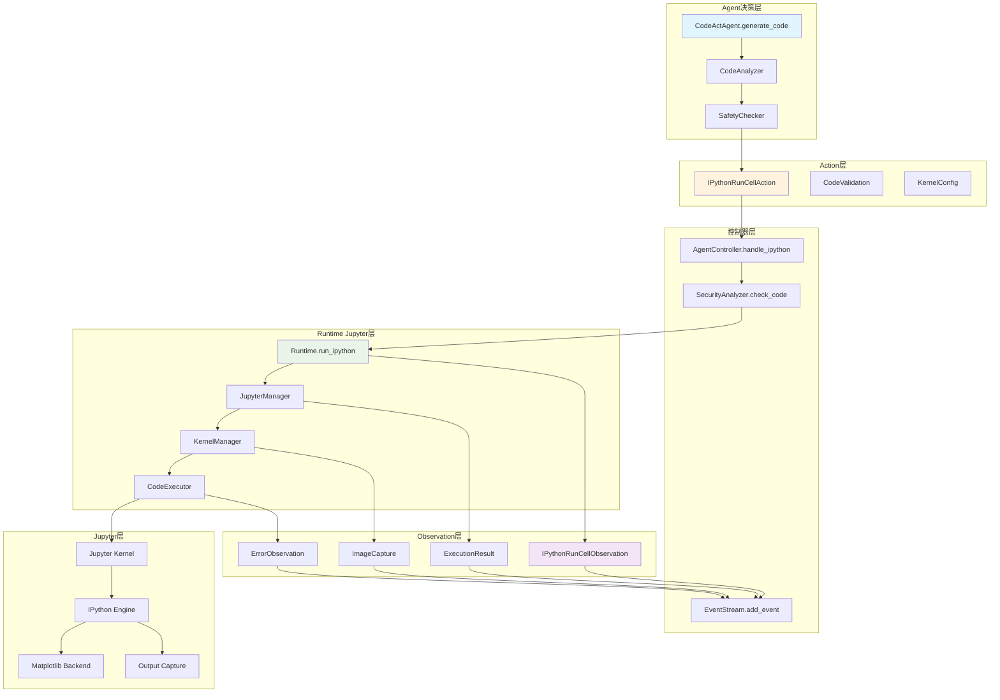
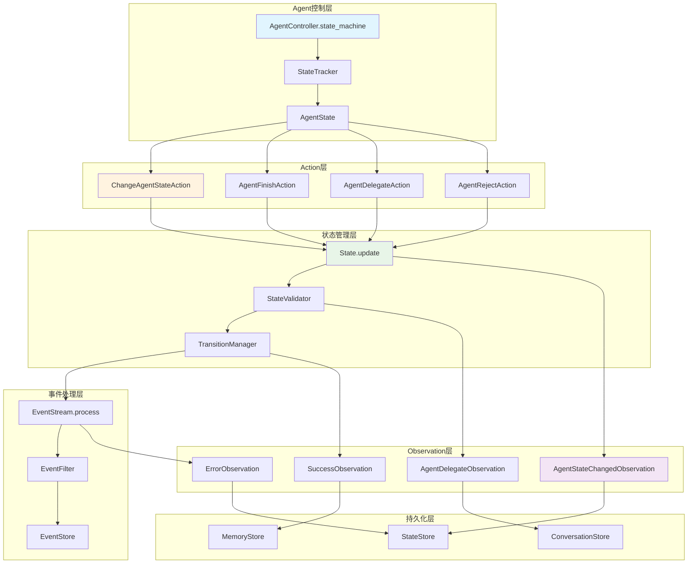

# OpenHands 模块依赖图详解

## 🎯 概述

本文档提供了OpenHands项目中Agent-Action-Observation模式相关模块的详细依赖关系图，按照不同的应用场景进行分类，帮助开发者逐步理解和学习系统架构。

## 📊 整体架构依赖图

```mermaid
graph TB
    subgraph "用户接口层"
        UI[Web UI]
        CLI[CLI Interface]
        API[REST API]
    end
    
    subgraph "控制层"
        AC[AgentController]
        SM[Session Manager]
        CM[Conversation Manager]
    end
    
    subgraph "Agent层"
        AB[Agent Base]
        CA[CodeAct Agent]
        BA[Browsing Agent]
        RA[ReadOnly Agent]
    end
    
    subgraph "事件系统"
        ES[Event Stream]
        EF[Event Filter]
        ESS[Event Store]
    end
    
    subgraph "Action系统"
        AA[Action Base]
        CRA[CmdRun Action]
        FEA[FileEdit Action]
        BUA[BrowseURL Action]
        IPA[IPython Action]
    end
    
    subgraph "Observation系统"
        OB[Observation Base]
        COO[CmdOutput Obs]
        FRO[FileRead Obs]
        BOO[BrowserOutput Obs]
        IPO[IPython Obs]
    end
    
    subgraph "Runtime层"
        RB[Runtime Base]
        DR[Docker Runtime]
        LR[Local Runtime]
        RR[Remote Runtime]
    end
    
    subgraph "LLM层"
        LLM[LLM Interface]
        LC[LLM Config]
        LM[LLM Metrics]
    end
    
    subgraph "存储层"
        FS[File Store]
        MS[Memory Store]
        CS[Config Store]
    end
    
    UI --> AC
    CLI --> AC
    API --> AC
    AC --> SM
    AC --> AB
    AB --> CA
    AB --> BA
    AB --> RA
    AC --> ES
    ES --> EF
    ES --> ESS
    AB --> AA
    AA --> CRA
    AA --> FEA
    AA --> BUA
    AA --> IPA
    RB --> OB
    OB --> COO
    OB --> FRO
    OB --> BOO
    OB --> IPO
    AC --> RB
    RB --> DR
    RB --> LR
    RB --> RR
    AB --> LLM
    LLM --> LC
    LLM --> LM
    AC --> FS
    AC --> MS
    AC --> CS
    
    style UI fill:#e3f2fd
    style AA fill:#fff3e0
    style OB fill:#f3e5f5
    style RB fill:#e8f5e8
    style LLM fill:#fce4ec
```



## 🔍 场景1：命令执行场景

### 模块依赖关系



### 关键代码文件

```python
# 1. Agent决策 - openhands/agenthub/codeact_agent/codeact_agent.py
class CodeActAgent(Agent):
    async def step(self, state: State) -> Action:
        messages = self._get_messages(state)
        response = await self.llm.acompletion(messages=messages)
        action = self._parse_response(response)
        return action

# 2. Action定义 - openhands/events/action/commands.py
@dataclass
class CmdRunAction(Action):
    command: str
    is_input: bool = False
    thought: str = ''
    blocking: bool = False
    runnable: ClassVar[bool] = True

# 3. Runtime执行 - openhands/runtime/base.py
class Runtime:
    async def run_command(self, action: CmdRunAction) -> CmdOutputObservation:
        result = await self._execute_bash_command(action.command)
        return CmdOutputObservation(
            content=result.stdout,
            command=action.command,
            metadata=CmdOutputMetadata(exit_code=result.exit_code)
        )

# 4. Observation处理 - openhands/events/observation/commands.py
@dataclass
class CmdOutputObservation(Observation):
    command: str
    metadata: CmdOutputMetadata
    
    @property
    def success(self) -> bool:
        return self.metadata.exit_code == 0
```

## 🔍 场景2：文件操作场景

### 模块依赖关系



### 关键代码文件

```python
# 1. 文件Action定义 - openhands/events/action/files.py
@dataclass
class FileReadAction(Action):
    path: str
    start: int = 1
    end: int = -1
    thought: str = ''

@dataclass
class FileEditAction(Action):
    path: str
    file_text: str
    start: int = 1
    end: int = -1
    thought: str = ''

# 2. 文件Runtime处理 - openhands/runtime/utils/files.py
class FileUtils:
    @staticmethod
    async def read_file(path: str, start: int = 1, end: int = -1) -> str:
        with open(path, 'r', encoding='utf-8') as f:
            lines = f.readlines()
            if end == -1:
                return ''.join(lines[start-1:])
            return ''.join(lines[start-1:end])

# 3. 文件编辑Mixin - openhands/runtime/utils/edit.py
class FileEditRuntimeMixin:
    async def edit_file(self, action: FileEditAction) -> FileEditObservation:
        try:
            # 执行文件编辑逻辑
            result = await self._perform_file_edit(action)
            return FileEditObservation(
                path=action.path,
                content=result.content,
                success=True
            )
        except Exception as e:
            return ErrorObservation(content=str(e))

# 4. 文件Observation - openhands/events/observation/files.py
@dataclass
class FileReadObservation(Observation):
    path: str
    content: str
    
    @property
    def message(self) -> str:
        return f'Read {len(self.content)} characters from {self.path}'
```

## 🔍 场景3：浏览器交互场景

### 模块依赖关系



### 关键代码文件

```python
# 1. 浏览器Action - openhands/events/action/browse.py
@dataclass
class BrowseURLAction(Action):
    url: str
    thought: str = ''
    
    @property
    def message(self) -> str:
        return f'Browsing URL: {self.url}'

@dataclass
class BrowseInteractiveAction(Action):
    browser_actions: str
    thought: str = ''

# 2. 浏览器Runtime - openhands/runtime/browser/utils.py
class BrowserUtils:
    @staticmethod
    async def browse_url(url: str) -> BrowserOutputObservation:
        async with playwright.async_playwright() as p:
            browser = await p.chromium.launch()
            page = await browser.new_page()
            await page.goto(url)
            
            content = await page.content()
            screenshot = await page.screenshot()
            
            return BrowserOutputObservation(
                url=url,
                content=content,
                screenshot=base64.b64encode(screenshot).decode()
            )

# 3. 浏览器Observation - openhands/events/observation/browse.py
@dataclass
class BrowserOutputObservation(Observation):
    url: str
    screenshot: str | None = None
    error: bool = False
    
    @property
    def message(self) -> str:
        return f'Browsed {self.url}'

# 4. 浏览器Agent - openhands/agenthub/browsing_agent/browsing_agent.py
class BrowsingAgent(Agent):
    async def step(self, state: State) -> Action:
        # 分析当前页面状态
        current_url = self._get_current_url(state)
        
        # 决定下一步浏览行动
        if self._need_navigate():
            return BrowseURLAction(url=self._get_target_url())
        else:
            return BrowseInteractiveAction(
                browser_actions=self._get_interaction_commands()
            )
```

## 🔍 场景4：Python代码执行场景

### 模块依赖关系



### 关键代码文件

```python
# 1. IPython Action - openhands/events/action/commands.py
@dataclass
class IPythonRunCellAction(Action):
    code: str
    thought: str = ''
    include_extra: bool = True
    kernel_init_code: str = ''
    
    @property
    def message(self) -> str:
        return f'Running Python code: {self.code[:50]}...'

# 2. Jupyter Runtime - openhands/runtime/plugins/jupyter/__init__.py
class JupyterRequirement(PluginRequirement):
    name: str = 'jupyter'
    
    async def initialize(self, runtime: Runtime):
        # 初始化Jupyter内核
        await self._setup_kernel(runtime)
        await self._configure_matplotlib(runtime)

# 3. IPython Observation - openhands/events/observation/commands.py
@dataclass
class IPythonRunCellObservation(Observation):
    code: str
    image_urls: list[str] | None = None
    
    @property
    def success(self) -> bool:
        return True  # IPython总是成功执行
    
    def __str__(self) -> str:
        result = f'**IPythonRunCellObservation**\n{self.content}'
        if self.image_urls:
            result += f'\nImages: {len(self.image_urls)}'
        return result

# 4. 代码执行工具 - openhands/runtime/utils/ipython.py
class IPythonUtils:
    @staticmethod
    async def execute_code(code: str, kernel_id: str) -> dict:
        # 在Jupyter内核中执行代码
        result = await kernel_manager.execute(
            code=code,
            kernel_id=kernel_id,
            capture_output=True
        )
        
        return {
            'stdout': result.stdout,
            'stderr': result.stderr,
            'display_data': result.display_data,
            'images': result.images
        }
```

## 🔍 场景5：Agent状态管理场景

### 模块依赖关系



### 关键代码文件

```python
# 1. Agent状态Action - openhands/events/action/agent.py
@dataclass
class ChangeAgentStateAction(Action):
    agent_state: AgentState
    thought: str = ''

@dataclass
class AgentFinishAction(Action):
    outputs: dict[str, Any] = field(default_factory=dict)
    thought: str = ''

# 2. 状态管理 - openhands/controller/state/state.py
@dataclass
class State:
    agent_state: AgentState = AgentState.INIT
    max_iterations: int = 100
    iteration: int = 0
    
    def update_agent_state(self, new_state: AgentState):
        self.agent_state = new_state
        self.last_updated = datetime.now()

# 3. 状态追踪 - openhands/controller/state/state_tracker.py
class StateTracker:
    def __init__(self, state: State):
        self.state = state
        self.history: list[AgentState] = []
    
    def transition_to(self, new_state: AgentState) -> bool:
        if self._is_valid_transition(self.state.agent_state, new_state):
            self.history.append(self.state.agent_state)
            self.state.update_agent_state(new_state)
            return True
        return False

# 4. Agent状态Observation - openhands/events/observation/agent.py
@dataclass
class AgentStateChangedObservation(Observation):
    agent_state: AgentState
    
    @property
    def message(self) -> str:
        return f'Agent state changed to {self.agent_state}'
```

## 📋 完整模块清单

### 核心事件模块

| 模块路径 | 主要类 | 功能描述 | 依赖关系 |
|---------|--------|----------|----------|
| `openhands.events.event` | `Event`, `EventSource` | 事件基类和来源定义 | 无依赖 |
| `openhands.events.stream` | `EventStream` | 事件流管理 | 依赖 `Event` |
| `openhands.events.event_store` | `EventStore` | 事件持久化 | 依赖 `Event`, `EventStream` |

### Action模块层次

| 层级 | 模块路径 | 主要类 | 功能描述 |
|------|---------|--------|----------|
| 基础层 | `openhands.events.action.action` | `Action` | Action基类 |
| 命令层 | `openhands.events.action.commands` | `CmdRunAction`, `IPythonRunCellAction` | 命令执行 |
| 文件层 | `openhands.events.action.files` | `FileReadAction`, `FileEditAction` | 文件操作 |
| 浏览器层 | `openhands.events.action.browse` | `BrowseURLAction`, `BrowseInteractiveAction` | 浏览器交互 |
| 消息层 | `openhands.events.action.message` | `MessageAction`, `SystemMessageAction` | 消息处理 |
| Agent层 | `openhands.events.action.agent` | `AgentFinishAction`, `AgentDelegateAction` | Agent控制 |

### Observation模块层次

| 层级 | 模块路径 | 主要类 | 功能描述 |
|------|---------|--------|----------|
| 基础层 | `openhands.events.observation.observation` | `Observation` | Observation基类 |
| 命令层 | `openhands.events.observation.commands` | `CmdOutputObservation`, `IPythonRunCellObservation` | 命令结果 |
| 文件层 | `openhands.events.observation.files` | `FileReadObservation`, `FileEditObservation` | 文件操作结果 |
| 浏览器层 | `openhands.events.observation.browse` | `BrowserOutputObservation` | 浏览器结果 |
| 错误层 | `openhands.events.observation.error` | `ErrorObservation` | 错误信息 |
| Agent层 | `openhands.events.observation.agent` | `AgentStateChangedObservation` | Agent状态 |

### 控制器模块层次

| 层级 | 模块路径 | 主要类 | 功能描述 |
|------|---------|--------|----------|
| 核心层 | `openhands.controller.agent_controller` | `AgentController` | 主控制器 |
| Agent层 | `openhands.controller.agent` | `Agent` | Agent基类 |
| 状态层 | `openhands.controller.state.state` | `State` | 状态管理 |
| 追踪层 | `openhands.controller.state.state_tracker` | `StateTracker` | 状态追踪 |

### Runtime模块层次

| 层级 | 模块路径 | 主要类 | 功能描述 |
|------|---------|--------|----------|
| 基础层 | `openhands.runtime.base` | `Runtime` | Runtime基类 |
| 实现层 | `openhands.runtime.impl.docker.docker_runtime` | `DockerRuntime` | Docker实现 |
| 实现层 | `openhands.runtime.impl.local.local_runtime` | `LocalRuntime` | 本地实现 |
| 工具层 | `openhands.runtime.utils.bash` | `BashUtils` | Bash工具 |
| 工具层 | `openhands.runtime.utils.files` | `FileUtils` | 文件工具 |

## 🎯 学习路径建议

### 第一阶段：理解基础概念
1. 从 `Event` 基类开始，理解事件系统的基础
2. 学习 `Action` 和 `Observation` 的基本结构
3. 理解 `EventStream` 的工作原理

### 第二阶段：掌握简单场景
1. 深入学习命令执行场景的完整流程
2. 理解 `CmdRunAction` → `Runtime` → `CmdOutputObservation` 的流程
3. 实践代码追踪和调试

### 第三阶段：扩展到复杂场景
1. 学习文件操作场景的实现
2. 理解浏览器交互的复杂性
3. 掌握Python代码执行的机制

### 第四阶段：深入系统架构
1. 理解Agent状态管理
2. 学习事件流的高级特性
3. 掌握Runtime的扩展机制

### 第五阶段：实践和扩展
1. 实现自定义的Action和Observation
2. 开发专用的Agent
3. 扩展Runtime功能

## 🔗 相关资源

- [Agent-Action-Observation模式详解](./agent-action-observation-pattern.md)
- [OpenHands架构概览](../README.md)
- [深入理解指南](../stage2-deep-dive/README.md)
- [扩展开发指南](../stage4-extension/README.md)