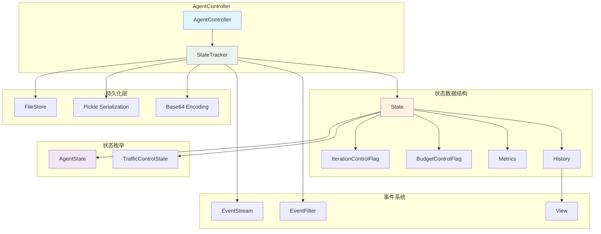
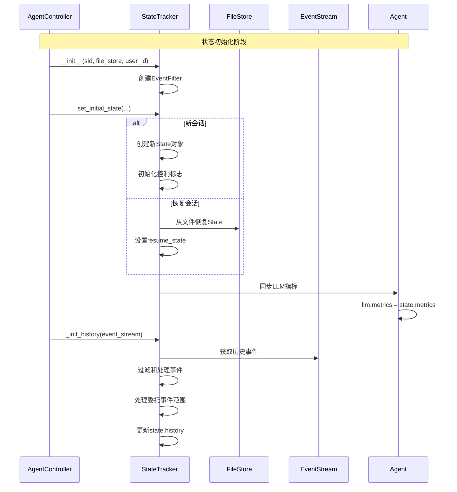
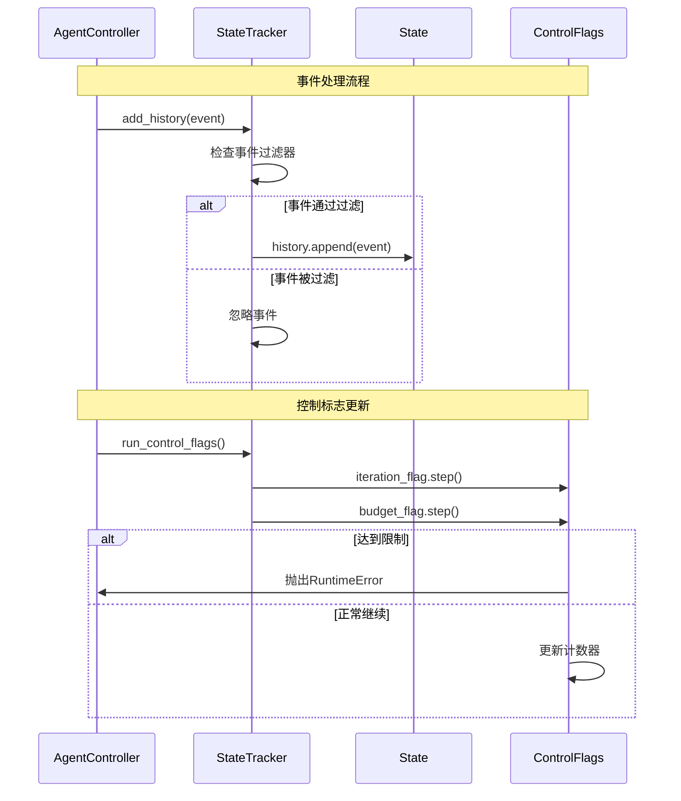
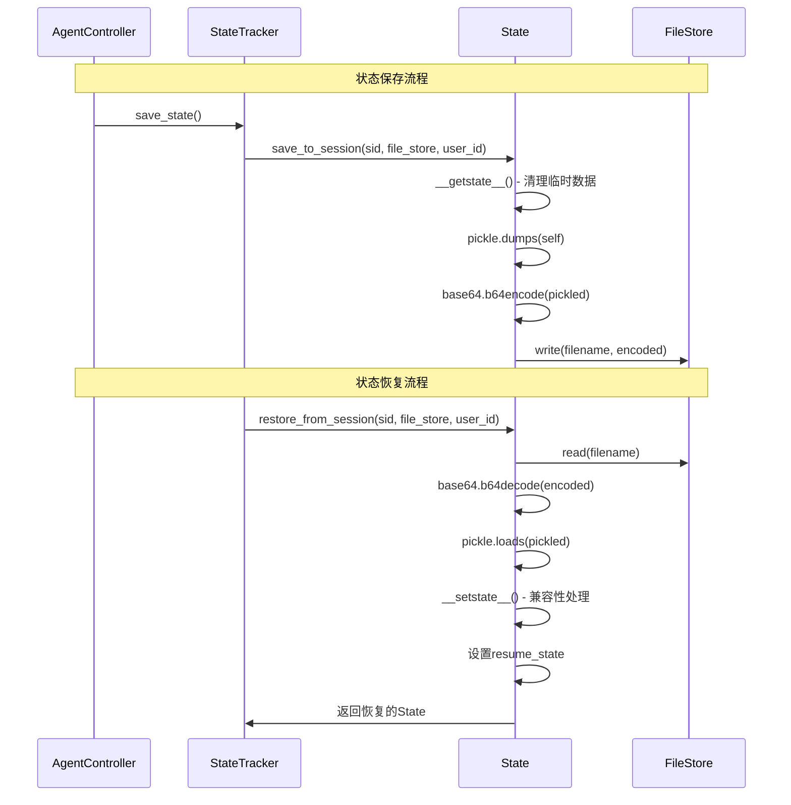
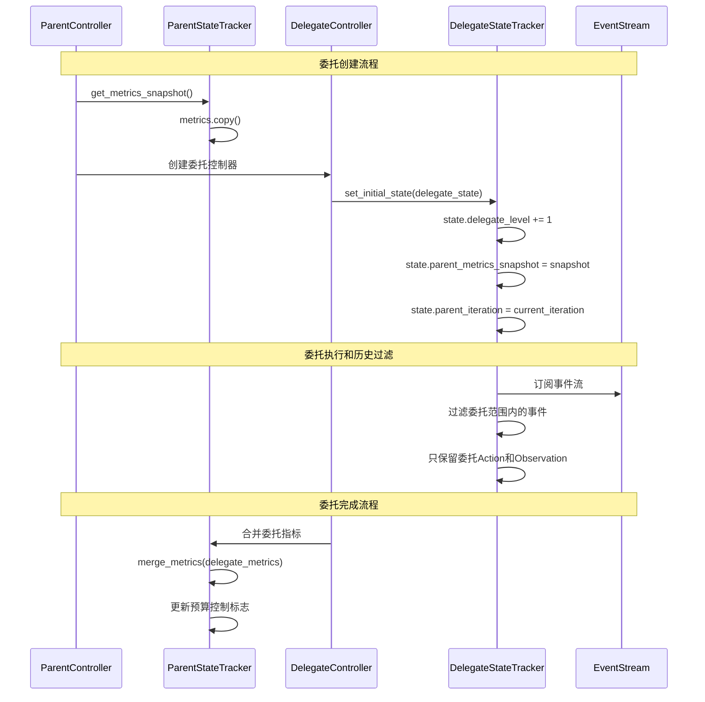
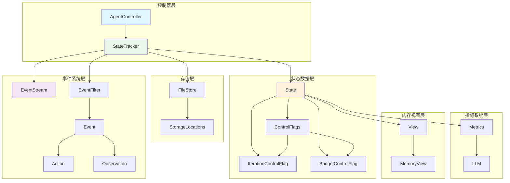
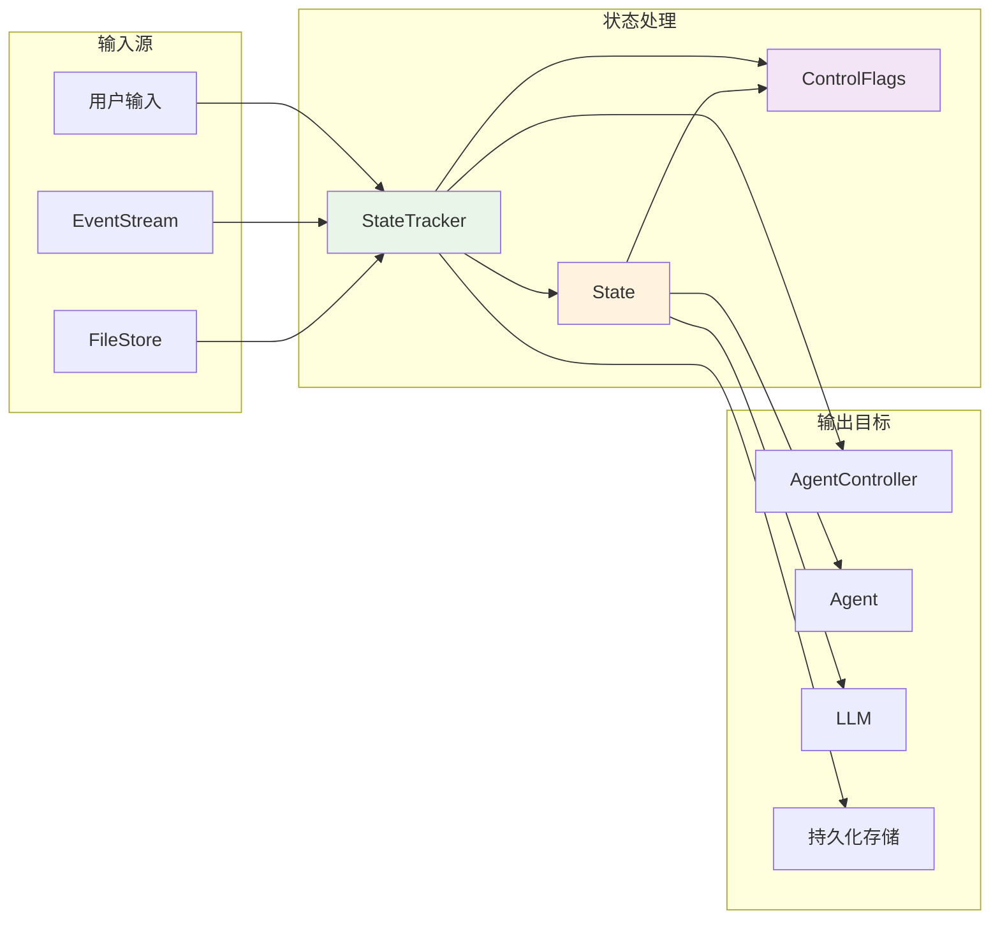

# AgentController 状态管理深度分析

## 🎯 概述

AgentController的状态管理是OpenHands系统的核心组件之一，负责维护Agent的执行状态、历史记录、资源控制和会话持久化。本文档从数据结构、使用流程、依赖关系等多个角度深入分析状态管理机制。

## 🏗️ 状态管理架构图



## 📊 核心数据结构分析

### 1. State 类 - 状态核心

```python
# 文件：openhands/controller/state/state.py

@dataclass
class State:
    """Agent运行状态的核心数据结构"""
    
    # === 基础标识信息 ===
    session_id: str = ''                    # 会话ID
    user_id: str | None = None              # 用户ID
    
    # === 控制标志 ===
    iteration_flag: IterationControlFlag    # 迭代控制
    budget_flag: BudgetControlFlag | None   # 预算控制
    confirmation_mode: bool = False         # 确认模式
    
    # === 核心状态数据 ===
    history: list[Event] = []               # 事件历史
    inputs: dict = {}                       # 输入数据
    outputs: dict = {}                      # 输出数据
    agent_state: AgentState                 # Agent状态
    resume_state: AgentState | None = None  # 恢复状态
    
    # === 指标和统计 ===
    metrics: Metrics                        # 全局指标
    delegate_level: int = 0                 # 委托层级
    
    # === 事件范围追踪 ===
    start_id: int = -1                      # 起始事件ID
    end_id: int = -1                        # 结束事件ID
    
    # === 委托相关 ===
    parent_metrics_snapshot: Metrics | None = None  # 父级指标快照
    parent_iteration: int = 100                      # 父级迭代数
    
    # === 扩展数据 ===
    extra_data: dict[str, Any] = {}         # 额外数据
    last_error: str = ''                    # 最后错误
```

**State类的核心职责：**
- 🏷️ **身份管理**：维护会话和用户标识
- 🎛️ **状态控制**：管理Agent的执行状态和控制标志
- 📚 **历史记录**：保存完整的事件历史
- 📊 **指标统计**：跟踪性能和成本指标
- 🔄 **会话持久化**：支持状态的保存和恢复
- 🎭 **多级委托**：支持Agent间的委托关系

### 2. StateTracker 类 - 状态管理器

```python
# 文件：openhands/controller/state/state_tracker.py

class StateTracker:
    """状态追踪和管理的核心组件"""
    
    def __init__(self, sid: str | None, file_store: FileStore | None, user_id: str | None):
        self.sid = sid
        self.file_store = file_store
        self.user_id = user_id
        
        # 事件过滤器 - 过滤不相关的事件
        self.agent_history_filter = EventFilter(
            exclude_types=(
                NullAction,
                NullObservation,
                ChangeAgentStateAction,
                AgentStateChangedObservation,
            ),
            exclude_hidden=True,
        )
    
    def set_initial_state(self, id: str, agent: Agent, state: State | None, 
                         max_iterations: int, max_budget_per_task: float | None, 
                         confirmation_mode: bool = False) -> None:
        """设置初始状态"""
        
        if state is None:
            # 创建新状态
            self.state = State(
                session_id=id.removesuffix('-delegate'),
                user_id=self.user_id,
                iteration_flag=IterationControlFlag(
                    limit_increase_amount=max_iterations,
                    current_value=0,
                    max_value=max_iterations,
                ),
                budget_flag=BudgetControlFlag(...) if max_budget_per_task else None,
                confirmation_mode=confirmation_mode,
            )
        else:
            # 使用现有状态
            self.state = state
        
        # 同步Agent的LLM指标
        agent.llm.metrics = self.state.metrics
```

**StateTracker的核心职责：**
- 🔧 **状态初始化**：创建或恢复Agent状态
- 📝 **历史管理**：维护和过滤事件历史
- 💾 **持久化管理**：处理状态的保存和加载
- 📊 **指标同步**：保持各组件间指标一致性
- 🎛️ **控制标志管理**：管理迭代和预算限制

### 3. 控制标志系统

#### IterationControlFlag - 迭代控制

```python
# 文件：openhands/controller/state/control_flags.py

@dataclass
class IterationControlFlag(ControlFlag[int]):
    """迭代次数控制标志"""
    
    def reached_limit(self) -> bool:
        """检查是否达到迭代限制"""
        self._hit_limit = self.current_value >= self.max_value
        return self._hit_limit
    
    def increase_limit(self, headless_mode: bool) -> None:
        """扩展迭代限制"""
        if not headless_mode and self._hit_limit:
            self.max_value += self.limit_increase_amount
            self._hit_limit = False
    
    def step(self):
        """执行一步迭代"""
        if self.reached_limit():
            raise RuntimeError(
                f'Agent reached maximum iteration. '
                f'Current: {self.current_value}, max: {self.max_value}'
            )
        self.current_value += 1
```

#### BudgetControlFlag - 预算控制

```python
@dataclass
class BudgetControlFlag(ControlFlag[float]):
    """预算控制标志"""
    
    def reached_limit(self) -> bool:
        """检查是否达到预算限制"""
        self._hit_limit = self.current_value >= self.max_value
        return self._hit_limit
    
    def increase_limit(self, headless_mode) -> None:
        """扩展预算限制"""
        if self._hit_limit:
            self.max_value = self.current_value + self.limit_increase_amount
            self._hit_limit = False
    
    def step(self):
        """检查预算状态"""
        if self.reached_limit():
            raise RuntimeError(
                f'Agent reached maximum budget. '
                f'Current: {self.current_value:.2f}, max: {self.max_value:.2f}'
            )
```

### 4. AgentState 枚举 - 状态定义

```python
# 文件：openhands/core/schema/agent.py

class AgentState(str, Enum):
    LOADING = 'loading'                           # 加载中
    RUNNING = 'running'                           # 运行中
    AWAITING_USER_INPUT = 'awaiting_user_input'   # 等待用户输入
    PAUSED = 'paused'                            # 暂停
    STOPPED = 'stopped'                          # 停止
    FINISHED = 'finished'                        # 完成
    REJECTED = 'rejected'                        # 拒绝
    ERROR = 'error'                              # 错误
    AWAITING_USER_CONFIRMATION = 'awaiting_user_confirmation'  # 等待确认
    USER_CONFIRMED = 'user_confirmed'            # 用户确认
    USER_REJECTED = 'user_rejected'              # 用户拒绝
    RATE_LIMITED = 'rate_limited'                # 速率限制
```

## 🔄 状态管理流程分析

### 1. 状态初始化流程



### 2. 事件处理流程



### 3. 状态持久化流程



### 4. 委托状态管理流程



## 🔍 依赖关系分析

### 1. 模块依赖图



### 2. 数据流向分析



## 📋 关键使用场景分析

### 1. 新会话创建场景

```python
# AgentController初始化时的状态创建
class AgentController:
    def __init__(self, agent: Agent, event_stream: EventStream, ...):
        # 创建StateTracker
        self.state_tracker = StateTracker(sid, file_store, user_id)
        
        # 设置初始状态
        self.state_tracker.set_initial_state(
            id=self.id,
            agent=agent,
            state=initial_state,  # None表示新会话
            max_iterations=iteration_delta,
            max_budget_per_task=budget_per_task_delta,
            confirmation_mode=confirmation_mode,
        )
        
        # 初始化历史
        self.state_tracker._init_history(self.event_stream)
        
        # 共享状态引用
        self.state = self.state_tracker.state
```

### 2. 会话恢复场景

```python
# 从持久化存储恢复会话状态
def restore_session(sid: str, file_store: FileStore, user_id: str):
    try:
        # 恢复状态
        state = State.restore_from_session(sid, file_store, user_id)
        
        # 检查可恢复状态
        if state.agent_state in RESUMABLE_STATES:
            state.resume_state = state.agent_state
        else:
            state.resume_state = None
        
        # 设置为加载状态
        state.agent_state = AgentState.LOADING
        
        return state
        
    except FileNotFoundError:
        # 创建新状态
        return None
```

### 3. 事件历史管理场景

```python
# StateTracker中的历史初始化
def _init_history(self, event_stream: EventStream) -> None:
    # 确定事件范围
    start_id = self.state.start_id if self.state.start_id >= 0 else 0
    end_id = self.state.end_id if self.state.end_id >= 0 else event_stream.get_latest_event_id()
    
    # 获取过滤后的事件
    events = list(event_stream.search_events(
        start_id=start_id,
        end_id=end_id,
        reverse=False,
        filter=self.agent_history_filter,
    ))
    
    # 处理委托事件范围
    delegate_ranges = self._find_delegate_ranges(events)
    if delegate_ranges:
        events = self._filter_delegate_events(events, delegate_ranges)
    
    # 更新状态
    self.state.history = events
    self.state.start_id = start_id
```

### 4. 控制标志管理场景

```python
# 迭代和预算控制的使用
class AgentController:
    async def _step_with_exception_handling(self) -> None:
        try:
            # 检查控制标志
            self.state_tracker.run_control_flags()
            
            # 执行Agent步骤
            action = await self.agent.step(self.state)
            
            # 同步预算
            self.state_tracker.sync_budget_flag_with_metrics()
            
        except RuntimeError as e:
            # 处理限制达到的情况
            if 'maximum iteration' in str(e) or 'maximum budget' in str(e):
                # 尝试扩展限制
                self.state_tracker.maybe_increase_control_flags_limits(self.headless_mode)
                # 或者结束任务
                await self.set_agent_state_to(AgentState.FINISHED)
```

### 5. 委托状态管理场景

```python
# 创建委托Agent时的状态管理
async def start_delegate(self, action: AgentDelegateAction) -> None:
    # 获取父级指标快照
    parent_metrics_snapshot = self.state_tracker.get_metrics_snapshot()
    
    # 创建委托状态
    delegate_state = State(
        session_id=f"{self.id}-delegate",
        user_id=self.user_id,
        delegate_level=self.state.delegate_level + 1,
        parent_metrics_snapshot=parent_metrics_snapshot,
        parent_iteration=self.state.iteration_flag.current_value,
        # ... 其他配置
    )
    
    # 创建委托控制器
    self.delegate = AgentController(
        agent=delegate_agent,
        event_stream=self.event_stream,
        initial_state=delegate_state,
        is_delegate=True,
        # ... 其他参数
    )
```

## 🎯 性能优化和最佳实践

### 1. 内存管理优化

```python
# State类中的内存优化
class State:
    @property
    def view(self) -> View:
        """使用缓存的视图以提高性能"""
        # 计算历史校验和
        history_checksum = len(self.history)
        old_history_checksum = getattr(self, '_history_checksum', -1)
        
        # 只有历史变化时才重新创建视图
        if history_checksum != old_history_checksum:
            self._history_checksum = history_checksum
            self._view = View.from_events(self.history)
        
        return self._view
    
    def __getstate__(self) -> dict:
        """序列化时的优化"""
        state = self.__dict__.copy()
        
        # 不序列化历史（从事件流恢复）
        state['history'] = []
        
        # 移除缓存属性
        state.pop('_history_checksum', None)
        state.pop('_view', None)
        
        # 移除废弃字段
        deprecated_fields = ['iteration', 'local_iteration', 'max_iterations', 
                           'traffic_control_state', 'local_metrics', 'delegates']
        for field in deprecated_fields:
            state.pop(field, None)
        
        return state
```

### 2. 事件过滤优化

```python
# StateTracker中的事件过滤优化
class StateTracker:
    def __init__(self, ...):
        # 预定义过滤器以提高性能
        self.agent_history_filter = EventFilter(
            exclude_types=(
                NullAction,
                NullObservation,
                ChangeAgentStateAction,
                AgentStateChangedObservation,
            ),
            exclude_hidden=True,
        )
    
    def _filter_delegate_events(self, events: list[Event], 
                               delegate_ranges: list[tuple[int, int]]) -> list[Event]:
        """高效的委托事件过滤"""
        if not delegate_ranges:
            return events
        
        filtered_events = []
        event_dict = {event.id: event for event in events}
        
        # 使用集合操作提高性能
        delegate_ids = set()
        for start_id, end_id in delegate_ranges:
            delegate_ids.update([start_id, end_id])
            # 排除范围内的其他事件
            for event in events:
                if start_id < event.id < end_id:
                    delegate_ids.add(event.id)
        
        # 过滤事件
        for event in events:
            if event.id not in delegate_ids or event.id in {r[0] for r in delegate_ranges} | {r[1] for r in delegate_ranges}:
                filtered_events.append(event)
        
        return filtered_events
```

### 3. 状态同步优化

```python
# 指标同步的优化策略
class StateTracker:
    def merge_metrics(self, metrics: Metrics):
        """优化的指标合并"""
        # 批量更新以减少计算开销
        self.state.metrics.merge(metrics)
        
        # 只在必要时更新预算标志
        if self.state.budget_flag and metrics.accumulated_cost > 0:
            self.state.budget_flag.current_value = self.state.metrics.accumulated_cost
    
    def sync_budget_flag_with_metrics(self):
        """同步预算标志的优化版本"""
        if self.state.budget_flag:
            # 避免不必要的更新
            new_cost = self.state.metrics.accumulated_cost
            if new_cost != self.state.budget_flag.current_value:
                self.state.budget_flag.current_value = new_cost
```

## 🛡️ 错误处理和恢复机制

### 1. 状态恢复错误处理

```python
class State:
    @staticmethod
    def restore_from_session(sid: str, file_store: FileStore, user_id: str | None = None) -> 'State':
        """健壮的状态恢复机制"""
        try:
            # 尝试从新位置恢复
            encoded = file_store.read(get_conversation_agent_state_filename(sid, user_id))
            pickled = base64.b64decode(encoded)
            state = pickle.loads(pickled)
            
        except FileNotFoundError:
            # 尝试从旧位置恢复（向后兼容）
            if user_id:
                try:
                    filename = get_conversation_agent_state_filename(sid)
                    encoded = file_store.read(filename)
                    pickled = base64.b64decode(encoded)
                    state = pickle.loads(pickled)
                except FileNotFoundError:
                    raise FileNotFoundError(f'Could not restore state from session file for sid: {sid}')
            else:
                raise
                
        except Exception as e:
            logger.error(f'Could not restore state from session: {e}')
            raise
        
        # 验证和修复状态
        state = cls._validate_and_fix_state(state)
        return state
    
    @classmethod
    def _validate_and_fix_state(cls, state: 'State') -> 'State':
        """验证和修复恢复的状态"""
        # 设置恢复状态
        if state.agent_state in RESUMABLE_STATES:
            state.resume_state = state.agent_state
        else:
            state.resume_state = None
        
        # 重置为加载状态
        state.agent_state = AgentState.LOADING
        
        # 确保必要属性存在
        if not hasattr(state, 'iteration_flag'):
            state.iteration_flag = IterationControlFlag(100, 0, 100)
        
        if not hasattr(state, 'budget_flag'):
            state.budget_flag = None
        
        return state
```

### 2. 控制标志错误处理

```python
class IterationControlFlag:
    def step(self):
        """带错误处理的步骤执行"""
        try:
            if self.reached_limit():
                raise RuntimeError(
                    f'Agent reached maximum iteration. '
                    f'Current: {self.current_value}, max: {self.max_value}'
                )
            self.current_value += 1
            
        except RuntimeError as e:
            # 记录错误信息
            logger.warning(f'Iteration limit reached: {e}')
            raise
        except Exception as e:
            # 处理意外错误
            logger.error(f'Unexpected error in iteration control: {e}')
            raise RuntimeError(f'Iteration control error: {e}')

class BudgetControlFlag:
    def step(self):
        """带错误处理的预算检查"""
        try:
            if self.reached_limit():
                current_str = f'{self.current_value:.2f}'
                max_str = f'{self.max_value:.2f}'
                raise RuntimeError(
                    f'Agent reached maximum budget. '
                    f'Current: {current_str}, max: {max_str}'
                )
                
        except RuntimeError as e:
            logger.warning(f'Budget limit reached: {e}')
            raise
        except Exception as e:
            logger.error(f'Unexpected error in budget control: {e}')
            raise RuntimeError(f'Budget control error: {e}')
```

## 🔧 扩展和自定义指南

### 1. 自定义控制标志

```python
# 创建自定义控制标志
@dataclass
class TimeControlFlag(ControlFlag[float]):
    """时间控制标志"""
    
    start_time: float = field(default_factory=time.time)
    
    def reached_limit(self) -> bool:
        """检查是否达到时间限制"""
        elapsed = time.time() - self.start_time
        self._hit_limit = elapsed >= self.max_value
        return self._hit_limit
    
    def increase_limit(self, headless_mode: bool) -> None:
        """扩展时间限制"""
        if self._hit_limit:
            self.max_value += self.limit_increase_amount
            self._hit_limit = False
    
    def step(self):
        """检查时间限制"""
        if self.reached_limit():
            elapsed = time.time() - self.start_time
            raise RuntimeError(
                f'Agent reached maximum time limit. '
                f'Elapsed: {elapsed:.2f}s, max: {self.max_value:.2f}s'
            )

# 在State中使用自定义控制标志
@dataclass
class ExtendedState(State):
    time_flag: TimeControlFlag | None = None
```

### 2. 自定义状态扩展

```python
# 扩展State类以支持特定需求
@dataclass
class TaskSpecificState(State):
    """任务特定的状态扩展"""
    
    # 任务特定字段
    task_type: str = ''
    task_progress: float = 0.0
    subtasks: list[dict] = field(default_factory=list)
    
    # 自定义方法
    def update_progress(self, progress: float):
        """更新任务进度"""
        self.task_progress = max(0.0, min(1.0, progress))
        
        # 记录进度变化
        logger.info(f'Task progress updated: {self.task_progress:.2%}')
    
    def add_subtask(self, subtask: dict):
        """添加子任务"""
        subtask['created_at'] = datetime.now().isoformat()
        subtask['status'] = 'pending'
        self.subtasks.append(subtask)
    
    def complete_subtask(self, subtask_id: str):
        """完成子任务"""
        for subtask in self.subtasks:
            if subtask.get('id') == subtask_id:
                subtask['status'] = 'completed'
                subtask['completed_at'] = datetime.now().isoformat()
                break
```

### 3. 自定义StateTracker

```python
# 扩展StateTracker以支持特定功能
class EnhancedStateTracker(StateTracker):
    """增强的状态追踪器"""
    
    def __init__(self, *args, **kwargs):
        super().__init__(*args, **kwargs)
        
        # 添加自定义过滤器
        self.custom_filter = EventFilter(
            include_types=(MessageAction, CmdRunAction, FileEditAction),
            exclude_hidden=True,
        )
    
    def get_filtered_history(self, filter_type: str = 'default') -> list[Event]:
        """获取特定过滤器的历史"""
        if filter_type == 'custom':
            return [event for event in self.state.history 
                   if self.custom_filter.include(event)]
        else:
            return self.state.history
    
    def export_state_summary(self) -> dict:
        """导出状态摘要"""
        return {
            'session_id': self.state.session_id,
            'agent_state': self.state.agent_state,
            'iteration_count': self.state.iteration_flag.current_value,
            'budget_used': self.state.metrics.accumulated_cost,
            'event_count': len(self.state.history),
            'delegate_level': self.state.delegate_level,
            'last_error': self.state.last_error,
        }
```

## 📊 监控和调试工具

### 1. 状态监控

```python
class StateMonitor:
    """状态监控工具"""
    
    def __init__(self, state_tracker: StateTracker):
        self.state_tracker = state_tracker
        self.snapshots = []
    
    def take_snapshot(self) -> dict:
        """创建状态快照"""
        snapshot = {
            'timestamp': datetime.now().isoformat(),
            'agent_state': self.state_tracker.state.agent_state,
            'iteration': self.state_tracker.state.iteration_flag.current_value,
            'budget': self.state_tracker.state.metrics.accumulated_cost,
            'history_length': len(self.state_tracker.state.history),
            'memory_usage': self._get_memory_usage(),
        }
        self.snapshots.append(snapshot)
        return snapshot
    
    def _get_memory_usage(self) -> dict:
        """获取内存使用情况"""
        import sys
        return {
            'state_size': sys.getsizeof(self.state_tracker.state),
            'history_size': sys.getsizeof(self.state_tracker.state.history),
            'total_events': len(self.state_tracker.state.history),
        }
    
    def generate_report(self) -> str:
        """生成监控报告"""
        if not self.snapshots:
            return "No snapshots available"
        
        latest = self.snapshots[-1]
        report = f"""
State Monitoring Report
======================
Current State: {latest['agent_state']}
Iterations: {latest['iteration']}
Budget Used: ${latest['budget']:.2f}
History Events: {latest['history_length']}
Memory Usage: {latest['memory_usage']['state_size']} bytes

Snapshot History: {len(self.snapshots)} snapshots
        """
        return report
```

### 2. 调试工具

```python
class StateDebugger:
    """状态调试工具"""
    
    @staticmethod
    def validate_state_consistency(state: State) -> list[str]:
        """验证状态一致性"""
        issues = []
        
        # 检查基本字段
        if not state.session_id:
            issues.append("Missing session_id")
        
        # 检查控制标志
        if state.iteration_flag.current_value < 0:
            issues.append("Negative iteration count")
        
        if state.budget_flag and state.budget_flag.current_value < 0:
            issues.append("Negative budget value")
        
        # 检查历史一致性
        if state.start_id > state.end_id and state.end_id >= 0:
            issues.append("Invalid event ID range")
        
        # 检查委托层级
        if state.delegate_level < 0:
            issues.append("Invalid delegate level")
        
        return issues
    
    @staticmethod
    def analyze_state_transitions(history: list[Event]) -> dict:
        """分析状态转换"""
        transitions = []
        current_state = None
        
        for event in history:
            if isinstance(event, ChangeAgentStateAction):
                if current_state:
                    transitions.append({
                        'from': current_state,
                        'to': event.agent_state,
                        'timestamp': event.timestamp,
                    })
                current_state = event.agent_state
        
        return {
            'total_transitions': len(transitions),
            'transitions': transitions,
            'final_state': current_state,
        }
```

## 🔗 相关资源

- [Agent-Action-Observation模式详解](./agent-action-observation-pattern.md)
- [AAO通信架构详解](./aao-communication-architecture.md)
- [模块依赖关系图](./module-dependency-diagrams.md)
- [代码示例详解](./code-examples.md)
- [OpenHands架构概览](../README.md)
- [深入理解指南](../stage2-deep-dive/README.md)