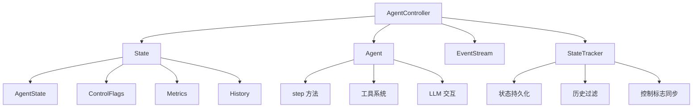
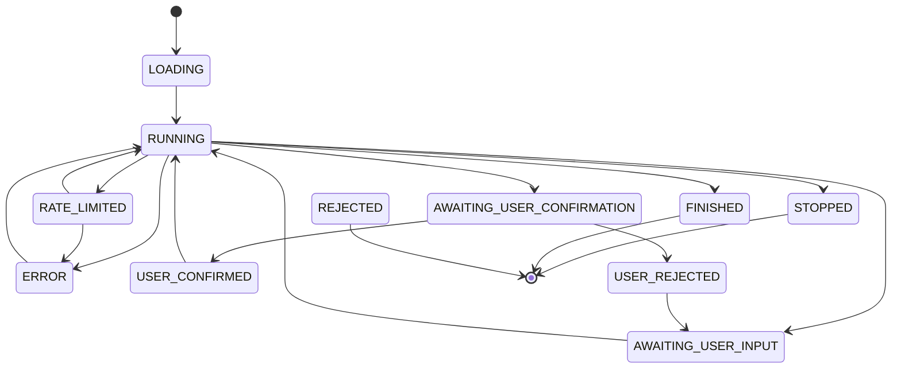
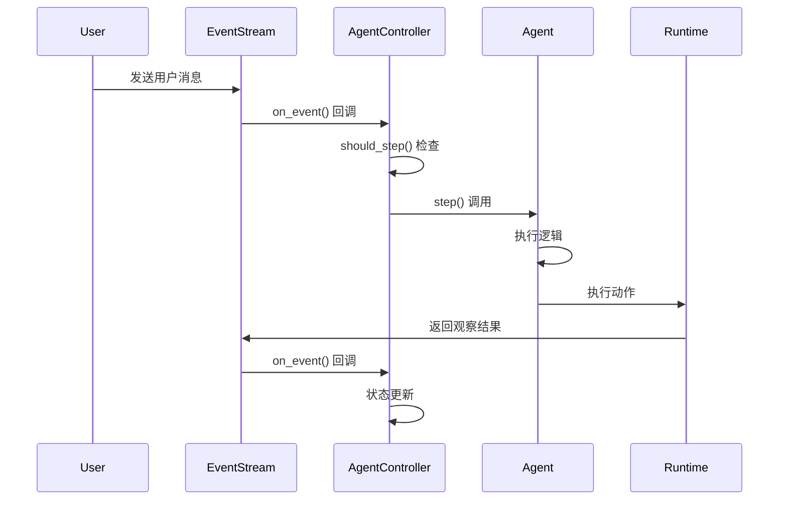

# Agent 生命周期管理深度分析

## 概述

Agent 生命周期管理是 OpenHands 系统的核心机制，负责管理 Agent 从创建到销毁的完整过程。本文档深入分析 Agent 的生命周期状态、状态转换、执行流程和资源管理。

## 架构设计

### 核心组件关系



### Agent 状态机设计



## AgentState 状态枚举

### 状态定义

```python
class AgentState(str, Enum):
    LOADING = 'loading'                    # Agent 正在加载
    RUNNING = 'running'                    # Agent 正在运行
    AWAITING_USER_INPUT = 'awaiting_user_input'  # 等待用户输入
    PAUSED = 'paused'                      # Agent 已暂停
    STOPPED = 'stopped'                    # Agent 已停止
    FINISHED = 'finished'                  # Agent 完成任务
    REJECTED = 'rejected'                  # Agent 拒绝任务
    ERROR = 'error'                        # 发生错误
    AWAITING_USER_CONFIRMATION = 'awaiting_user_confirmation'  # 等待用户确认
    USER_CONFIRMED = 'user_confirmed'      # 用户已确认
    USER_REJECTED = 'user_rejected'        # 用户已拒绝
    RATE_LIMITED = 'rate_limited'          # 被限流
```

### 可恢复状态

```python
RESUMABLE_STATES = [
    AgentState.RUNNING,
    AgentState.PAUSED,
    AgentState.AWAITING_USER_INPUT,
    AgentState.FINISHED,
]
```

## 生命周期阶段

### 1. 初始化阶段 (Initialization)

#### AgentController 初始化
```python
class AgentController:
    def __init__(
        self,
        agent: Agent,
        event_stream: EventStream,
        iteration_delta: int,
        budget_per_task_delta: float | None = None,
        agent_to_llm_config: dict[str, LLMConfig] | None = None,
        agent_configs: dict[str, AgentConfig] | None = None,
        sid: str | None = None,
        file_store: FileStore | None = None,
        user_id: str | None = None,
        confirmation_mode: bool = False,
        initial_state: State | None = None,
        is_delegate: bool = False,
        headless_mode: bool = True,
        status_callback: Callable | None = None,
        replay_events: list[Event] | None = None,
    ):
        # 1. 设置基本属性
        self.id = sid or event_stream.sid
        self.user_id = user_id
        self.file_store = file_store
        self.agent = agent
        self.headless_mode = headless_mode
        self.is_delegate = is_delegate
        
        # 2. 设置事件流
        self.event_stream = event_stream
        
        # 3. 订阅事件流（非委托 Agent）
        if not self.is_delegate:
            self.event_stream.subscribe(
                EventStreamSubscriber.AGENT_CONTROLLER, self.on_event, self.id
            )
        
        # 4. 初始化状态跟踪器
        self.state_tracker = StateTracker(sid, file_store, user_id)
        
        # 5. 设置初始状态
        self.set_initial_state(
            state=initial_state,
            max_iterations=iteration_delta,
            max_budget_per_task=budget_per_task_delta,
            confirmation_mode=confirmation_mode,
        )
        
        # 6. 初始化其他组件
        self._stuck_detector = StuckDetector(self.state)
        self._replay_manager = ReplayManager(replay_events)
        
        # 7. 添加系统消息
        self._add_system_message()
```

#### State 初始化
```python
class State:
    def __init__(
        self,
        session_id: str = '',
        user_id: str | None = None,
        iteration_flag: IterationControlFlag = field(
            default_factory=lambda: IterationControlFlag(
                limit_increase_amount=100, current_value=0, max_value=100
            )
        ),
        budget_flag: BudgetControlFlag | None = None,
        confirmation_mode: bool = False,
        history: list[Event] = field(default_factory=list),
        inputs: dict = field(default_factory=dict),
        outputs: dict = field(default_factory=dict),
        agent_state: AgentState = AgentState.LOADING,
        resume_state: AgentState | None = None,
        metrics: Metrics = field(default_factory=Metrics),
        delegate_level: int = 0,
        start_id: int = -1,
        end_id: int = -1,
    ):
        # 状态管理相关字段
        self.agent_state = agent_state
        self.resume_state = resume_state
        
        # 控制标志
        self.iteration_flag = iteration_flag
        self.budget_flag = budget_flag
        
        # 数据存储
        self.history = history
        self.inputs = inputs
        self.outputs = outputs
        
        # 指标跟踪
        self.metrics = metrics
        
        # 委托管理
        self.delegate_level = delegate_level
```

### 2. 执行阶段 (Execution)

#### 事件驱动执行流程



#### Step 方法执行流程

```python
async def _step(self) -> None:
    """执行 Agent 的单步操作"""
    
    # 1. 状态检查
    if self.get_agent_state() != AgentState.RUNNING:
        return
    
    # 2. 待处理动作检查
    if self._pending_action:
        return
    
    # 3. 控制标志检查
    self.state_tracker.sync_budget_flag_with_metrics()
    
    # 4. 卡死检测
    if self._is_stuck():
        await self._react_to_exception(AgentStuckInLoopError('Agent got stuck in a loop'))
        return
    
    # 5. 控制标志执行
    try:
        self.state_tracker.run_control_flags()
    except Exception as e:
        await self._react_to_exception(e)
        return
    
    # 6. 执行 Agent step
    action: Action = NullAction()
    
    if self._replay_manager.should_replay():
        # 重放模式
        action = self._replay_manager.step()
    else:
        # 正常执行模式
        try:
            action = self.agent.step(self.state)
            if action is None:
                raise LLMNoActionError('No action was returned')
            action._source = EventSource.AGENT
        except Exception as e:
            # 错误处理
            self.event_stream.add_event(ErrorObservation(content=str(e)), EventSource.AGENT)
            return
    
    # 7. 动作处理
    if action.runnable:
        if self.state.confirmation_mode:
            action.confirmation_state = ActionConfirmationStatus.AWAITING_CONFIRMATION
        self._pending_action = action
    
    # 8. 状态更新
    if not isinstance(action, NullAction):
        if hasattr(action, 'confirmation_state') and action.confirmation_state == ActionConfirmationStatus.AWAITING_CONFIRMATION:
            await self.set_agent_state_to(AgentState.AWAITING_USER_CONFIRMATION)
        
        # 9. 发送事件
        self.event_stream.add_event(action, action._source)
```

#### 事件处理机制

```python
def should_step(self, event: Event) -> bool:
    """判断是否应该执行 step"""
    
    # 如果有委托 Agent，不执行
    if self.delegate is not None:
        return False
    
    if isinstance(event, Action):
        # 用户消息触发 step
        if isinstance(event, MessageAction) and event.source == EventSource.USER:
            return True
        # 委托动作触发 step
        if isinstance(event, AgentDelegateAction):
            return True
        # 压缩动作触发 step
        if isinstance(event, CondensationAction):
            return True
        if isinstance(event, CondensationRequestAction):
            return True
        return False
    
    if isinstance(event, Observation):
        # 状态变化观察不触发 step
        if isinstance(event, AgentStateChangedObservation) or isinstance(event, NullObservation):
            return False
        # 其他观察触发 step
        return True
    
    return False
```

### 3. 状态转换管理

#### 状态设置方法

```python
async def set_agent_state_to(self, new_state: AgentState) -> None:
    """设置 Agent 状态并处理副作用"""
    
    # 1. 状态检查
    if new_state == self.state.agent_state:
        return
    
    # 2. 保存旧状态
    old_state = self.state.agent_state
    
    # 3. 更新状态
    self.state.agent_state = new_state
    
    # 4. 状态特定处理
    if new_state in (AgentState.STOPPED, AgentState.ERROR):
        self._reset()
    
    # 5. 控制限制检查
    if old_state == AgentState.ERROR and new_state == AgentState.RUNNING:
        self.state_tracker.maybe_increase_control_flags_limits(self.headless_mode)
    
    # 6. 待处理动作处理
    if self._pending_action is not None and (new_state in (AgentState.USER_CONFIRMED, AgentState.USER_REJECTED)):
        # 处理用户确认/拒绝
        if new_state == AgentState.USER_CONFIRMED:
            confirmation_state = ActionConfirmationStatus.CONFIRMED
        else:
            confirmation_state = ActionConfirmationStatus.REJECTED
        self._pending_action.confirmation_state = confirmation_state
        self.event_stream.add_event(self._pending_action, EventSource.AGENT)
    
    # 7. 创建状态变化观察
    reason = ''
    if new_state == AgentState.ERROR:
        reason = self.state.last_error
    
    self.event_stream.add_event(
        AgentStateChangedObservation('', self.state.agent_state, reason),
        EventSource.ENVIRONMENT,
    )
    
    # 8. 保存状态
    self.save_state()
```

### 4. 委托管理 (Delegation)

#### 委托启动

```python
async def start_delegate(self, action: AgentDelegateAction) -> None:
    """启动委托 Agent 处理子任务"""
    
    # 1. 获取委托 Agent 类
    agent_cls: type[Agent] = Agent.get_cls(action.agent)
    
    # 2. 获取配置
    agent_config = self.agent_configs.get(action.agent, self.agent.config)
    llm_config = self.agent_to_llm_config.get(action.agent, self.agent.llm.config)
    
    # 3. 创建 LLM 实例（共享指标）
    llm = LLM(
        config=llm_config,
        retry_listener=self.agent.llm.retry_listener,
        metrics=self.state.metrics,
    )
    
    # 4. 创建委托 Agent
    delegate_agent = agent_cls(llm=llm, config=agent_config)
    
    # 5. 创建委托状态
    state = State(
        session_id=self.id.removesuffix('-delegate'),
        user_id=self.user_id,
        inputs=action.inputs or {},
        iteration_flag=self.state.iteration_flag,
        budget_flag=self.state.budget_flag,
        delegate_level=self.state.delegate_level + 1,
        metrics=self.state.metrics,
        start_id=self.event_stream.get_latest_event_id() + 1,
        parent_metrics_snapshot=self.state_tracker.get_metrics_snapshot(),
        parent_iteration=self.state.iteration_flag.current_value,
    )
    
    # 6. 创建委托控制器
    self.delegate = AgentController(
        sid=self.id + '-delegate',
        file_store=self.file_store,
        user_id=self.user_id,
        agent=delegate_agent,
        event_stream=self.event_stream,
        iteration_delta=self._initial_max_iterations,
        budget_per_task_delta=self._initial_max_budget_per_task,
        agent_to_llm_config=self.agent_to_llm_config,
        agent_configs=self.agent_configs,
        initial_state=state,
        is_delegate=True,
        headless_mode=self.headless_mode,
    )
```

#### 委托结束

```python
def end_delegate(self) -> None:
    """结束当前活动的委托"""
    
    if self.delegate is None:
        return
    
    # 1. 获取委托状态
    delegate_state = self.delegate.get_agent_state()
    
    # 2. 更新共享迭代计数
    self.state.iteration_flag.current_value = self.delegate.state.iteration_flag.current_value
    
    # 3. 计算委托特定指标
    delegate_metrics = self.state.get_local_metrics()
    
    # 4. 关闭委托控制器
    asyncio.get_event_loop().run_until_complete(self.delegate.close())
    
    # 5. 处理委托结果
    if delegate_state in (AgentState.FINISHED, AgentState.REJECTED):
        # 成功完成
        delegate_outputs = self.delegate.state.outputs if self.delegate.state else {}
        content = f'{self.delegate.agent.name} finishes task with {formatted_output}'
    else:
        # 错误情况
        content = f'{self.delegate.agent.name} encountered an error during execution.'
    
    # 6. 发送委托结果观察
    obs = AgentDelegateObservation(outputs=delegate_outputs, content=content)
    
    # 7. 关联委托动作
    for event in reversed(self.state.history):
        if isinstance(event, AgentDelegateAction):
            delegate_action = event
            obs.tool_call_metadata = delegate_action.tool_call_metadata
            break
    
    self.event_stream.add_event(obs, EventSource.AGENT)
    
    # 8. 清除委托
    self.delegate = None
```

### 5. 终止阶段 (Termination)

#### 关闭流程

```python
async def close(self, set_stop_state: bool = True) -> None:
    """关闭 Agent 控制器，取消任何正在进行的任务并取消订阅事件流"""
    
    # 1. 设置停止状态
    if set_stop_state:
        await self.set_agent_state_to(AgentState.STOPPED)
    
    # 2. 关闭状态跟踪器
    self.state_tracker.close(self.event_stream)
    
    # 3. 取消订阅事件流（仅根控制器）
    if not self.is_delegate:
        self.event_stream.unsubscribe(
            EventStreamSubscriber.AGENT_CONTROLLER, self.id
        )
    
    # 4. 标记为已关闭
    self._closed = True
```

#### 状态持久化

```python
def save_to_session(
    self, sid: str, file_store: FileStore, user_id: str | None
) -> None:
    """将状态保存到会话"""
    pickled = pickle.dumps(self)
    encoded = base64.b64encode(pickled).decode('utf-8')
    
    try:
        file_store.write(
            get_conversation_agent_state_filename(sid, user_id), encoded
        )
    except Exception as e:
        logger.error(f'Failed to save state to session: {e}')
        raise e

@staticmethod
def restore_from_session(
    sid: str, file_store: FileStore, user_id: str | None = None
) -> 'State':
    """从之前保存的会话恢复状态"""
    try:
        encoded = file_store.read(
            get_conversation_agent_state_filename(sid, user_id)
        )
        pickled = base64.b64decode(encoded)
        state = pickle.loads(pickled)
    except Exception as e:
        logger.debug(f'Could not restore state from session: {e}')
        raise e
    
    # 更新状态
    if state.agent_state in RESUMABLE_STATES:
        state.resume_state = state.agent_state
    else:
        state.resume_state = None
    
    # 恢复后的第一个状态
    state.agent_state = AgentState.LOADING
    
    return state
```

## 关键设计原则

### 1. 事件驱动架构
- **异步处理**: 基于 asyncio 的非阻塞 I/O
- **发布-订阅模式**: EventStream 作为事件总线
- **状态一致性**: 通过事件保证状态同步

### 2. 状态管理
- **状态机模式**: 明确的 AgentState 转换
- **持久化机制**: 支持会话恢复
- **控制标志**: 迭代和预算限制

### 3. 委托系统
- **多代理协作**: 支持任务委托
- **状态共享**: 指标和迭代计数共享
- **结果聚合**: 委托结果集成到主任务

### 4. 错误处理
- **异常分类**: 不同类型的异常处理策略
- **状态恢复**: 从错误状态恢复执行
- **用户反馈**: 错误信息展示给用户

### 5. 资源管理
- **生命周期管理**: 明确的创建、执行、销毁流程
- **内存优化**: 历史记录压缩和过滤
- **性能监控**: 指标收集和分析

## 总结

Agent 生命周期管理体现了 OpenHands 系统的核心设计理念：

1. **模块化设计**: 清晰的组件职责分离
2. **事件驱动**: 基于 Action-Observation 模式的异步处理
3. **状态一致性**: 通过状态机保证执行流程的正确性
4. **可扩展性**: 委托系统支持多代理协作
5. **容错性**: 完善的错误处理和恢复机制

这种设计使得 Agent 能够高效地处理复杂的软件工程任务，同时保持良好的可维护性和扩展性。