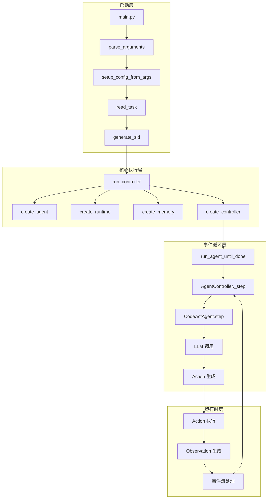
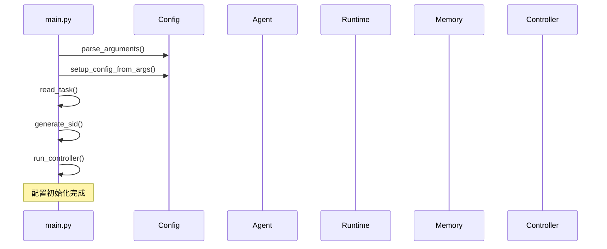
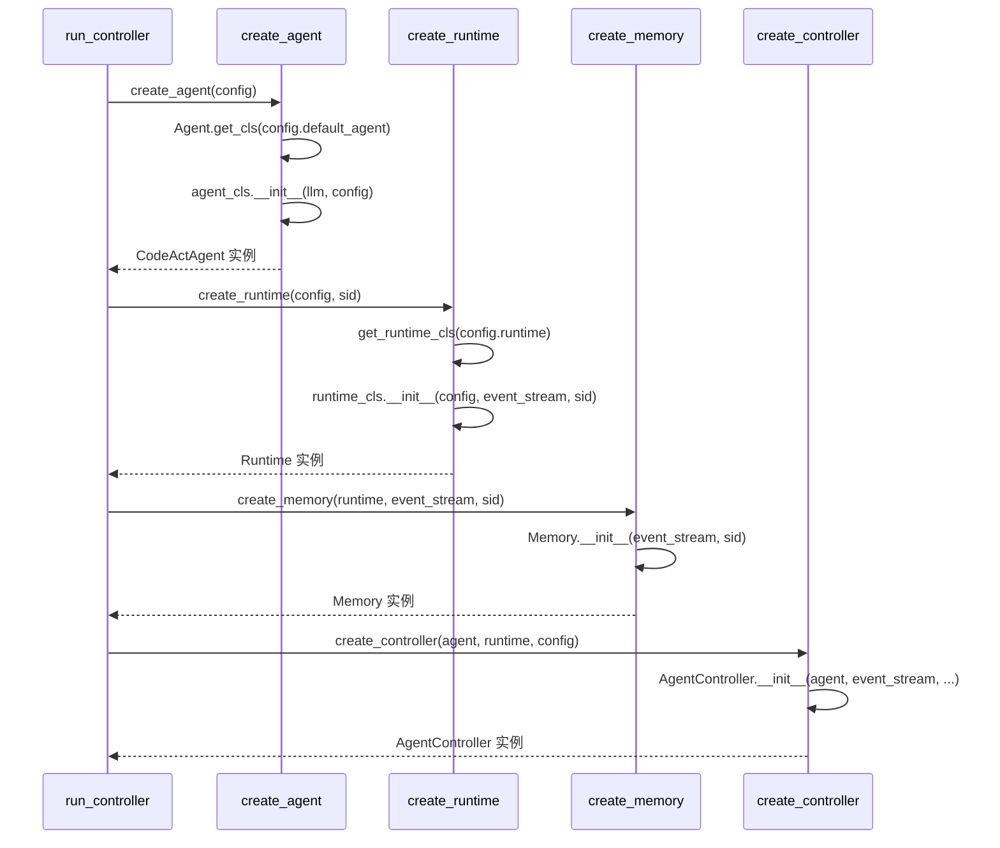
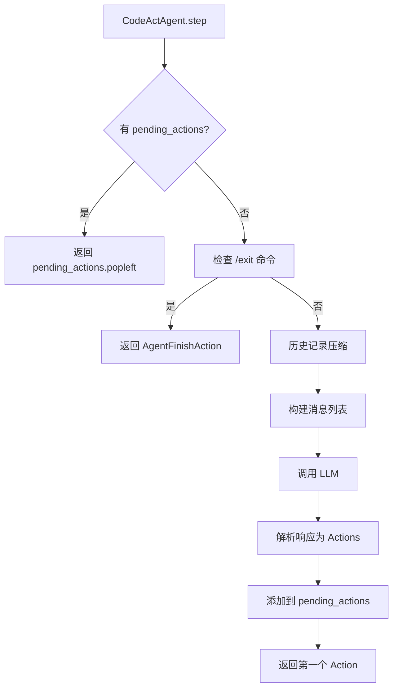
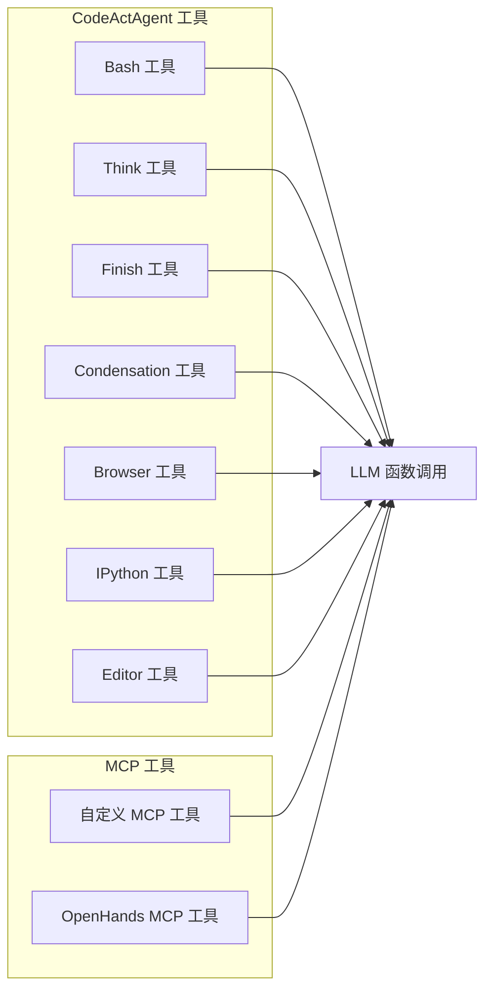
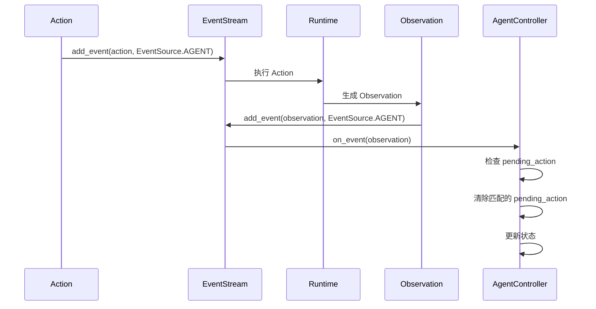
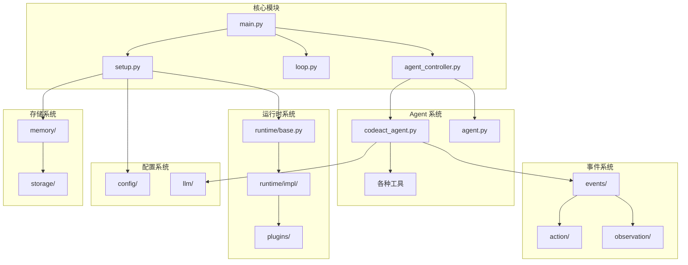

# CodeActAgent 执行流程分析

## 概述

本文档基于 `openhands/core/main.py` 中的示例代码，深入分析 CodeActAgent 的完整执行流程。通过追踪从程序启动到任务完成的整个过程，揭示 OpenHands 系统的核心架构和工作原理。

## 系统架构概览



## 详细执行流程

### 1. 程序启动阶段



#### 关键步骤
1. **参数解析**: 解析命令行参数和环境变量
2. **配置设置**: 构建完整的 OpenHandsConfig 对象
3. **任务读取**: 从文件、命令行或标准输入读取任务
4. **会话ID生成**: 创建唯一的会话标识符

### 2. 核心组件初始化



#### 组件初始化详解

##### Agent 创建 (`create_agent`)
```python
def create_agent(config: OpenHandsConfig) -> Agent:
    agent_cls: type[Agent] = Agent.get_cls(config.default_agent)
    agent_config = config.get_agent_config(config.default_agent)
    llm_config = config.get_llm_config_from_agent(config.default_agent)
    
    agent = agent_cls(
        llm=LLM(config=llm_config),
        config=agent_config,
    )
    return agent
```

##### Runtime 创建 (`create_runtime`)
```python
def create_runtime(config: OpenHandsConfig, sid: str) -> Runtime:
    file_store = get_file_store(config.file_store, config.file_store_path)
    event_stream = EventStream(session_id, file_store)
    
    runtime_cls = get_runtime_cls(config.runtime)
    runtime = runtime_cls(
        config=config,
        event_stream=event_stream,
        sid=session_id,
        plugins=agent_cls.sandbox_plugins,
    )
    return runtime
```

##### Memory 创建 (`create_memory`)
```python
def create_memory(runtime: Runtime, event_stream: EventStream, sid: str) -> Memory:
    memory = Memory(event_stream=event_stream, sid=sid)
    memory.set_runtime_info(runtime, {}, working_dir)
    memory.load_user_workspace_microagents(microagents)
    return memory
```

##### Controller 创建 (`create_controller`)
```python
def create_controller(agent: Agent, runtime: Runtime, config: OpenHandsConfig):
    event_stream = runtime.event_stream
    initial_state = State.restore_from_session(event_stream.sid, event_stream.file_store)
    
    controller = AgentController(
        agent=agent,
        iteration_delta=config.max_iterations,
        budget_per_task_delta=config.max_budget_per_task,
        event_stream=event_stream,
        initial_state=initial_state,
    )
    return (controller, initial_state)
```

### 3. 主事件循环

```mermaid
sequenceDiagram
    participant RC as run_controller
    participant Loop as run_agent_until_done
    participant Ctrl as AgentController
    participant Agent as CodeActAgent
    participant LLM as LLM
    participant ES as EventStream
    participant RT as Runtime
    
    RC->>Loop: run_agent_until_done(controller, runtime, memory, end_states)
    
    loop 直到达到结束状态
        Loop->>Ctrl: controller.state.agent_state
        Ctrl-->>Loop: 当前状态
        
        alt 状态为 RUNNING
            Loop->>Ctrl: await asyncio.sleep(1)
            Ctrl->>Ctrl: _step()
            Ctrl->>Agent: agent.step(state)
            Agent->>Agent: _get_messages(events, initial_user_message)
            Agent->>LLM: llm.completion(messages, tools)
            LLM-->>Agent: ModelResponse
            Agent->>Agent: response_to_actions(response)
            Agent-->>Ctrl: Action
            Ctrl->>ES: event_stream.add_event(action, EventSource.AGENT)
            ES->>RT: 执行 Action
            RT-->>ES: Observation
            ES->>Ctrl: on_event(observation)
        end
    end
```

#### 事件循环详解

##### `run_agent_until_done` 函数
```python
async def run_agent_until_done(controller, runtime, memory, end_states):
    while controller.state.agent_state not in end_states:
        await asyncio.sleep(1)
```

##### AgentController._step 方法
```python
async def _step(self) -> None:
    if self.get_agent_state() != AgentState.RUNNING:
        return
    if self._pending_action:
        return
    
    action = self.agent.step(self.state)
    
    if action.runnable:
        self._pending_action = action
    
    self.event_stream.add_event(action, EventSource.AGENT)
```

### 4. CodeActAgent 执行流程



#### CodeActAgent.step 方法详解

```python
def step(self, state: State) -> 'Action':
    # 继续执行待处理的动作
    if self.pending_actions:
        return self.pending_actions.popleft()
    
    # 检查退出命令
    latest_user_message = state.get_last_user_message()
    if latest_user_message and latest_user_message.content.strip() == '/exit':
        return AgentFinishAction()
    
    # 压缩历史记录
    condensed_history = []
    match self.condenser.condensed_history(state):
        case View(events=events):
            condensed_history = events
        case Condensation(action=condensation_action):
            return condensation_action
    
    # 构建消息
    initial_user_message = self._get_initial_user_message(state.history)
    messages = self._get_messages(condensed_history, initial_user_message)
    
    # 调用 LLM
    response = self.llm.completion(
        messages=self.llm.format_messages_for_llm(messages),
        tools=check_tools(self.tools, self.llm.config),
    )
    
    # 解析响应
    actions = self.response_to_actions(response)
    for action in actions:
        self.pending_actions.append(action)
    
    return self.pending_actions.popleft()
```

### 5. 工具系统



#### 工具配置
```python
def _get_tools(self) -> list['ChatCompletionToolParam']:
    tools = []
    if self.config.enable_cmd:
        tools.append(create_cmd_run_tool())
    if self.config.enable_think:
        tools.append(ThinkTool)
    if self.config.enable_finish:
        tools.append(FinishTool)
    if self.config.enable_condensation_request:
        tools.append(CondensationRequestTool)
    if self.config.enable_browsing:
        tools.append(BrowserTool)
    if self.config.enable_jupyter:
        tools.append(IPythonTool)
    if self.config.enable_llm_editor:
        tools.append(LLMBasedFileEditTool)
    elif self.config.enable_editor:
        tools.append(create_str_replace_editor_tool())
    return tools
```

### 6. 事件流处理



#### 事件处理机制

```python
async def on_event(self, event: Event) -> None:
    if isinstance(event, Observation):
        # 检查是否匹配 pending_action
        if self._pending_action and self._pending_action.id == observation.cause:
            self._pending_action = None
            
            # 更新状态
            if self.state.agent_state == AgentState.USER_CONFIRMED:
                await self.set_agent_state_to(AgentState.RUNNING)
            if self.state.agent_state == AgentState.USER_REJECTED:
                await self.set_agent_state_to(AgentState.AWAITING_USER_INPUT)
```

## 依赖关系图



## 关键设计模式

### 1. 观察者模式 (Observer Pattern)
- **EventStream** 作为主题 (Subject)
- **AgentController** 作为观察者 (Observer)
- 实现事件驱动的异步处理

### 2. 策略模式 (Strategy Pattern)
- **Agent** 作为策略接口
- **CodeActAgent** 作为具体策略
- 支持多种 Agent 实现

### 3. 工厂模式 (Factory Pattern)
- **create_agent**, **create_runtime**, **create_memory** 作为工厂方法
- 统一的对象创建接口

### 4. 状态模式 (State Pattern)
- **AgentState** 枚举定义状态
- **AgentController** 管理状态转换

## 性能优化点

### 1. 异步处理
- 使用 `asyncio` 实现非阻塞 I/O
- 事件流的异步订阅/发布

### 2. 内存优化
- 历史记录压缩 (Condenser)
- 消息长度限制
- 工具描述的智能截断

### 3. 缓存机制
- LLM 提示缓存
- 会话状态持久化
- 工具结果缓存

## 错误处理机制

### 1. 异常分类
```python
# LLM 相关异常
LLMMalformedActionError
LLMNoActionError
LLMResponseError
LLMContextWindowExceedError

# 运行时异常
AgentStuckInLoopError
FunctionCallNotExistsError
FunctionCallValidationError
```

### 2. 恢复策略
- 状态持久化和恢复
- 错误观察生成
- 用户确认机制
- 自动重试逻辑

## 扩展性设计

### 1. 插件系统
- 运行时插件 (Jupyter, AgentSkills)
- MCP 工具集成
- 自定义工具开发

### 2. 配置驱动
- 灵活的配置系统
- 环境变量支持
- 命令行参数覆盖

### 3. 模块化架构
- 清晰的模块边界
- 松耦合的组件设计
- 标准化的接口定义

## 总结

通过分析 `openhands/core/main.py` 中的 CodeActAgent 执行流程，我们可以看到 OpenHands 系统的核心设计理念：

1. **事件驱动架构**: 基于 Action-Observation 模式的异步处理
2. **模块化设计**: 清晰的组件边界和职责分离
3. **可扩展性**: 插件系统和工具集成支持
4. **容错性**: 完善的错误处理和恢复机制
5. **性能优化**: 异步处理、缓存和压缩机制

这种设计使得 OpenHands 能够高效地处理复杂的软件工程任务，同时保持良好的可维护性和扩展性。