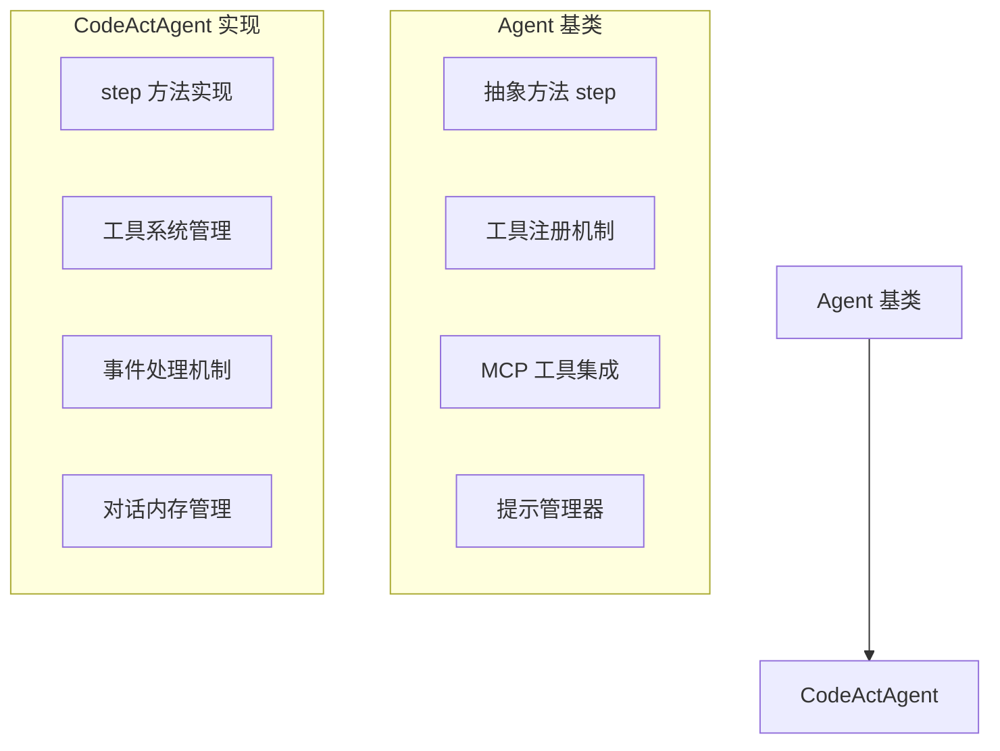
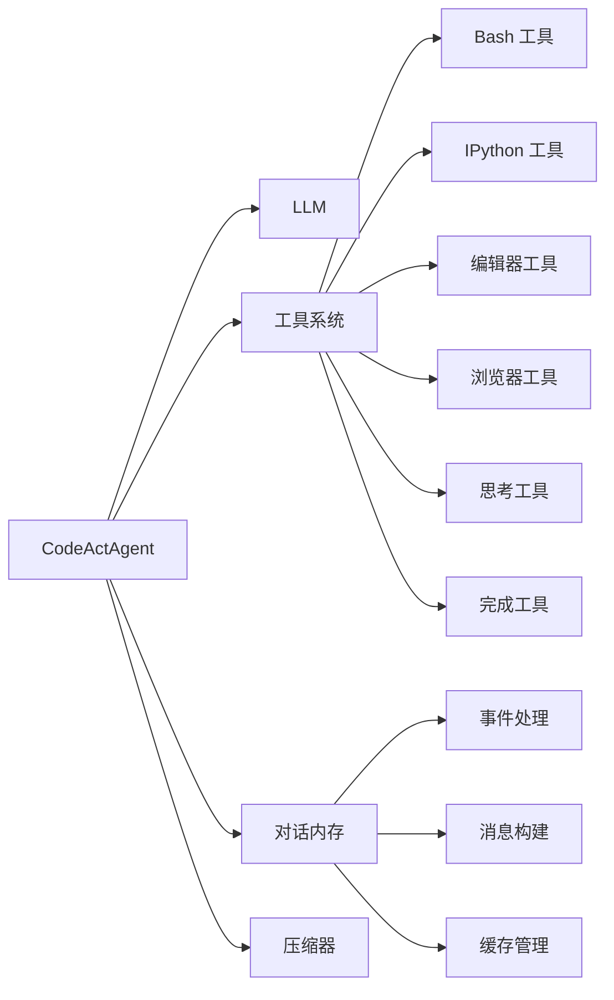
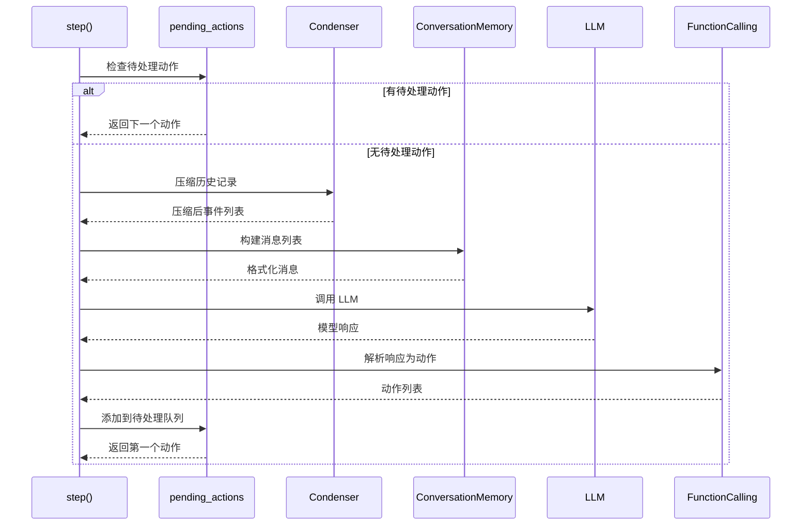

# CodeActAgent 实现原理深度分析

## 概述

CodeActAgent 是 OpenHands 系统的核心 Agent，基于 CodeAct 理念设计，将 LLM Agent 的动作统一到代码执行空间中。本文档深入分析 CodeActAgent 的实现原理、架构设计和核心机制。

## 架构设计

### 继承体系



### 核心组件关系



## 核心实现原理

### 1. Agent 基类设计

#### 抽象接口定义
```python
class Agent(ABC):
    """Agent 抽象基类，定义所有 Agent 的通用接口"""
    
    @abstractmethod
    def step(self, state: 'State') -> 'Action':
        """执行一步操作的核心抽象方法"""
        pass
```

#### 注册机制
```python
class Agent(ABC):
    _registry: dict[str, type['Agent']] = {}
    
    @classmethod
    def register(cls, name: str, agent_cls: type['Agent']) -> None:
        """Agent 类注册机制"""
        if name in cls._registry:
            raise AgentAlreadyRegisteredError(name)
        cls._registry[name] = agent_cls
    
    @classmethod
    def get_cls(cls, name: str) -> type['Agent']:
        """根据名称获取 Agent 类"""
        if name not in cls._registry:
            raise AgentNotRegisteredError(name)
        return cls._registry[name]
```

### 2. CodeActAgent 核心实现

#### 初始化过程
```python
class CodeActAgent(Agent):
    VERSION = '2.2'
    
    def __init__(self, llm: LLM, config: AgentConfig) -> None:
        super().__init__(llm, config)
        self.pending_actions: deque['Action'] = deque()
        self.reset()
        self.tools = self._get_tools()
        
        # 创建对话内存实例
        self.conversation_memory = ConversationMemory(self.config, self.prompt_manager)
        
        # 创建压缩器
        self.condenser = Condenser.from_config(self.config.condenser)
```

#### 工具系统管理
```python
def _get_tools(self) -> list['ChatCompletionToolParam']:
    """动态构建工具列表，支持配置驱动的工具启用/禁用"""
    tools = []
    
    # 根据配置启用不同工具
    if self.config.enable_cmd:
        tools.append(create_cmd_run_tool(use_short_description=use_short_tool_desc))
    if self.config.enable_think:
        tools.append(ThinkTool)
    if self.config.enable_finish:
        tools.append(FinishTool)
    if self.config.enable_condensation_request:
        tools.append(CondensationRequestTool)
    if self.config.enable_browsing:
        tools.append(BrowserTool)
    if self.config.enable_jupyter:
        tools.append(IPythonTool)
    if self.config.enable_llm_editor:
        tools.append(LLMBasedFileEditTool)
    elif self.config.enable_editor:
        tools.append(create_str_replace_editor_tool(use_short_description=use_short_tool_desc))
    
    return tools
```

### 3. Step 方法执行流程



#### Step 方法详细实现
```python
def step(self, state: State) -> 'Action':
    """执行一步操作的核心方法"""
    
    # 1. 继续执行待处理的动作
    if self.pending_actions:
        return self.pending_actions.popleft()
    
    # 2. 检查退出命令
    latest_user_message = state.get_last_user_message()
    if latest_user_message and latest_user_message.content.strip() == '/exit':
        return AgentFinishAction()
    
    # 3. 压缩历史记录
    condensed_history: list[Event] = []
    match self.condenser.condensed_history(state):
        case View(events=events):
            condensed_history = events
        case Condensation(action=condensation_action):
            return condensation_action
    
    # 4. 构建消息
    initial_user_message = self._get_initial_user_message(state.history)
    messages = self._get_messages(condensed_history, initial_user_message)
    
    # 5. 调用 LLM
    params = {
        'messages': self.llm.format_messages_for_llm(messages),
        'tools': check_tools(self.tools, self.llm.config),
        'extra_body': {
            'metadata': state.to_llm_metadata(
                model_name=self.llm.config.model, agent_name=self.name
            )
        }
    }
    response = self.llm.completion(**params)
    
    # 6. 解析响应为动作
    actions = self.response_to_actions(response)
    for action in actions:
        self.pending_actions.append(action)
    
    return self.pending_actions.popleft()
```

### 4. 函数调用机制

#### 响应解析
```python
def response_to_actions(response: ModelResponse, mcp_tool_names: list[str] | None = None) -> list[Action]:
    """将 LLM 响应解析为动作列表"""
    actions: list[Action] = []
    
    if hasattr(assistant_msg, 'tool_calls') and assistant_msg.tool_calls:
        # 处理工具调用
        for i, tool_call in enumerate(assistant_msg.tool_calls):
            arguments = json.loads(tool_call.function.arguments)
            
            # 根据工具名称创建相应动作
            if tool_call.function.name == create_cmd_run_tool()['function']['name']:
                action = CmdRunAction(command=arguments['command'], is_input=arguments.get('is_input', 'false') == 'true')
            elif tool_call.function.name == IPythonTool['function']['name']:
                action = IPythonRunCellAction(code=arguments['code'])
            elif tool_call.function.name == FinishTool['function']['name']:
                action = AgentFinishAction(final_thought=arguments.get('message', ''))
            # ... 其他工具处理
            
            actions.append(action)
    else:
        # 无工具调用，创建消息动作
        actions.append(MessageAction(content=str(assistant_msg.content) if assistant_msg.content else ''))
    
    return actions
```

### 5. 工具系统设计

#### 工具定义模式
```python
# Bash 工具定义
def create_cmd_run_tool(use_short_description: bool = False) -> ChatCompletionToolParam:
    description = _SHORT_BASH_DESCRIPTION if use_short_description else _DETAILED_BASH_DESCRIPTION
    return ChatCompletionToolParam(
        type='function',
        function=ChatCompletionToolParamFunctionChunk(
            name=EXECUTE_BASH_TOOL_NAME,
            description=refine_prompt(description),
            parameters={
                'type': 'object',
                'properties': {
                    'command': {
                        'type': 'string',
                        'description': 'The bash command to execute...',
                    },
                    'is_input': {
                        'type': 'string',
                        'description': 'If True, the command is an input to the running process...',
                        'enum': ['true', 'false'],
                    },
                    'timeout': {
                        'type': 'number',
                        'description': 'Optional. Sets a hard timeout in seconds...',
                    },
                },
                'required': ['command'],
            },
        ),
    )
```

#### 思考工具
```python
ThinkTool = ChatCompletionToolParam(
    type='function',
    function=ChatCompletionToolParamFunctionChunk(
        name='think',
        description=_THINK_DESCRIPTION,
        parameters={
            'type': 'object',
            'properties': {
                'thought': {'type': 'string', 'description': 'The thought to log.'},
            },
            'required': ['thought'],
        },
    ),
)
```

### 6. 对话内存管理

#### 事件处理流程
```python
class ConversationMemory:
    def process_events(
        self,
        condensed_history: list[Event],
        initial_user_action: MessageAction,
        max_message_chars: int | None = None,
        vision_is_active: bool = False,
    ) -> list[Message]:
        """将事件历史处理为 LLM 可理解的消息列表"""
        
        # 确保事件列表以 SystemMessageAction 开始
        self._ensure_system_message(events)
        self._ensure_initial_user_message(events, initial_user_action)
        
        # 处理常规事件
        pending_tool_call_action_messages: dict[str, Message] = {}
        tool_call_id_to_message: dict[str, Message] = {}
        
        for event in events:
            if isinstance(event, Action):
                messages_to_add = self._process_action(event, pending_tool_call_action_messages, vision_is_active)
            elif isinstance(event, Observation):
                messages_to_add = self._process_observation(event, tool_call_id_to_message, max_message_chars, vision_is_active)
            
            # 检查并处理完成的工具调用
            self._check_completed_tool_calls(pending_tool_call_action_messages, tool_call_id_to_message, messages_to_add)
            
            messages += messages_to_add
        
        return messages
```

### 7. 插件系统集成

#### 运行时插件
```python
class CodeActAgent(Agent):
    sandbox_plugins: list[PluginRequirement] = [
        # AgentSkillsRequirement 需要在 JupyterRequirement 之前
        # 因为它提供了很多 Python 函数，需要在 Jupyter 初始化之前可用
        AgentSkillsRequirement(),
        JupyterRequirement(),
    ]
```

## 设计模式分析

### 1. 策略模式 (Strategy Pattern)
- **Agent 基类** 定义策略接口
- **CodeActAgent** 实现具体策略
- 支持多种 Agent 实现

### 2. 观察者模式 (Observer Pattern)
- **EventStream** 作为主题
- **AgentController** 作为观察者
- 实现事件驱动的异步处理

### 3. 工厂模式 (Factory Pattern)
- **Agent.get_cls()** 作为工厂方法
- 统一的 Agent 创建接口

### 4. 命令模式 (Command Pattern)
- **Action** 抽象基类
- 具体动作类实现具体命令
- 支持动作的序列化和执行

## 性能优化机制

### 1. 异步处理
- 使用 `asyncio` 实现非阻塞 I/O
- 事件流的异步订阅/发布

### 2. 内存优化
- **历史记录压缩**: 智能压缩算法减少上下文长度
- **消息长度限制**: 防止超出 LLM 上下文窗口
- **工具描述截断**: 针对特定模型优化工具描述长度

### 3. 缓存机制
- **提示缓存**: 对 Anthropic 等模型的支持
- **会话状态持久化**: 支持会话恢复
- **工具结果缓存**: 减少重复计算

### 4. 配置驱动优化
```python
# 工具描述长度优化
SHORT_TOOL_DESCRIPTION_LLM_SUBSTRS = ['gpt-4', 'o3', 'o1', 'o4']
use_short_tool_desc = any(
    model_substr in self.llm.config.model
    for model_substr in SHORT_TOOL_DESCRIPTION_LLM_SUBSTRS
)
```

## 错误处理机制

### 1. 异常分类
```python
# LLM 相关异常
LLMMalformedActionError
LLMNoActionError
LLMResponseError
LLMContextWindowExceedError

# 运行时异常
AgentStuckInLoopError
FunctionCallNotExistsError
FunctionCallValidationError
```

### 2. 恢复策略
- **状态持久化**: 支持从错误状态恢复
- **错误观察生成**: 将错误信息反馈给 Agent
- **用户确认机制**: 关键操作需要用户确认
- **自动重试逻辑**: 对临时性错误的重试

## 扩展性设计

### 1. 插件系统
- **运行时插件**: Jupyter, AgentSkills 等
- **MCP 工具集成**: 支持 Model Context Protocol
- **自定义工具开发**: 标准化的工具接口

### 2. 配置驱动
- **灵活的配置系统**: 支持环境变量和命令行参数
- **工具启用/禁用**: 运行时动态配置
- **模型特定优化**: 针对不同 LLM 的优化配置

### 3. 模块化架构
- **清晰的模块边界**: Agent, Runtime, Memory, Controller
- **松耦合的组件设计**: 标准化的接口定义
- **事件驱动架构**: 基于 Action-Observation 模式

## 核心设计理念

### 1. CodeAct 理念
- **统一动作空间**: 将复杂动作统一为代码执行
- **简化 Agent 设计**: 减少专用动作类型
- **提高性能**: 基于论文证明的性能优势

### 2. 最小化 Agent 设计
- **核心职责单一**: 专注于代码执行和工具调用
- **配置驱动**: 通过配置启用/禁用功能
- **可组合性**: 支持与其他 Agent 协作

### 3. 事件驱动架构
- **Action-Observation 模式**: 清晰的执行反馈循环
- **异步处理**: 支持并发执行
- **状态管理**: 明确的执行状态跟踪

## 总结

CodeActAgent 的实现体现了现代 AI Agent 系统的优秀设计原则：

1. **模块化设计**: 清晰的组件边界和职责分离
2. **配置驱动**: 灵活的运行时配置和优化
3. **事件驱动**: 基于 Action-Observation 的异步处理
4. **扩展性**: 插件系统和工具集成支持
5. **容错性**: 完善的错误处理和恢复机制

这种设计使得 CodeActAgent 能够高效地处理复杂的软件工程任务，同时保持良好的可维护性和扩展性。