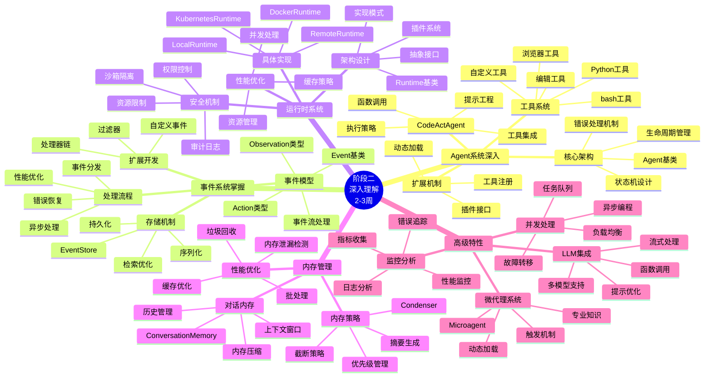
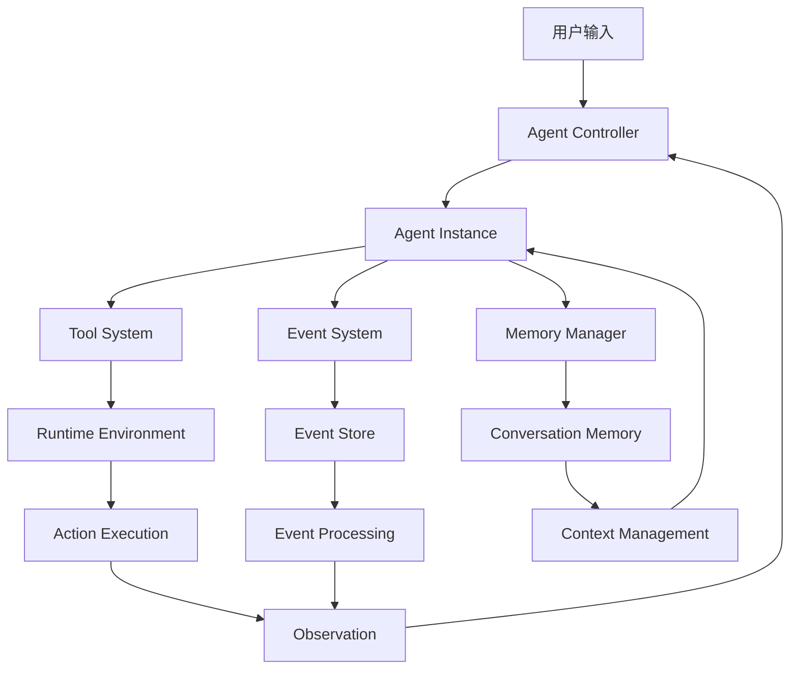
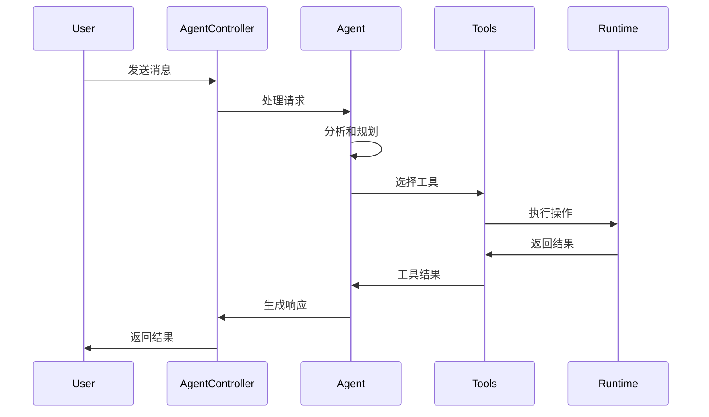
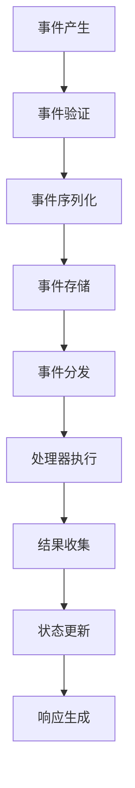
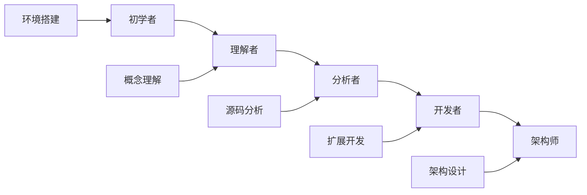

# 阶段二学习脑图：深入理解



## 🎯 深度学习路径

### 1. Agent系统深入路径
```
基础概念 → 源码分析 → 架构理解 → 扩展开发 → 性能优化
```

### 2. 事件系统掌握路径
```
事件模型 → 处理流程 → 存储机制 → 性能分析 → 自定义开发
```

### 3. 运行时理解路径
```
接口设计 → 具体实现 → 安全机制 → 资源管理 → 扩展开发
```

### 4. 内存管理路径
```
内存模型 → 管理策略 → 优化技术 → 问题诊断 → 自定义实现
```

## 📊 核心组件关系图



## 🔍 关键技术深度分析

### Agent执行流程


### 事件处理流程


## 📈 学习进度评估

### 知识掌握度评估
| 知识点 | 理论理解 | 代码分析 | 实践能力 | 综合评分 |
|--------|----------|----------|----------|----------|
| Agent架构 | ⭐⭐⭐⭐⭐ | ⭐⭐⭐⭐ | ⭐⭐⭐ | 80% |
| 事件系统 | ⭐⭐⭐⭐ | ⭐⭐⭐⭐ | ⭐⭐⭐ | 75% |
| 运行时系统 | ⭐⭐⭐⭐ | ⭐⭐⭐ | ⭐⭐⭐ | 70% |
| 内存管理 | ⭐⭐⭐ | ⭐⭐⭐ | ⭐⭐ | 60% |

### 技能发展轨迹


## 🛠️ 实践项目指南

### 项目复杂度分级
- **初级项目**：简单的Agent扩展，基础工具开发
- **中级项目**：事件处理器开发，运行时扩展
- **高级项目**：完整的子系统开发，性能优化

### 项目评估标准
1. **功能完整性**：是否实现了预期功能
2. **代码质量**：代码结构、注释、测试覆盖
3. **性能表现**：执行效率、资源使用
4. **扩展性**：是否易于扩展和维护
5. **文档质量**：使用说明、API文档

## 💡 学习技巧和建议

### 源码阅读技巧
1. **自顶向下**：从入口点开始，逐步深入
2. **关键路径**：重点关注主要执行路径
3. **数据流追踪**：跟踪数据在系统中的流动
4. **设计模式识别**：识别和理解使用的设计模式

### 调试技巧
1. **日志分析**：充分利用系统日志
2. **断点调试**：在关键位置设置断点
3. **单元测试**：编写测试验证理解
4. **性能分析**：使用工具分析性能瓶颈

### 实践建议
1. **小步快跑**：从简单功能开始，逐步复杂化
2. **文档先行**：先写设计文档，再写代码
3. **测试驱动**：先写测试，再实现功能
4. **代码审查**：请他人审查你的代码

## 🔗 深度学习资源

### 核心源码文件
- `openhands/controller/agent.py` - Agent基类
- `openhands/events/event.py` - 事件系统核心
- `openhands/runtime/base.py` - 运行时基类
- `openhands/memory/memory.py` - 内存管理

### 相关论文和文档
- [CodeAct论文](https://arxiv.org/abs/2407.16741)
- [Agent架构设计文档](../../openhands/agenthub/README.md)
- [事件系统设计文档](../../openhands/events/README.md)
- [运行时系统文档](../../openhands/runtime/README.md)

### 社区资源
- [GitHub Discussions](https://github.com/All-Hands-AI/OpenHands/discussions)
- [技术博客](https://docs.all-hands.dev/blog)
- [开发者指南](../../Development.md)
