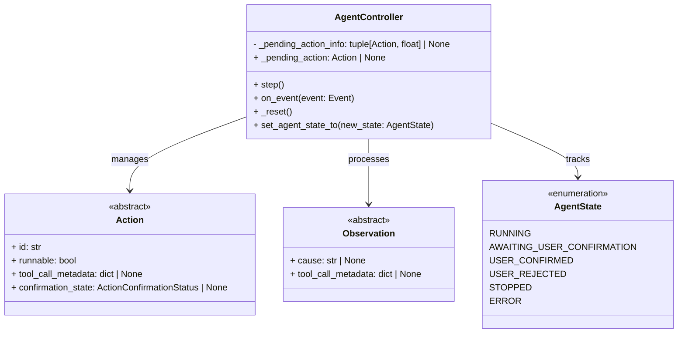
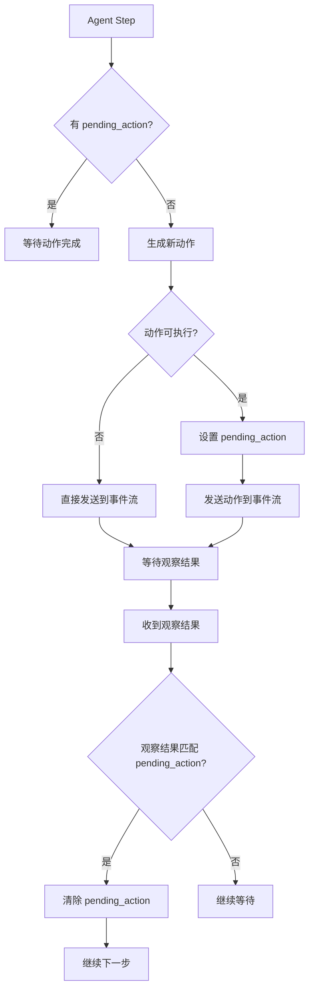
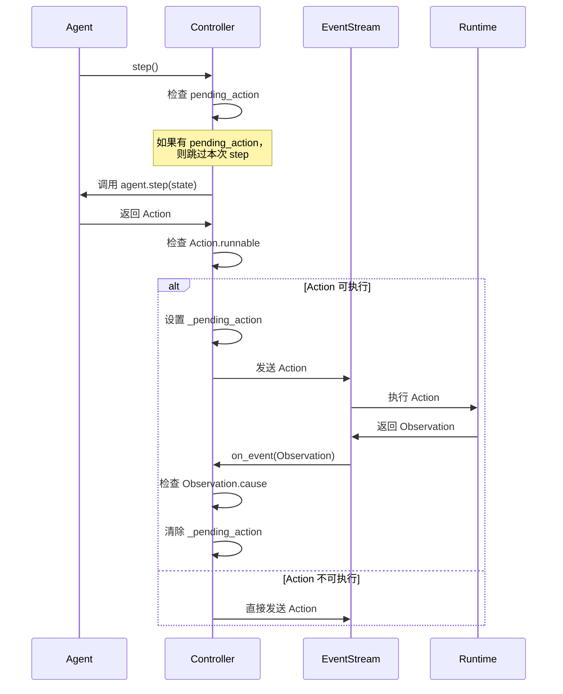
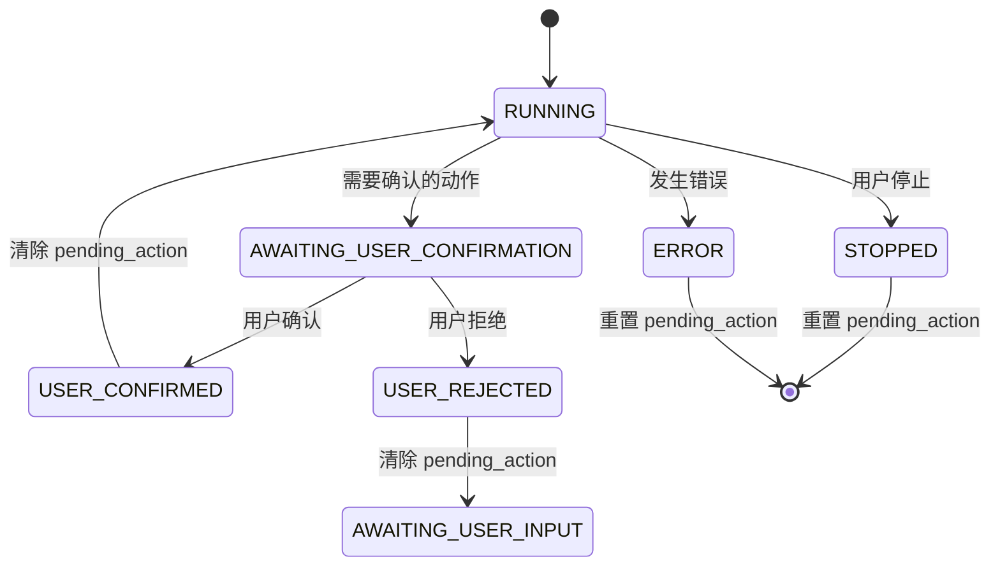

# Agent Controller Pending Action 机制分析

## 概述

在 OpenHands 的 Agent Controller 中，`_pending_action` 是一个核心机制，用于管理正在执行中的动作（Action）。它确保系统能够正确处理动作的执行状态、错误恢复和用户确认流程。

### 什么是 Pending Action？

`_pending_action` 是一个存储当前正在执行的动作及其时间戳的元组：

```python
_pending_action_info: tuple[Action, float] | None = None  # (action, timestamp)
```

通过属性装饰器提供访问接口：

```python
@property
def _pending_action(self) -> Action | None
@_pending_action.setter
def _pending_action(self, action: Action | None)
```

## 架构设计

### 核心组件



## 工作流程

### 主要工作流程



### 详细执行流程

#### 1. Agent Step 执行



## 使用场景

### 场景 1: 可执行动作的处理

当 Agent 生成一个可执行的动作（如 `CmdRunAction`, `IPythonRunCellAction`）时：

```python
async def _step(self) -> None:
    # 检查是否有 pending_action
    if self._pending_action:
        return  # 等待当前动作完成
    
    # 生成新动作
    action = self.agent.step(self.state)
    
    if action.runnable:
        # 设置 pending_action
        self._pending_action = action
        
        # 发送到事件流
        self.event_stream.add_event(action, EventSource.AGENT)
```

### 场景 2: 用户确认模式

在确认模式下，需要等待用户确认某些动作：

```python
if self.state.confirmation_mode and (
    type(action) is CmdRunAction or type(action) is IPythonRunCellAction
):
    action.confirmation_state = ActionConfirmationStatus.AWAITING_CONFIRMATION
    
if hasattr(action, 'confirmation_state') and \
   action.confirmation_state == ActionConfirmationStatus.AWAITING_CONFIRMATION:
    await self.set_agent_state_to(AgentState.AWAITING_USER_CONFIRMATION)
```

### 场景 3: 观察结果处理

当收到观察结果时，检查是否与 pending_action 匹配：

```python
async def on_event(self, event: Event) -> None:
    if isinstance(event, Observation):
        # 检查是否匹配 pending_action
        if self._pending_action and self._pending_action.id == observation.cause:
            # 处理用户确认状态
            if self.state.agent_state == AgentState.AWAITING_USER_CONFIRMATION:
                return
            
            # 清除 pending_action
            self._pending_action = None
            
            # 更新状态
            if self.state.agent_state == AgentState.USER_CONFIRMED:
                await self.set_agent_state_to(AgentState.RUNNING)
            if self.state.agent_state == AgentState.USER_REJECTED:
                await self.set_agent_state_to(AgentState.AWAITING_USER_INPUT)
```

### 场景 4: 系统重置

当 Agent 状态变为 STOPPED 或 ERROR 时，需要重置 pending_action：

```python
def _reset(self) -> None:
    """Resets the agent controller."""
    # 对于有 tool_call_metadata 的可执行动作
    if self._pending_action and hasattr(self._pending_action, 'tool_call_metadata'):
        # 检查是否已有对应的观察结果
        found_observation = False
        for event in self.state.history:
            if (isinstance(event, Observation) and 
                event.tool_call_metadata == self._pending_action.tool_call_metadata):
                found_observation = True
                break
        
        # 如果没有观察结果，创建错误观察
        if not found_observation:
            if self.state.agent_state == AgentState.STOPPED:
                error_content = ERROR_ACTION_NOT_EXECUTED_STOPPED
                error_id = ERROR_ACTION_NOT_EXECUTED_STOPPED_ID
            else:  # AgentState.ERROR
                error_content = ERROR_ACTION_NOT_EXECUTED_ERROR
                error_id = ERROR_ACTION_NOT_EXECUTED_ERROR_ID
            
            obs = ErrorObservation(
                content=error_content,
                error_id=error_id,
            )
            obs.tool_call_metadata = self._pending_action.tool_call_metadata
            obs._cause = self._pending_action.id
            self.event_stream.add_event(obs, EventSource.AGENT)
    
    # 重置 pending_action
    self._pending_action = None
    self.agent.reset()
```

### 场景 5: RecallAction 处理

处理用户消息时自动创建 RecallAction：

```python
async def _handle_message_action(self, action: MessageAction) -> None:
    if action.source == EventSource.USER:
        # 创建 RecallAction
        recall_action = RecallAction(query=action.content, recall_type=recall_type)
        self._pending_action = recall_action
        self.event_stream.add_event(recall_action, EventSource.USER)
```

## 属性实现细节

### Getter 实现

```python
@property
def _pending_action(self) -> Action | None:
    """Get the current pending action with time tracking."""
    if self._pending_action_info is None:
        return None
    
    action, timestamp = self._pending_action_info
    current_time = time.time()
    elapsed_time = current_time - timestamp
    
    # 记录长时间挂起的动作
    if elapsed_time > 60.0:  # 1分钟
        action_id = getattr(action, 'id', 'unknown')
        action_type = type(action).__name__
        self.log(
            'info',
            f'Pending action active for {elapsed_time:.2f}s: {action_type} (id={action_id})',
            extra={'msg_type': 'PENDING_ACTION_TIMEOUT'},
        )
    
    return action
```

### Setter 实现

```python
@_pending_action.setter
def _pending_action(self, action: Action | None) -> None:
    """Set or clear the pending action with timestamp and logging."""
    if action is None:
        # 清除 pending_action
        if self._pending_action_info is not None:
            prev_action, timestamp = self._pending_action_info
            action_id = getattr(prev_action, 'id', 'unknown')
            action_type = type(prev_action).__name__
            elapsed_time = time.time() - timestamp
            self.log(
                'debug',
                f'Cleared pending action after {elapsed_time:.2f}s: {action_type} (id={action_id})',
                extra={'msg_type': 'PENDING_ACTION_CLEARED'},
            )
        self._pending_action_info = None
    else:
        # 设置新的 pending_action
        action_id = getattr(action, 'id', 'unknown')
        action_type = type(action).__name__
        self.log(
            'debug',
            f'Set pending action: {action_type} (id={action_id})',
            extra={'msg_type': 'PENDING_ACTION_SET'},
        )
        self._pending_action_info = (action, time.time())
```

## 状态管理

### Agent 状态与 Pending Action 的关系



### 状态转换处理

```python
async def set_agent_state_to(self, new_state: AgentState) -> None:
    # 更新状态
    self.state.agent_state = new_state
    
    # 处理 STOPPED 或 ERROR 状态
    if new_state in (AgentState.STOPPED, AgentState.ERROR):
        self._reset()
    
    # 处理用户确认状态
    if self._pending_action is not None and (
        new_state in (AgentState.USER_CONFIRMED, AgentState.USER_REJECTED)
    ):
        # 更新动作的确认状态
        if new_state == AgentState.USER_CONFIRMED:
            confirmation_state = ActionConfirmationStatus.CONFIRMED
        else:
            confirmation_state = ActionConfirmationStatus.REJECTED
        
        self._pending_action.confirmation_state = confirmation_state
        self._pending_action._id = None  # 重置 ID 以重新发送
        self.event_stream.add_event(self._pending_action, EventSource.AGENT)
```

## 错误处理机制

### 动作执行失败的处理

当动作执行失败时，系统需要确保 pending_action 被正确清理：

```python
# 在 _reset 方法中处理未完成的动作
if not found_observation:
    # 根据状态创建不同的错误消息
    if self.state.agent_state == AgentState.STOPPED:
        error_content = 'Stop button pressed. The action has not been executed.'
        error_id = 'AGENT_ERROR$ERROR_ACTION_NOT_EXECUTED_STOPPED'
    else:  # AgentState.ERROR
        error_content = 'The action has not been executed due to a runtime error...'
        error_id = 'AGENT_ERROR$ERROR_ACTION_NOT_EXECUTED_ERROR'
    
    # 创建错误观察
    obs = ErrorObservation(
        content=error_content,
        error_id=error_id,
    )
    obs.tool_call_metadata = self._pending_action.tool_call_metadata
    obs._cause = self._pending_action.id
    self.event_stream.add_event(obs, EventSource.AGENT)
```

### 超时处理

通过 getter 方法实现超时检测：

```python
# 在 _pending_action getter 中
elapsed_time = current_time - timestamp
if elapsed_time > 60.0:  # 1分钟
    # 记录超时日志，但不自动清除
    self.log(
        'info',
        f'Pending action active for {elapsed_time:.2f}s: {action_type} (id={action_id})',
        extra={'msg_type': 'PENDING_ACTION_TIMEOUT'},
    )
```

## 测试场景

### 测试用例分析

根据测试文件，pending_action 的主要测试场景包括：

1. **重置时处理 pending_action**
   - 有 pending_action 但没有观察结果
   - 有 pending_action 且状态为 STOPPED
   - 有 pending_action 但已有观察结果
   - 没有 pending_action
   - pending_action 没有 tool_call_metadata

2. **状态转换测试**
   - 用户确认/拒绝 pending_action
   - 错误状态下的 pending_action 清理

## 最佳实践

### 1. 动作设计

- 可执行动作应该设置 `runnable = True`
- 需要用户确认的动作应该设置 `confirmation_state`
- 动作应该包含唯一的 `tool_call_metadata` 用于跟踪

### 2. 错误处理

- 确保所有 pending_action 最终都会被清理
- 在状态转换时正确处理 pending_action
- 记录长时间挂起的动作以便调试

### 3. 性能考虑

- 避免长时间挂起的 pending_action
- 及时清理完成的 pending_action
- 监控 pending_action 的生命周期

## 总结

`_pending_action` 机制是 OpenHands Agent Controller 的核心组件，它：

1. **确保动作执行的顺序性** - 防止同时执行多个可执行动作
2. **支持用户确认流程** - 管理需要用户确认的动作
3. **提供错误恢复机制** - 在系统重置时正确处理未完成的动作
4. **实现动作跟踪** - 通过时间戳和日志记录动作执行状态
5. **维护系统一致性** - 确保动作和观察结果的正确匹配

通过这个机制，OpenHands 能够可靠地管理复杂的多步骤任务执行流程，提供良好的用户体验和系统稳定性。