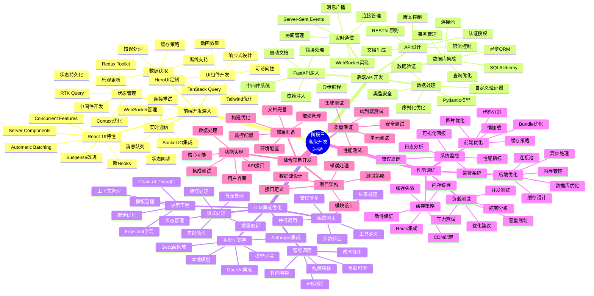
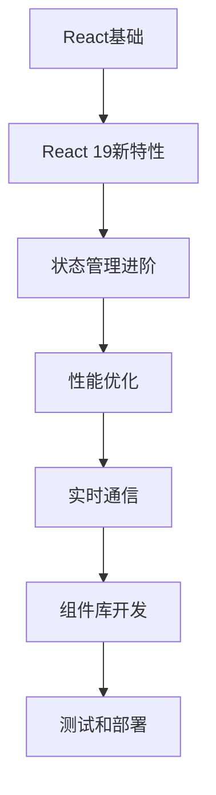
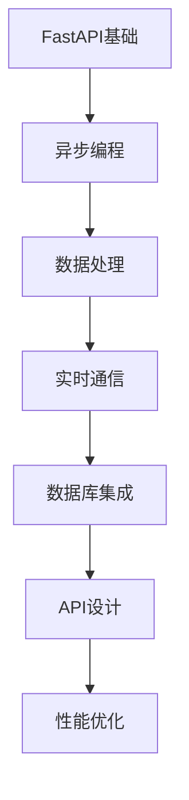
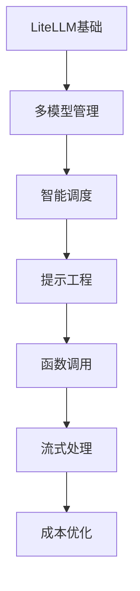

# 阶段三学习脑图：高级开发



## 🎯 技术栈深度学习路径

### 1. 前端技术深度路径


### 2. 后端技术深度路径


### 3. LLM集成深度路径


## 📊 技能发展矩阵

| 技能领域 | 初级 | 中级 | 高级 | 专家级 |
|---------|------|------|------|--------|
| React开发 | 基础组件 | 状态管理 | 性能优化 | 架构设计 |
| FastAPI | 基础API | 异步处理 | 复杂业务 | 系统设计 |
| LLM集成 | 基础调用 | 多模型 | 智能调度 | 成本优化 |
| 性能优化 | 基础监控 | 瓶颈分析 | 系统调优 | 架构优化 |

## 🛠️ 核心开发模式

### 1. 前端开发模式
```typescript
// 高级React组件模式
interface ComponentProps {
  data: DataType;
  onUpdate: (data: DataType) => void;
  config: ConfigType;
}

const AdvancedComponent: React.FC<ComponentProps> = ({
  data,
  onUpdate,
  config
}) => {
  // 使用自定义Hooks
  const { state, actions } = useComponentState(data);
  const { isLoading, error } = useAsyncOperation();

  // 性能优化
  const memoizedValue = useMemo(() =>
    computeExpensiveValue(data), [data]
  );

  const handleUpdate = useCallback((newData: DataType) => {
    actions.update(newData);
    onUpdate(newData);
  }, [actions, onUpdate]);

  // 错误边界
  if (error) return <ErrorFallback error={error} />;

  return (
    <Suspense fallback={<LoadingSpinner />}>
      <ComponentContent
        state={state}
        onUpdate={handleUpdate}
        config={config}
      />
    </Suspense>
  );
};
```

### 2. 后端开发模式
```python
# 高级FastAPI模式
from fastapi import FastAPI, Depends, HTTPException
from fastapi.middleware.cors import CORSMiddleware
from contextlib import asynccontextmanager

@asynccontextmanager
async def lifespan(app: FastAPI):
    # 启动时初始化
    await initialize_services()
    yield
    # 关闭时清理
    await cleanup_services()

app = FastAPI(lifespan=lifespan)

# 依赖注入
async def get_service() -> ServiceType:
    return await ServiceFactory.create()

# 高级路由处理
@app.post("/api/v1/process")
async def process_data(
    request: ProcessRequest,
    service: ServiceType = Depends(get_service),
    background_tasks: BackgroundTasks
) -> ProcessResponse:
    try:
        # 异步处理
        result = await service.process(request.data)

        # 后台任务
        background_tasks.add_task(
            update_analytics,
            request.user_id,
            result
        )

        return ProcessResponse(
            success=True,
            result=result,
            processing_time=result.duration
        )
    except ServiceException as e:
        raise HTTPException(
            status_code=400,
            detail=str(e)
        )
```

### 3. LLM集成模式
```python
# 智能LLM管理模式
class SmartLLMRouter:
    def __init__(self):
        self.models = ModelRegistry()
        self.load_balancer = LoadBalancer()
        self.cost_optimizer = CostOptimizer()

    async def route_request(
        self,
        request: LLMRequest
    ) -> LLMResponse:
        # 分析请求特征
        features = await self.analyze_request(request)

        # 选择最优模型
        model = await self.select_model(features)

        # 优化提示
        optimized_prompt = await self.optimize_prompt(
            request.prompt, model
        )

        # 执行请求
        response = await self.execute_request(
            model, optimized_prompt, request.config
        )

        # 记录和分析
        await self.record_usage(model, request, response)

        return response
```

## 📈 性能优化策略

### 1. 前端性能优化
```typescript
// 代码分割和懒加载
const LazyComponent = lazy(() => import('./HeavyComponent'));

// 虚拟化长列表
const VirtualizedList = ({ items }: { items: Item[] }) => {
  return (
    <FixedSizeList
      height={600}
      itemCount={items.length}
      itemSize={50}
      itemData={items}
    >
      {({ index, style, data }) => (
        <div style={style}>
          <ItemComponent item={data[index]} />
        </div>
      )}
    </FixedSizeList>
  );
};

// 缓存策略
const useOptimizedData = (key: string) => {
  return useQuery({
    queryKey: [key],
    queryFn: fetchData,
    staleTime: 5 * 60 * 1000, // 5分钟
    cacheTime: 10 * 60 * 1000, // 10分钟
    refetchOnWindowFocus: false
  });
};
```

### 2. 后端性能优化
```python
# 异步处理和缓存
import asyncio
from functools import lru_cache
import aioredis

class OptimizedService:
    def __init__(self):
        self.redis = aioredis.from_url("redis://localhost")
        self.semaphore = asyncio.Semaphore(10)  # 并发限制

    @lru_cache(maxsize=1000)
    def expensive_computation(self, data: str) -> str:
        # 内存缓存计算结果
        return complex_algorithm(data)

    async def cached_operation(self, key: str) -> dict:
        # Redis缓存
        cached = await self.redis.get(key)
        if cached:
            return json.loads(cached)

        # 计算结果
        result = await self.compute_result(key)

        # 缓存结果
        await self.redis.setex(
            key, 3600, json.dumps(result)
        )

        return result

    async def batch_process(self, items: List[str]) -> List[dict]:
        # 批量处理
        async with self.semaphore:
            tasks = [self.process_item(item) for item in items]
            return await asyncio.gather(*tasks)
```

## 🔍 调试和监控工具

### 1. 前端调试工具
```typescript
// 性能监控
const PerformanceMonitor = () => {
  useEffect(() => {
    // 监控Core Web Vitals
    getCLS(console.log);
    getFID(console.log);
    getFCP(console.log);
    getLCP(console.log);
    getTTFB(console.log);
  }, []);

  return null;
};

// 错误边界
class ErrorBoundary extends React.Component {
  constructor(props) {
    super(props);
    this.state = { hasError: false };
  }

  static getDerivedStateFromError(error) {
    return { hasError: true };
  }

  componentDidCatch(error, errorInfo) {
    // 发送错误到监控服务
    errorReporting.captureException(error, {
      extra: errorInfo
    });
  }

  render() {
    if (this.state.hasError) {
      return <ErrorFallback />;
    }

    return this.props.children;
  }
}
```

### 2. 后端监控工具
```python
# 性能监控中间件
import time
from fastapi import Request, Response

@app.middleware("http")
async def performance_middleware(request: Request, call_next):
    start_time = time.time()

    # 执行请求
    response = await call_next(request)

    # 计算处理时间
    process_time = time.time() - start_time

    # 记录指标
    metrics.record_request_duration(
        method=request.method,
        path=request.url.path,
        status_code=response.status_code,
        duration=process_time
    )

    # 添加响应头
    response.headers["X-Process-Time"] = str(process_time)

    return response

# 健康检查
@app.get("/health")
async def health_check():
    checks = {
        "database": await check_database(),
        "redis": await check_redis(),
        "external_api": await check_external_api()
    }

    all_healthy = all(checks.values())

    return {
        "status": "healthy" if all_healthy else "unhealthy",
        "checks": checks,
        "timestamp": datetime.now().isoformat()
    }
```

## 🎯 项目实战建议

### 1. 项目规划
- **需求分析**：明确功能需求和性能要求
- **技术选型**：选择合适的技术栈和工具
- **架构设计**：设计可扩展的系统架构
- **开发计划**：制定详细的开发时间表

### 2. 开发实践
- **代码规范**：遵循团队代码规范
- **测试驱动**：先写测试再写实现
- **持续集成**：自动化构建和测试
- **代码审查**：定期进行代码审查

### 3. 质量保证
- **单元测试**：覆盖核心业务逻辑
- **集成测试**：测试组件间交互
- **性能测试**：验证系统性能指标
- **安全测试**：检查安全漏洞

## 🔗 学习资源推荐

### 官方文档
- [React 19 文档](https://react.dev)
- [FastAPI 文档](https://fastapi.tiangolo.com)
- [LiteLLM 文档](https://docs.litellm.ai)

### 进阶教程
- [React 性能优化指南](https://react.dev/learn/render-and-commit)
- [FastAPI 最佳实践](https://fastapi.tiangolo.com/tutorial/)
- [LLM 集成模式](https://docs.litellm.ai/docs/providers)

### 社区资源
- [React 社区](https://reactjs.org/community/support.html)
- [FastAPI 社区](https://github.com/tiangolo/fastapi/discussions)
- [OpenHands 社区](https://github.com/All-Hands-AI/OpenHands/discussions)
