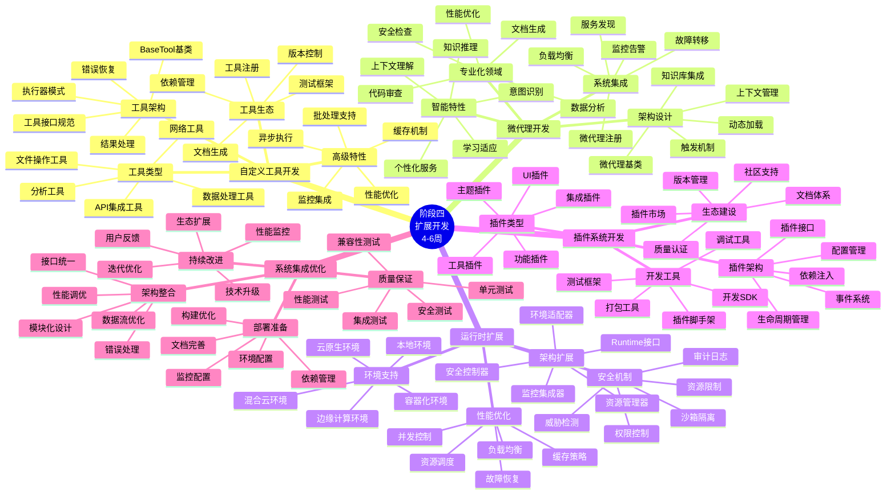
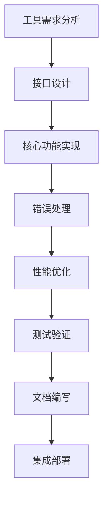
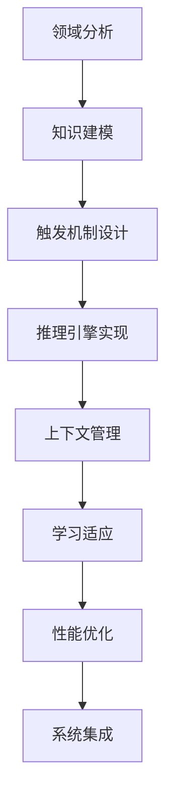
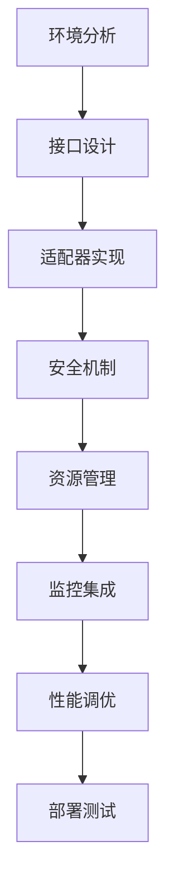

# 阶段四学习脑图：扩展开发



## 🎯 扩展开发技术路径

### 1. 工具开发技术路径


### 2. 微代理开发技术路径


### 3. 运行时扩展技术路径


## 📊 扩展开发能力矩阵

| 技能领域 | 基础能力 | 进阶能力 | 高级能力 | 专家能力 |
|---------|----------|----------|----------|----------|
| 工具开发 | 简单工具 | 复杂工具 | 工具框架 | 生态建设 |
| 微代理 | 基础代理 | 专业代理 | 智能代理 | 自适应代理 |
| 运行时 | 环境适配 | 安全隔离 | 性能优化 | 架构设计 |
| 插件系统 | 插件开发 | 插件管理 | 插件生态 | 平台架构 |

## 🛠️ 核心开发模式

### 1. 工具开发模式
```python
# 高级工具开发模式
class AdvancedTool(BaseTool):
    def __init__(self, config: ToolConfig):
        super().__init__(config)
        self.cache = ToolCache()
        self.monitor = ToolMonitor()
        self.validator = ToolValidator()

    async def execute(self, action: Action) -> Observation:
        # 预处理和验证
        validated_action = await self.validator.validate(action)

        # 缓存检查
        cached_result = await self.cache.get(validated_action)
        if cached_result:
            return cached_result

        # 执行工具逻辑
        with self.monitor.track_execution():
            result = await self._execute_core_logic(validated_action)

        # 后处理和缓存
        processed_result = await self._post_process(result)
        await self.cache.set(validated_action, processed_result)

        return processed_result

    async def _execute_core_logic(self, action: Action) -> Any:
        # 核心业务逻辑
        pass

    async def _post_process(self, result: Any) -> Observation:
        # 结果后处理
        pass
```

### 2. 微代理开发模式
```python
# 智能微代理开发模式
class IntelligentMicroagent(BaseMicroagent):
    def __init__(self, domain: str):
        super().__init__(domain)
        self.knowledge_base = KnowledgeBase(domain)
        self.context_manager = ContextManager()
        self.reasoning_engine = ReasoningEngine()
        self.learning_module = LearningModule()

    async def process_request(self, request: Request) -> Response:
        # 上下文理解
        context = await self.context_manager.build_context(request)

        # 知识检索
        relevant_knowledge = await self.knowledge_base.retrieve(
            request.query, context
        )

        # 推理决策
        decision = await self.reasoning_engine.reason(
            request, context, relevant_knowledge
        )

        # 执行决策
        response = await self._execute_decision(decision)

        # 学习反馈
        await self.learning_module.learn_from_interaction(
            request, response, context
        )

        return response

    async def _execute_decision(self, decision: Decision) -> Response:
        # 决策执行逻辑
        pass
```

### 3. 运行时扩展模式
```python
# 高级运行时扩展模式
class AdvancedRuntime(BaseRuntime):
    def __init__(self, config: RuntimeConfig):
        super().__init__(config)
        self.resource_manager = ResourceManager()
        self.security_controller = SecurityController()
        self.monitor = RuntimeMonitor()
        self.scheduler = TaskScheduler()

    async def execute_action(self, action: Action) -> Observation:
        # 安全检查
        await self.security_controller.validate_action(action)

        # 资源分配
        resources = await self.resource_manager.allocate(action)

        try:
            # 任务调度
            task = await self.scheduler.schedule_task(action, resources)

            # 监控执行
            with self.monitor.track_execution(task):
                result = await self._execute_in_environment(task)

            return result

        finally:
            # 资源释放
            await self.resource_manager.release(resources)

    async def _execute_in_environment(self, task: Task) -> Observation:
        # 环境特定的执行逻辑
        pass
```

## 🔍 高级开发技术

### 1. 异步编程模式
```python
# 高级异步模式
import asyncio
from typing import AsyncGenerator

class AsyncToolExecutor:
    def __init__(self, max_concurrent: int = 10):
        self.semaphore = asyncio.Semaphore(max_concurrent)
        self.task_queue = asyncio.Queue()
        self.result_cache = {}

    async def execute_batch(self, actions: List[Action]) -> List[Observation]:
        """批量异步执行"""
        tasks = [self._execute_with_semaphore(action) for action in actions]
        results = await asyncio.gather(*tasks, return_exceptions=True)
        return [r if not isinstance(r, Exception) else self._handle_error(r)
                for r in results]

    async def _execute_with_semaphore(self, action: Action) -> Observation:
        async with self.semaphore:
            return await self._execute_action(action)

    async def stream_execute(self, action: Action) -> AsyncGenerator[Observation, None]:
        """流式执行"""
        async for partial_result in self._stream_execution(action):
            yield partial_result
```

### 2. 插件系统架构
```python
# 插件系统架构
class PluginManager:
    def __init__(self):
        self.plugins: Dict[str, Plugin] = {}
        self.hooks: Dict[str, List[Callable]] = {}
        self.dependencies: Dict[str, List[str]] = {}

    async def load_plugin(self, plugin_path: str) -> Plugin:
        """动态加载插件"""
        spec = importlib.util.spec_from_file_location("plugin", plugin_path)
        module = importlib.util.module_from_spec(spec)
        spec.loader.exec_module(module)

        plugin = module.create_plugin()
        await self._validate_plugin(plugin)
        await self._resolve_dependencies(plugin)

        self.plugins[plugin.name] = plugin
        await plugin.initialize()

        return plugin

    async def execute_hook(self, hook_name: str, *args, **kwargs):
        """执行钩子函数"""
        if hook_name in self.hooks:
            for hook_func in self.hooks[hook_name]:
                try:
                    await hook_func(*args, **kwargs)
                except Exception as e:
                    logger.error(f"Hook {hook_name} failed: {e}")

    def register_hook(self, hook_name: str, func: Callable):
        """注册钩子函数"""
        if hook_name not in self.hooks:
            self.hooks[hook_name] = []
        self.hooks[hook_name].append(func)
```

### 3. 智能缓存系统
```python
# 智能缓存系统
class IntelligentCache:
    def __init__(self):
        self.memory_cache = {}
        self.disk_cache = DiskCache()
        self.distributed_cache = RedisCache()
        self.cache_stats = CacheStats()

    async def get(self, key: str, context: Dict = None) -> Any:
        """智能缓存获取"""
        # 检查内存缓存
        if key in self.memory_cache:
            self.cache_stats.record_hit('memory')
            return self.memory_cache[key]

        # 检查磁盘缓存
        disk_result = await self.disk_cache.get(key)
        if disk_result:
            self.cache_stats.record_hit('disk')
            # 提升到内存缓存
            self.memory_cache[key] = disk_result
            return disk_result

        # 检查分布式缓存
        distributed_result = await self.distributed_cache.get(key)
        if distributed_result:
            self.cache_stats.record_hit('distributed')
            # 提升到本地缓存
            await self._promote_to_local(key, distributed_result)
            return distributed_result

        self.cache_stats.record_miss()
        return None

    async def set(self, key: str, value: Any, ttl: int = 3600):
        """智能缓存设置"""
        # 根据数据大小和访问模式选择缓存层级
        cache_strategy = await self._determine_cache_strategy(key, value)

        if cache_strategy.use_memory:
            self.memory_cache[key] = value

        if cache_strategy.use_disk:
            await self.disk_cache.set(key, value, ttl)

        if cache_strategy.use_distributed:
            await self.distributed_cache.set(key, value, ttl)
```

## 📈 性能优化策略

### 1. 工具性能优化
```python
# 工具性能优化
class OptimizedTool(BaseTool):
    def __init__(self):
        super().__init__()
        self.connection_pool = ConnectionPool()
        self.batch_processor = BatchProcessor()
        self.result_cache = LRUCache(maxsize=1000)

    async def execute_optimized(self, actions: List[Action]) -> List[Observation]:
        # 批处理优化
        batched_actions = self.batch_processor.group_actions(actions)

        # 并行执行
        tasks = []
        for batch in batched_actions:
            task = asyncio.create_task(self._execute_batch(batch))
            tasks.append(task)

        batch_results = await asyncio.gather(*tasks)

        # 展平结果
        return [result for batch_result in batch_results for result in batch_result]

    @lru_cache(maxsize=128)
    def _compute_expensive_operation(self, data: str) -> str:
        # 昂贵计算的缓存版本
        return expensive_computation(data)
```

### 2. 内存管理优化
```python
# 内存管理优化
class MemoryOptimizedComponent:
    def __init__(self):
        self.object_pool = ObjectPool()
        self.weak_references = weakref.WeakValueDictionary()
        self.memory_monitor = MemoryMonitor()

    async def process_large_dataset(self, dataset: Iterator[Any]):
        """处理大数据集的内存优化版本"""
        with self.memory_monitor.track_usage():
            async for chunk in self._chunk_dataset(dataset, chunk_size=1000):
                # 使用对象池减少内存分配
                processor = self.object_pool.get_processor()
                try:
                    result = await processor.process(chunk)
                    yield result
                finally:
                    self.object_pool.return_processor(processor)

                # 定期检查内存使用
                if self.memory_monitor.usage_high():
                    await self._trigger_gc()

    async def _trigger_gc(self):
        """触发垃圾回收"""
        import gc
        gc.collect()
        await asyncio.sleep(0.1)  # 让出控制权
```

## 🔧 调试和测试工具

### 1. 扩展组件测试框架
```python
# 扩展组件测试框架
class ExtensionTestFramework:
    def __init__(self):
        self.test_environment = TestEnvironment()
        self.mock_factory = MockFactory()
        self.assertion_helper = AssertionHelper()

    async def test_tool(self, tool: BaseTool, test_cases: List[TestCase]):
        """测试工具功能"""
        results = []

        for test_case in test_cases:
            # 设置测试环境
            await self.test_environment.setup(test_case.environment)

            try:
                # 执行测试
                result = await tool.execute(test_case.action)

                # 验证结果
                assertion_result = await self.assertion_helper.verify(
                    result, test_case.expected_result
                )

                results.append(TestResult(
                    test_case=test_case,
                    actual_result=result,
                    assertion_result=assertion_result,
                    success=assertion_result.passed
                ))

            except Exception as e:
                results.append(TestResult(
                    test_case=test_case,
                    error=str(e),
                    success=False
                ))

            finally:
                # 清理测试环境
                await self.test_environment.cleanup()

        return TestReport(results)
```

### 2. 性能基准测试
```python
# 性能基准测试
class PerformanceBenchmark:
    def __init__(self):
        self.metrics_collector = MetricsCollector()
        self.load_generator = LoadGenerator()
        self.report_generator = ReportGenerator()

    async def benchmark_tool(self, tool: BaseTool, benchmark_config: BenchmarkConfig):
        """工具性能基准测试"""
        # 预热
        await self._warmup(tool, benchmark_config.warmup_requests)

        # 基准测试
        with self.metrics_collector.collect():
            await self.load_generator.generate_load(
                tool,
                benchmark_config.load_pattern,
                benchmark_config.duration
            )

        # 生成报告
        metrics = self.metrics_collector.get_metrics()
        report = await self.report_generator.generate_performance_report(
            tool, metrics, benchmark_config
        )

        return report

    async def _warmup(self, tool: BaseTool, warmup_requests: int):
        """预热工具"""
        warmup_actions = [self._create_warmup_action() for _ in range(warmup_requests)]
        await asyncio.gather(*[tool.execute(action) for action in warmup_actions])
```

## 🎯 扩展开发最佳实践

### 1. 设计原则
- **模块化设计**：保持组件的独立性和可复用性
- **接口一致性**：遵循统一的接口规范和约定
- **错误处理**：完善的错误处理和恢复机制
- **性能考虑**：从设计阶段就考虑性能影响

### 2. 开发流程
- **需求分析**：深入理解用户需求和使用场景
- **架构设计**：设计可扩展和可维护的架构
- **原型开发**：快速构建原型验证设计
- **迭代完善**：基于反馈持续改进

### 3. 质量保证
- **代码审查**：严格的代码审查流程
- **自动化测试**：完整的测试覆盖
- **性能测试**：定期的性能基准测试
- **安全审计**：安全漏洞扫描和修复

## 🔗 学习资源推荐

### 技术文档
- [Python异步编程指南](https://docs.python.org/3/library/asyncio.html)
- [插件架构设计模式](https://martinfowler.com/articles/plugins.html)
- [微服务架构最佳实践](https://microservices.io/)

### 开源项目
- [Pluggy - Python插件系统](https://github.com/pytest-dev/pluggy)
- [Celery - 分布式任务队列](https://github.com/celery/celery)
- [FastAPI - 现代Web框架](https://github.com/tiangolo/fastapi)

### 社区资源
- [OpenHands扩展开发指南](../../docs/extensions/)
- [开发者社区讨论](https://github.com/All-Hands-AI/OpenHands/discussions)
- [技术博客和案例研究](https://docs.all-hands.dev/blog)
