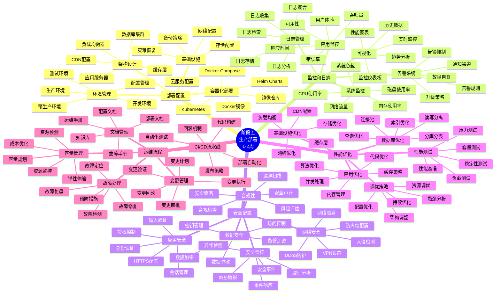
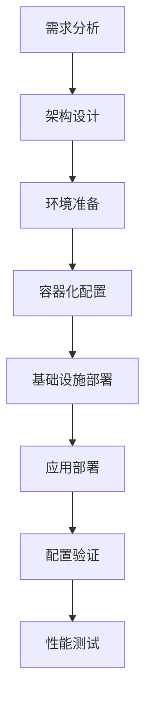
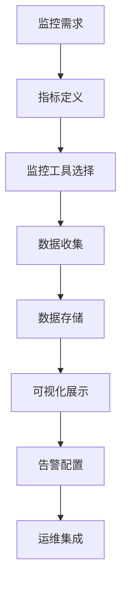
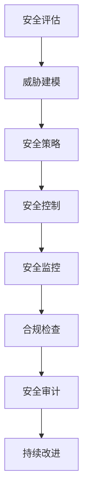

# 阶段五学习脑图：生产部署



## 🎯 生产部署技术路径

### 1. 部署配置技术路径


### 2. 监控系统技术路径


### 3. 安全配置技术路径


## 📊 生产环境能力矩阵

| 能力领域 | 基础级别 | 中级级别 | 高级级别 | 专家级别 |
|---------|----------|----------|----------|----------|
| 部署配置 | 单机部署 | 集群部署 | 云原生部署 | 多云部署 |
| 监控运维 | 基础监控 | 全面监控 | 智能运维 | 自动化运维 |
| 安全防护 | 基础安全 | 深度防御 | 零信任架构 | 安全运营 |
| 性能优化 | 基础调优 | 系统调优 | 架构优化 | 全栈优化 |

## 🛠️ 核心部署模式

### 1. 蓝绿部署模式
```yaml
# 蓝绿部署配置
apiVersion: argoproj.io/v1alpha1
kind: Rollout
metadata:
  name: openhands-rollout
spec:
  replicas: 5
  strategy:
    blueGreen:
      activeService: openhands-active
      previewService: openhands-preview
      autoPromotionEnabled: false
      scaleDownDelaySeconds: 30
      prePromotionAnalysis:
        templates:
        - templateName: success-rate
        args:
        - name: service-name
          value: openhands-preview
      postPromotionAnalysis:
        templates:
        - templateName: success-rate
        args:
        - name: service-name
          value: openhands-active
  selector:
    matchLabels:
      app: openhands
  template:
    metadata:
      labels:
        app: openhands
    spec:
      containers:
      - name: openhands
        image: openhands:latest
        ports:
        - containerPort: 8000
```

### 2. 金丝雀部署模式
```yaml
# 金丝雀部署配置
apiVersion: argoproj.io/v1alpha1
kind: Rollout
metadata:
  name: openhands-canary
spec:
  replicas: 10
  strategy:
    canary:
      steps:
      - setWeight: 10
      - pause: {duration: 1m}
      - setWeight: 20
      - pause: {duration: 1m}
      - setWeight: 50
      - pause: {duration: 1m}
      - setWeight: 100
      canaryService: openhands-canary
      stableService: openhands-stable
      trafficRouting:
        nginx:
          stableIngress: openhands-stable
          annotationPrefix: nginx.ingress.kubernetes.io
          additionalIngressAnnotations:
            canary-by-header: X-Canary
```

### 3. 滚动更新模式
```yaml
# 滚动更新配置
apiVersion: apps/v1
kind: Deployment
metadata:
  name: openhands-deployment
spec:
  replicas: 6
  strategy:
    type: RollingUpdate
    rollingUpdate:
      maxUnavailable: 1
      maxSurge: 1
  selector:
    matchLabels:
      app: openhands
  template:
    metadata:
      labels:
        app: openhands
    spec:
      containers:
      - name: openhands
        image: openhands:latest
        readinessProbe:
          httpGet:
            path: /health
            port: 8000
          initialDelaySeconds: 10
          periodSeconds: 5
        livenessProbe:
          httpGet:
            path: /health
            port: 8000
          initialDelaySeconds: 30
          periodSeconds: 10
```

## 🔍 高级运维技术

### 1. 自动化运维脚本
```bash
#!/bin/bash
# 自动化部署脚本

set -e

# 配置变量
APP_NAME="openhands"
ENVIRONMENT=${1:-production}
VERSION=${2:-latest}
NAMESPACE="openhands-${ENVIRONMENT}"

# 颜色输出
RED='\033[0;31m'
GREEN='\033[0;32m'
YELLOW='\033[1;33m'
NC='\033[0m'

log_info() {
    echo -e "${GREEN}[INFO]${NC} $1"
}

log_warn() {
    echo -e "${YELLOW}[WARN]${NC} $1"
}

log_error() {
    echo -e "${RED}[ERROR]${NC} $1"
}

# 预检查
pre_check() {
    log_info "Starting pre-deployment checks..."

    # 检查kubectl连接
    if ! kubectl cluster-info &> /dev/null; then
        log_error "Cannot connect to Kubernetes cluster"
        exit 1
    fi

    # 检查命名空间
    if ! kubectl get namespace $NAMESPACE &> /dev/null; then
        log_info "Creating namespace $NAMESPACE"
        kubectl create namespace $NAMESPACE
    fi

    # 检查镜像是否存在
    if ! docker manifest inspect $APP_NAME:$VERSION &> /dev/null; then
        log_error "Docker image $APP_NAME:$VERSION not found"
        exit 1
    fi

    log_info "Pre-deployment checks passed"
}

# 备份当前版本
backup_current_version() {
    log_info "Backing up current version..."

    # 获取当前版本
    CURRENT_VERSION=$(kubectl get deployment $APP_NAME -n $NAMESPACE -o jsonpath='{.spec.template.spec.containers[0].image}' 2>/dev/null || echo "none")

    if [ "$CURRENT_VERSION" != "none" ]; then
        # 创建备份标签
        kubectl label deployment $APP_NAME -n $NAMESPACE backup-version="$CURRENT_VERSION" --overwrite
        log_info "Current version $CURRENT_VERSION backed up"
    fi
}

# 部署新版本
deploy_new_version() {
    log_info "Deploying version $VERSION..."

    # 更新部署配置
    kubectl set image deployment/$APP_NAME $APP_NAME=$APP_NAME:$VERSION -n $NAMESPACE

    # 等待部署完成
    kubectl rollout status deployment/$APP_NAME -n $NAMESPACE --timeout=600s

    log_info "Deployment completed successfully"
}

# 健康检查
health_check() {
    log_info "Performing health checks..."

    # 等待Pod就绪
    kubectl wait --for=condition=ready pod -l app=$APP_NAME -n $NAMESPACE --timeout=300s

    # 获取服务端点
    SERVICE_IP=$(kubectl get service $APP_NAME -n $NAMESPACE -o jsonpath='{.status.loadBalancer.ingress[0].ip}' 2>/dev/null || echo "localhost")
    SERVICE_PORT=$(kubectl get service $APP_NAME -n $NAMESPACE -o jsonpath='{.spec.ports[0].port}')

    # 健康检查
    for i in {1..10}; do
        if curl -f http://$SERVICE_IP:$SERVICE_PORT/health &> /dev/null; then
            log_info "Health check passed"
            return 0
        fi
        log_warn "Health check attempt $i failed, retrying..."
        sleep 10
    done

    log_error "Health check failed after 10 attempts"
    return 1
}

# 回滚函数
rollback() {
    log_warn "Rolling back to previous version..."

    # 获取备份版本
    BACKUP_VERSION=$(kubectl get deployment $APP_NAME -n $NAMESPACE -o jsonpath='{.metadata.labels.backup-version}' 2>/dev/null || echo "")

    if [ -n "$BACKUP_VERSION" ]; then
        kubectl set image deployment/$APP_NAME $APP_NAME=$BACKUP_VERSION -n $NAMESPACE
        kubectl rollout status deployment/$APP_NAME -n $NAMESPACE --timeout=300s
        log_info "Rollback completed to version $BACKUP_VERSION"
    else
        kubectl rollout undo deployment/$APP_NAME -n $NAMESPACE
        log_info "Rollback completed to previous version"
    fi
}

# 清理函数
cleanup() {
    log_info "Performing cleanup..."

    # 清理旧的ReplicaSets
    kubectl delete replicaset -l app=$APP_NAME -n $NAMESPACE --field-selector='status.replicas==0'

    # 清理未使用的镜像
    docker system prune -f

    log_info "Cleanup completed"
}

# 主部署流程
main() {
    log_info "Starting deployment of $APP_NAME:$VERSION to $ENVIRONMENT"

    # 执行预检查
    pre_check

    # 备份当前版本
    backup_current_version

    # 部署新版本
    if deploy_new_version; then
        # 健康检查
        if health_check; then
            log_info "Deployment successful!"
            cleanup
        else
            log_error "Health check failed, rolling back..."
            rollback
            exit 1
        fi
    else
        log_error "Deployment failed, rolling back..."
        rollback
        exit 1
    fi
}

# 错误处理
trap 'log_error "Deployment failed with error"; rollback; exit 1' ERR

# 执行主流程
main "$@"
```

### 2. 监控告警配置
```yaml
# Prometheus告警规则
groups:
- name: openhands.rules
  rules:
  # 高CPU使用率告警
  - alert: HighCPUUsage
    expr: 100 - (avg by(instance) (irate(node_cpu_seconds_total{mode="idle"}[5m])) * 100) > 80
    for: 5m
    labels:
      severity: warning
    annotations:
      summary: "High CPU usage detected"
      description: "CPU usage is above 80% for more than 5 minutes on {{ $labels.instance }}"

  # 高内存使用率告警
  - alert: HighMemoryUsage
    expr: (node_memory_MemTotal_bytes - node_memory_MemAvailable_bytes) / node_memory_MemTotal_bytes * 100 > 90
    for: 2m
    labels:
      severity: critical
    annotations:
      summary: "High memory usage detected"
      description: "Memory usage is above 90% on {{ $labels.instance }}"

  # 应用响应时间告警
  - alert: HighResponseTime
    expr: histogram_quantile(0.95, rate(http_request_duration_seconds_bucket[5m])) > 2
    for: 3m
    labels:
      severity: warning
    annotations:
      summary: "High response time detected"
      description: "95th percentile response time is above 2 seconds"

  # 应用错误率告警
  - alert: HighErrorRate
    expr: rate(http_requests_total{status=~"5.."}[5m]) / rate(http_requests_total[5m]) * 100 > 5
    for: 2m
    labels:
      severity: critical
    annotations:
      summary: "High error rate detected"
      description: "Error rate is above 5% for the last 5 minutes"

  # Pod重启告警
  - alert: PodRestartingTooOften
    expr: increase(kube_pod_container_status_restarts_total[1h]) > 3
    for: 0m
    labels:
      severity: warning
    annotations:
      summary: "Pod restarting too often"
      description: "Pod {{ $labels.pod }} in namespace {{ $labels.namespace }} has restarted more than 3 times in the last hour"

  # 磁盘空间告警
  - alert: DiskSpaceRunningLow
    expr: (node_filesystem_avail_bytes / node_filesystem_size_bytes) * 100 < 15
    for: 5m
    labels:
      severity: warning
    annotations:
      summary: "Disk space running low"
      description: "Disk space is below 15% on {{ $labels.instance }} mount {{ $labels.mountpoint }}"

---
# AlertManager配置
global:
  smtp_smarthost: 'smtp.gmail.com:587'
  smtp_from: 'alerts@company.com'
  smtp_auth_username: 'alerts@company.com'
  smtp_auth_password: 'password'

route:
  group_by: ['alertname']
  group_wait: 10s
  group_interval: 10s
  repeat_interval: 1h
  receiver: 'web.hook'
  routes:
  - match:
      severity: critical
    receiver: 'critical-alerts'
  - match:
      severity: warning
    receiver: 'warning-alerts'

receivers:
- name: 'web.hook'
  webhook_configs:
  - url: 'http://webhook-service:5000/alerts'

- name: 'critical-alerts'
  email_configs:
  - to: 'oncall@company.com'
    subject: '[CRITICAL] {{ .GroupLabels.alertname }}'
    body: |
      {{ range .Alerts }}
      Alert: {{ .Annotations.summary }}
      Description: {{ .Annotations.description }}
      {{ end }}
  slack_configs:
  - api_url: 'https://hooks.slack.com/services/...'
    channel: '#critical-alerts'
    title: '[CRITICAL] {{ .GroupLabels.alertname }}'
    text: '{{ range .Alerts }}{{ .Annotations.description }}{{ end }}'

- name: 'warning-alerts'
  email_configs:
  - to: 'team@company.com'
    subject: '[WARNING] {{ .GroupLabels.alertname }}'
    body: |
      {{ range .Alerts }}
      Alert: {{ .Annotations.summary }}
      Description: {{ .Annotations.description }}
      {{ end }}
```

### 3. 性能优化配置
```yaml
# 性能优化的Kubernetes配置
apiVersion: apps/v1
kind: Deployment
metadata:
  name: openhands-optimized
spec:
  replicas: 6
  selector:
    matchLabels:
      app: openhands
  template:
    metadata:
      labels:
        app: openhands
    spec:
      # 节点亲和性
      affinity:
        nodeAffinity:
          requiredDuringSchedulingIgnoredDuringExecution:
            nodeSelectorTerms:
            - matchExpressions:
              - key: node-type
                operator: In
                values: ["compute-optimized"]
        podAntiAffinity:
          preferredDuringSchedulingIgnoredDuringExecution:
          - weight: 100
            podAffinityTerm:
              labelSelector:
                matchExpressions:
                - key: app
                  operator: In
                  values: ["openhands"]
              topologyKey: kubernetes.io/hostname

      # 容器配置
      containers:
      - name: openhands
        image: openhands:latest

        # 资源限制和请求
        resources:
          requests:
            memory: "512Mi"
            cpu: "250m"
          limits:
            memory: "2Gi"
            cpu: "1000m"

        # 环境变量优化
        env:
        - name: WORKERS
          value: "4"
        - name: MAX_CONNECTIONS
          value: "1000"
        - name: KEEP_ALIVE_TIMEOUT
          value: "65"
        - name: GRACEFUL_TIMEOUT
          value: "30"

        # 健康检查优化
        readinessProbe:
          httpGet:
            path: /health/ready
            port: 8000
          initialDelaySeconds: 5
          periodSeconds: 3
          timeoutSeconds: 2
          failureThreshold: 3

        livenessProbe:
          httpGet:
            path: /health/live
            port: 8000
          initialDelaySeconds: 30
          periodSeconds: 10
          timeoutSeconds: 5
          failureThreshold: 3

        # 启动探针
        startupProbe:
          httpGet:
            path: /health/startup
            port: 8000
          initialDelaySeconds: 10
          periodSeconds: 5
          timeoutSeconds: 3
          failureThreshold: 10

        # 卷挂载
        volumeMounts:
        - name: tmp-volume
          mountPath: /tmp
        - name: cache-volume
          mountPath: /app/cache

      # 卷配置
      volumes:
      - name: tmp-volume
        emptyDir:
          sizeLimit: 1Gi
      - name: cache-volume
        emptyDir:
          sizeLimit: 2Gi

      # 优化配置
      terminationGracePeriodSeconds: 30
      dnsPolicy: ClusterFirst
      restartPolicy: Always

---
# HPA配置
apiVersion: autoscaling/v2
kind: HorizontalPodAutoscaler
metadata:
  name: openhands-hpa
spec:
  scaleTargetRef:
    apiVersion: apps/v1
    kind: Deployment
    name: openhands-optimized
  minReplicas: 3
  maxReplicas: 20
  metrics:
  - type: Resource
    resource:
      name: cpu
      target:
        type: Utilization
        averageUtilization: 70
  - type: Resource
    resource:
      name: memory
      target:
        type: Utilization
        averageUtilization: 80
  behavior:
    scaleDown:
      stabilizationWindowSeconds: 300
      policies:
      - type: Percent
        value: 10
        periodSeconds: 60
    scaleUp:
      stabilizationWindowSeconds: 60
      policies:
      - type: Percent
        value: 50
        periodSeconds: 60
```

## 📈 生产环境最佳实践

### 1. 部署策略
- **蓝绿部署**：零停机部署，快速回滚
- **金丝雀部署**：渐进式发布，风险控制
- **滚动更新**：平滑升级，资源高效
- **A/B测试**：功能验证，用户体验优化

### 2. 监控策略
- **全栈监控**：从基础设施到应用层
- **实时告警**：及时发现和响应问题
- **性能基线**：建立性能标准和趋势分析
- **用户体验监控**：关注真实用户体验

### 3. 安全策略
- **纵深防御**：多层安全防护
- **最小权限**：最小化访问权限
- **持续监控**：实时安全监控和响应
- **合规管理**：满足行业合规要求

### 4. 运维策略
- **自动化优先**：减少人工操作错误
- **文档驱动**：完善的运维文档
- **故障演练**：定期进行故障演练
- **持续改进**：基于监控数据持续优化

## 🔗 生产环境工具推荐

### 监控工具
- **Prometheus + Grafana**：指标监控和可视化
- **ELK Stack**：日志收集和分析
- **Jaeger**：分布式链路追踪
- **New Relic / DataDog**：APM监控

### 部署工具
- **Kubernetes**：容器编排平台
- **Helm**：Kubernetes包管理
- **ArgoCD**：GitOps持续部署
- **Terraform**：基础设施即代码

### 安全工具
- **Vault**：密钥管理
- **Falco**：运行时安全监控
- **Trivy**：容器镜像安全扫描
- **OPA**：策略引擎

### 运维工具
- **Ansible**：配置管理
- **Jenkins**：CI/CD流水线
- **PagerDuty**：事件管理
- **Slack**：团队协作

## 🎯 生产部署成功标准

### 技术指标
- **可用性**：99.9%以上的服务可用性
- **性能**：响应时间P95 < 500ms
- **容量**：支持预期用户负载
- **安全**：通过安全审计和合规检查

### 运维指标
- **部署频率**：支持频繁安全部署
- **故障恢复时间**：MTTR < 30分钟
- **变更成功率**：>95%的变更成功率
- **监控覆盖率**：>90%的系统监控覆盖

### 业务指标
- **用户满意度**：用户体验指标良好
- **成本效益**：合理的运营成本
- **扩展能力**：支持业务增长需求
- **合规性**：满足相关法规要求

恭喜你完成了OpenHands项目的完整学习之旅！从基础理解到生产部署，你已经掌握了全栈开发和运维的核心技能。现在你可以：

1. **独立开发**：具备完整的OpenHands开发能力
2. **系统扩展**：能够扩展和定制OpenHands功能
3. **生产部署**：具备生产环境部署和运维能力
4. **持续改进**：建立持续学习和改进的能力

继续实践和探索，成为OpenHands生态的重要贡献者！🚀
